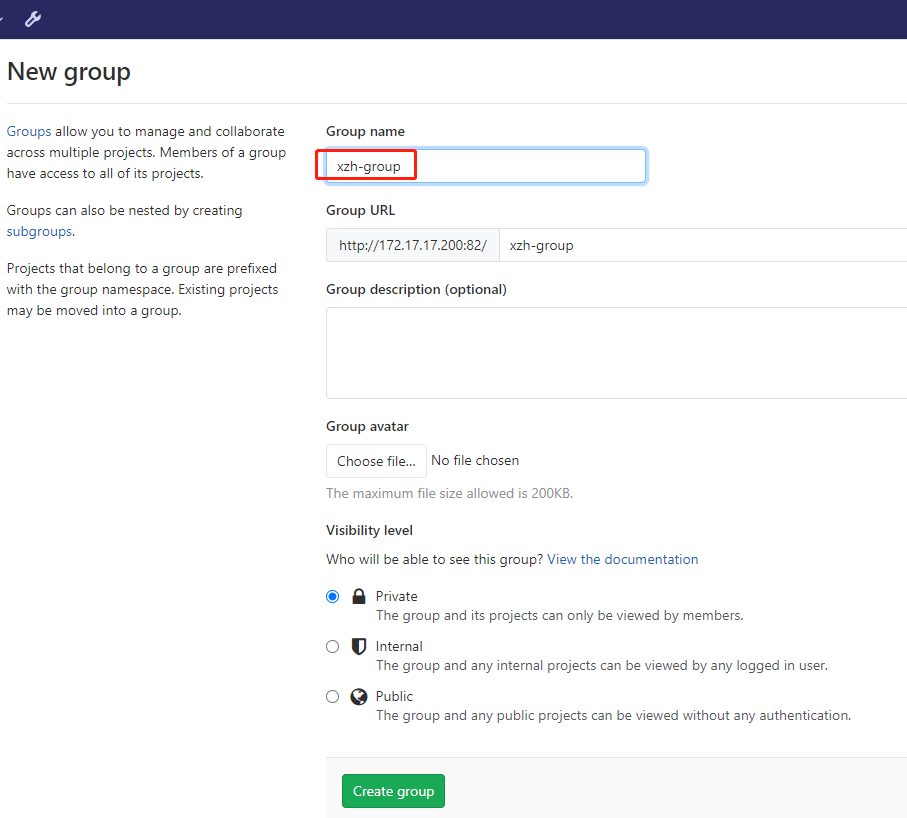
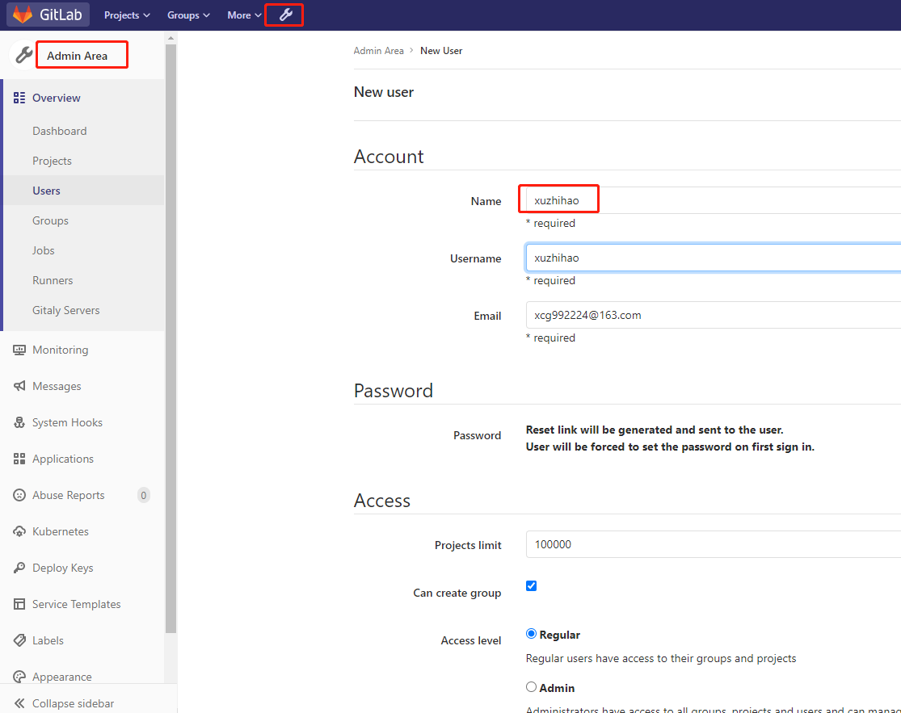
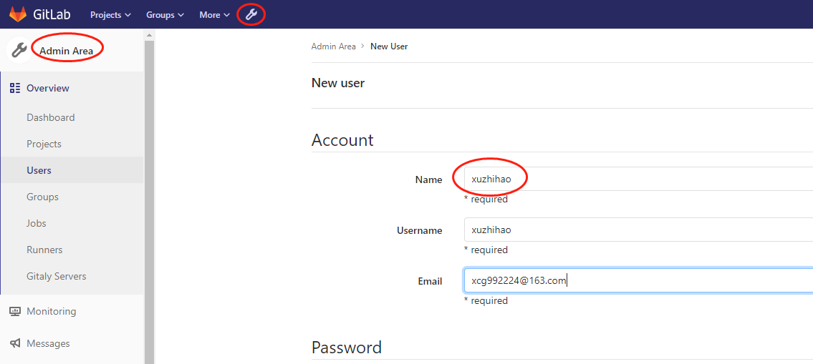
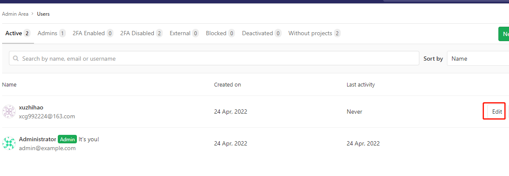

# Gitlab 12.4.2

GitLab是一个用于仓库管理系统的开源项目，使用Git作为代码管理工具，并在此基础上搭建起来的Web服务

## 1. 安装

### 1.1 安装依赖

```bash
yum -y install policycoreutils openssh-server openssh-clients postfix   # 安装依赖
```

### 1.2 初始化环境

```bash
systemctl enable sshd && sudo systemctl start sshd      # 启动ssh服务&设置为开机启动
systemctl enable postfix && systemctl start postfix     # 设置postfix开机自启，并启动，postfix支持gitlab发信功能
firewall-cmd --add-service=ssh --permanent              # 开放ssh以及http服务，然后重新加载防火墙列表
firewall-cmd --add-service=http --permanent
firewall-cmd --reload
```

### 1.3 下载安装

```bash
wget https://mirrors.tuna.tsinghua.edu.cn/gitlab-ce/yum/el6/gitlab-ce-12.4.2-ce.0.el6.x86_64.rpm --no-check-certificate
# 安装
rpm -i gitlab-ce-12.4.2-ce.0.el6.x86_64.rpm --force --nodeps
```

### 1.4 修改配置

```bash
vi /etc/gitlab/gitlab.rb
# 修改内容
external_url 'http://192.168.3.200:82'
nginx['listen_port'] = 82
```

### 1.5 启动服务

```bash
gitlab-ctl reconfigure  # 重载配置及启动gitlab
gitlab-ctl restart
```

## 2. 应用设置

### 2.1 系统登录

?> http://192.168.3.200:82/ 首次进入重置root账号密码

### 2.2 添加组



### 2.3 创建用户






### 2.4 修改密码




### 2.5 用户添加到组中


### 2.6 新用户身份登录创建项目


## 3. 客户端

### 3.1 下载git

https://github.com/git-for-windows/git/releases/download/v2.23.0.windows.1/Git-2.23.0-64-bit.exe

### 3.2 项目Clone

1. 复制项目连接


2. 打开命令行


3. 设置用户名密码

```bash
git credential-manager uninstall # 清除掉缓存在git中的用户名和密码
```
  
4. 项目clone

```bash
git clone http://192.168.3.200:82/xzh-group/xzh-spring-boot.git
```

### 3.3 提交代码

```bash
cd xzh-spring-boot            # 进入项目工程目录
git add .                     # 将当前修改的文件添加到暂存区
git commit -m "first commit"  # 提交代码
git push                      # 推送到远程仓库
git pull                      # 拉取代码
git checkout -b dev           # 切换并从当前分支创建一个dev分支
git push origin dev           # 将新创建的dev分支推送到远程仓库
```

## 4. git命令

### 4.1 Git全局设置

```bash
git config --global user.name "xuzhihao"
git config --global user.email "xuzhihao@163.com"
```

### 4.2 创建仓库

```bash
git clone http://172.17.17.200:82/xzh-group/xzh-spring-boot.git
cd xzh-spring-boot
touch README.md
git add README.md
git commit -m "add README"
git push -u origin master
```

### 4.3 推送现有文件夹

```bash
cd existing_folder
git init
git remote add origin http://172.17.17.200:82/xzh-group/xzh-spring-boot.git
git add .
git commit -m "Initial commit"
git push -u origin master
```

### 4.4 本地代码推送到仓库

```bash
cd existing_repo
git remote rename origin old-origin
git remote add origin http://172.17.17.200:82/xzh-group/xzh-spring-boot.git
git push -u origin --all
git push -u origin --tags
```

### 4.5 其他

```bash
git checkout dev # 切换到dev分支
git status # 查看本地仓库文件状况
git branch # 查看本地所有分支
git log # 查看提交记录
```