# GitLab仓库搭建

## 1. 安装


```bash
docker pull gitlab/gitlab-ce
mkdir -p /mydata/gitlab/{config,logs,data}

docker run -d --name gitlab\
  -p 10443:443 -p 1080:80 -p 1022:22 \
  --restart always \
  -v /mydata/gitlab/config:/etc/gitlab \
  -v /mydata/gitlab/logs:/var/log/gitlab \
  -v /mydata/gitlab/data:/var/opt/gitlab \
  gitlab/gitlab-ce:latest
```

?> http://192.168.3.200:1080/ 重置root账号


## 2. Gitlab的使用

### 2.1 Gitlab启动完成后第一次访问，会让你重置root帐号的密码
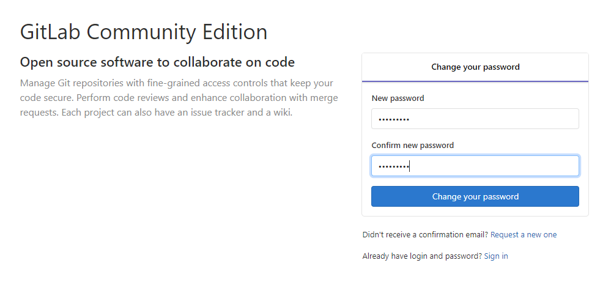

### 2.2 重置完成后输入帐号密码登录
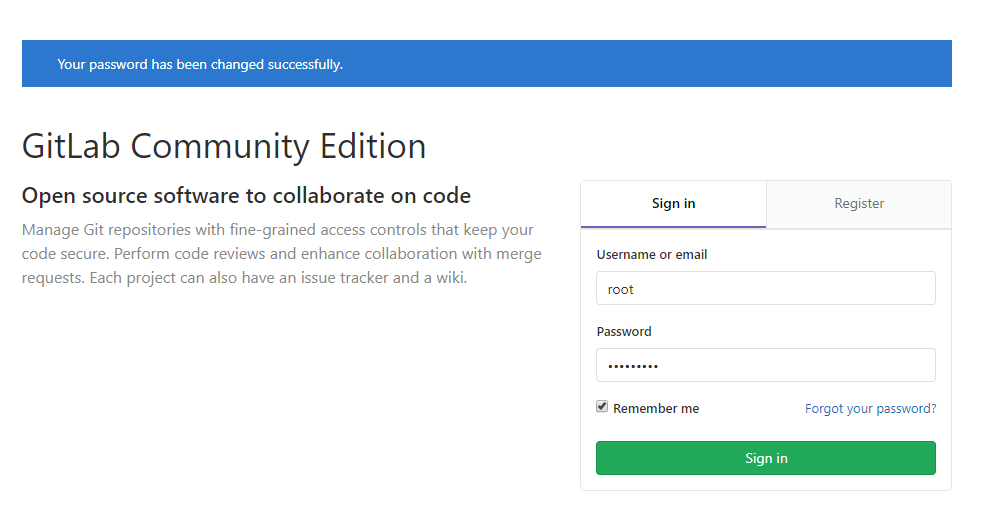

### 2.3 选择创建项目、创建组织、创建帐号
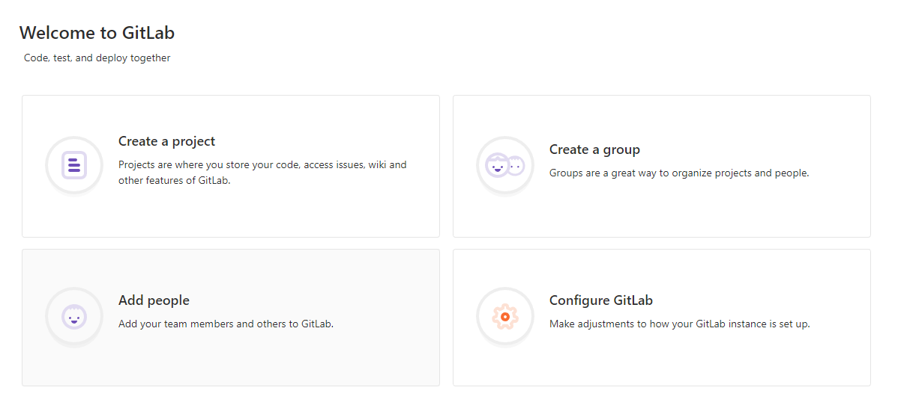

### 2.4 创建组织
首先我们需要创建一个组织，然后在这个组织下分别创建用户和项目，这样同组织的用户就可以使用该组织下的项目了。
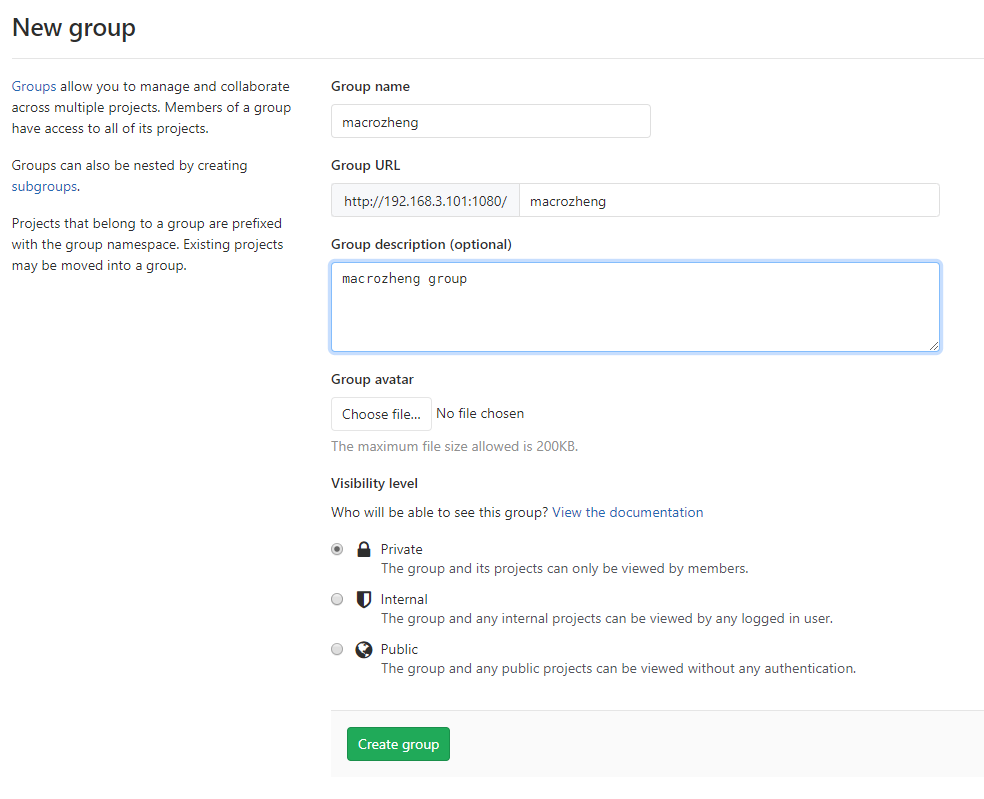

### 2.5 创建用户并修改密码

#### 2.5.1 找到添加用户的按钮

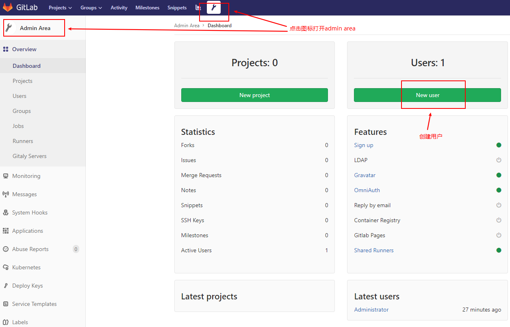

#### 2.5.2 输入用户名密码添加用户

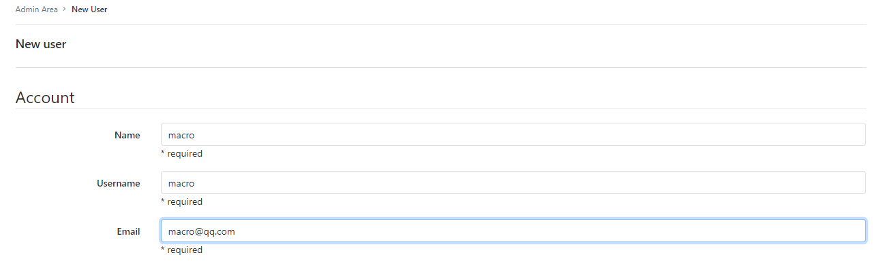

#### 2.5.3 在编辑界面中修改用户密码

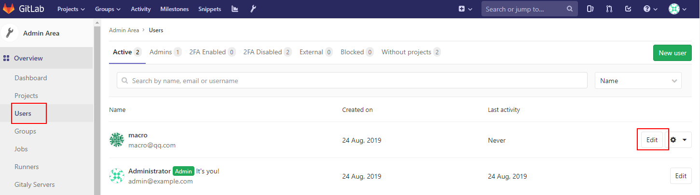

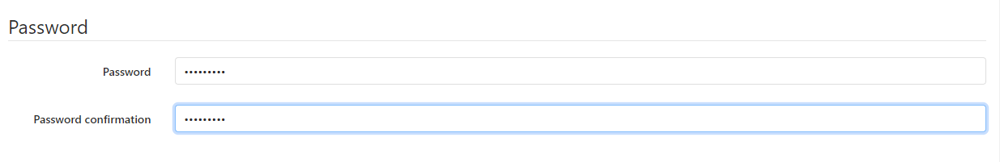

### 2.6 创建项目并添加README文件


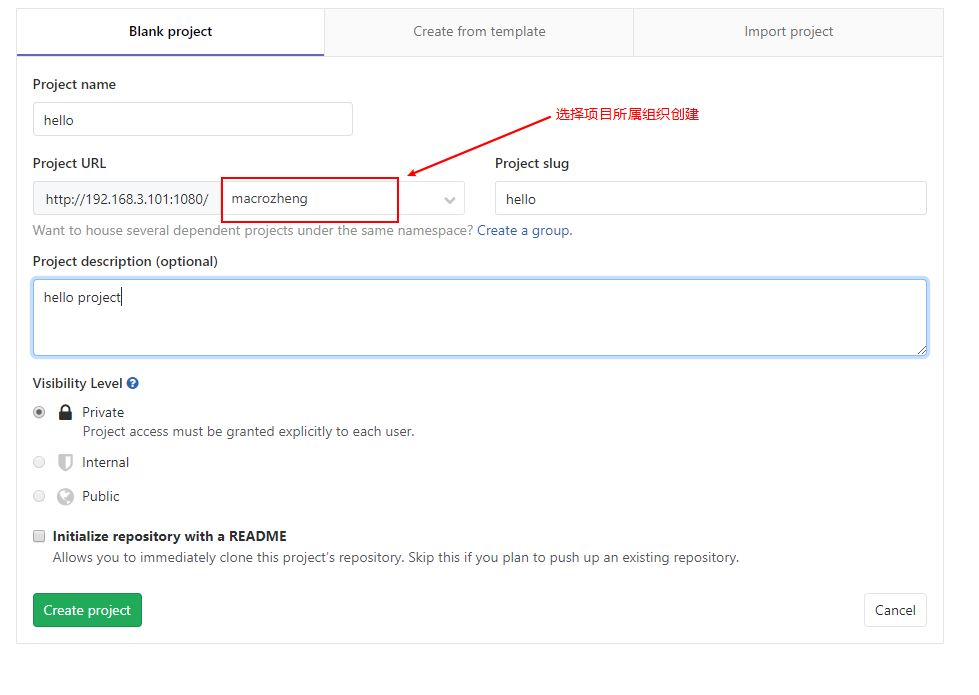

### 2.7 将用户分配到组织

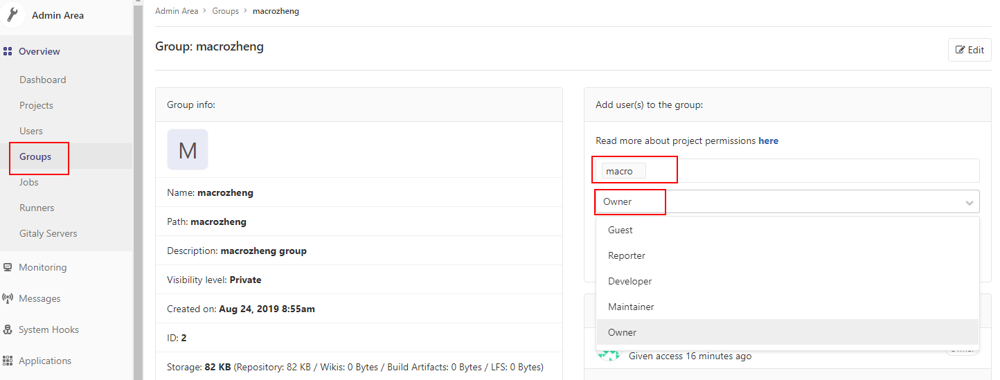

## 3. Git客户端安装及使用

### 3.1 下载Git客户端并安装

- 下载地址：https://github.com/git-for-windows/git/releases/download/v2.23.0.windows.1/Git-2.23.0-64-bit.exe
- 下载完成后，一路点击Next安装即可。

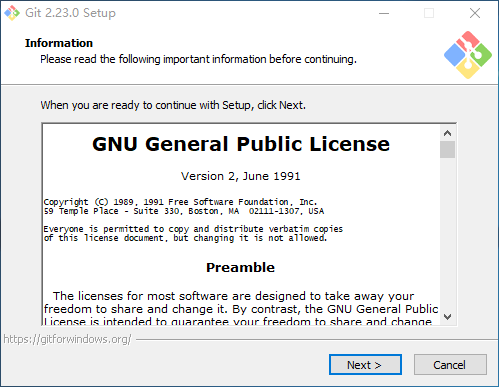

### 3.2 clone项目

- 找到项目clone的地址：

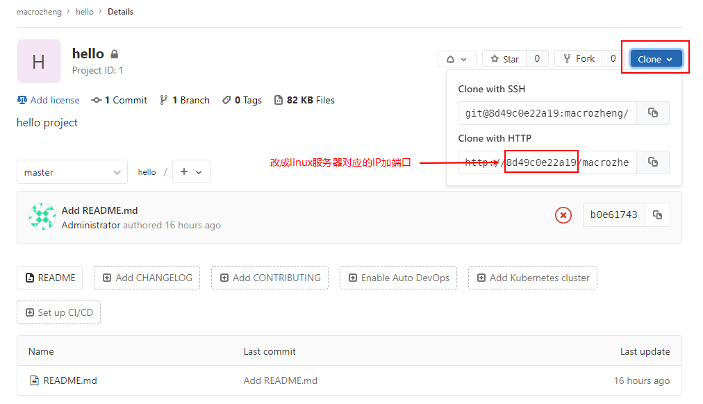
- 打开Git命令行工具：
  
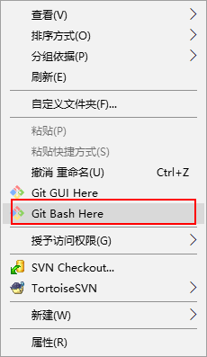
- 执行以下命令clone项目到本地：

```bash

git credential-manager uninstall # 清除掉缓存在git中的用户名和密码

git clone http://192.168.3.200:1080/xuzhihao/hello.git
```

### 3.3 提交代码

进入项目目录，修改一下README.md并提交：
```bash
# 进入项目工程目录
cd hello/
# 将当前修改的文件添加到暂存区
git add .
# 提交代码
git commit -m "first commit"
```

### 3.4 推送到远程仓库
```bash
git push
```
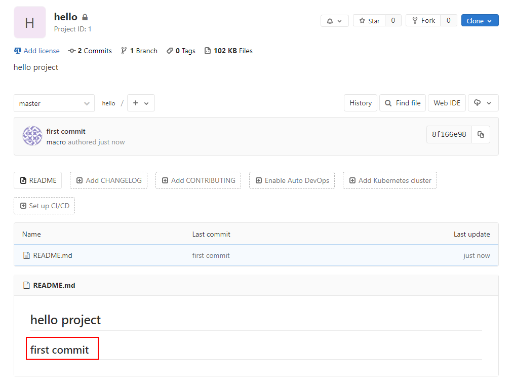

### 3.5 拉取远程仓库代码

- 在Gitlab上修改readme中的文件内容：

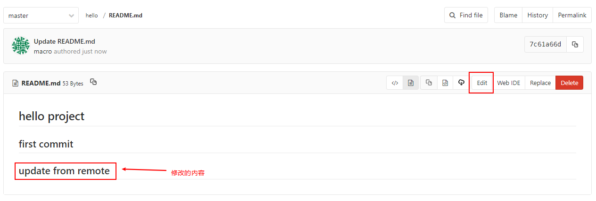
- 拉取代码：
 ```bash
git pull
```

### 3.6 本地创建并提交分支

```bash
# 切换并从当前分支创建一个dev分支
git checkout -b dev
# 将新创建的dev分支推送到远程仓库
git push origin dev
```
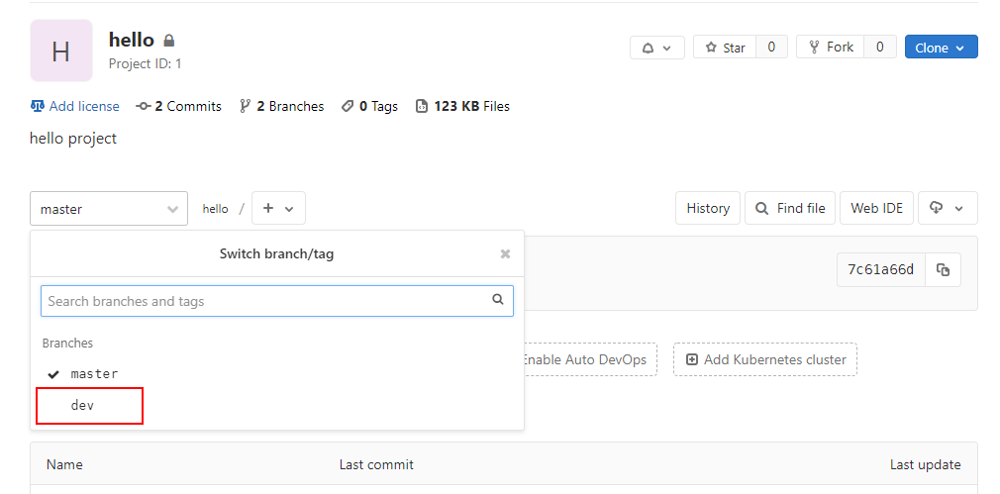

### 3.7 其他常用命令

1. Git全局设置
```bash
git config --global user.name "zhangsan"
git config --global user.email "xcg992224@163.com"
```

2. 创建仓库
```bash
git clone http://172.17.17.50:82/vjsp/web_demo.git
cd web_demo
touch README.md
git add README.md
git commit -m "add README"
```

3. 推送现有文件夹
```bash
cd existing_folder
git init
git remote add origin http://172.17.17.50:82/vjsp/web_demo.git
git add .
git commit -m "Initial commit"
```

4. 本地代码推送到仓库
```bash
cd existing_repo
git remote rename origin old-origin
git remote add origin http://172.17.17.50:82/vjsp/web_demo.git
```

5. 其他
```bash
git checkout dev # 切换到dev分支
git status # 查看本地仓库文件状况
git branch # 查看本地所有分支
git log # 查看提交记录
```