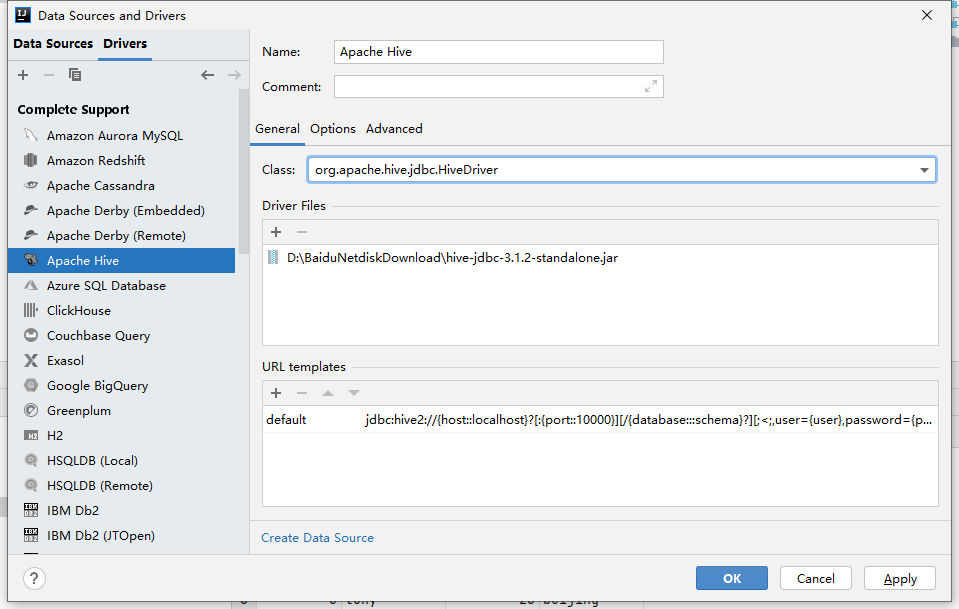
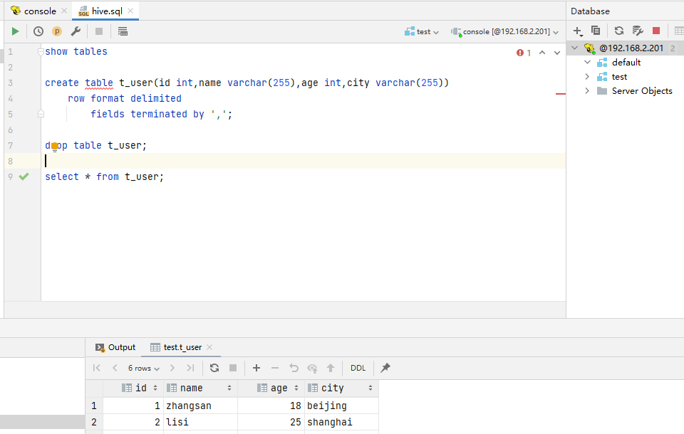

# Hive 3.1.2

Apache Hive是一款建立在Hadoop之上的开源数据仓库系统，可以将存储在Hadoop文件中的结构化、半结构化数据文件映射为一张数据库表，基于表提供了一种类似SQL的查询模型，称为Hive查询语言（HQL），用于访问和分析存储在Hadoop文件中的大型数据集。

Hive核心是将HQL转换为MapReduce程序，然后将程序提交到Hadoop群集执行。Hive由Facebook实现并开源。Hive不是分布式安装运行的软件，其分布式的特性主要借由Hadoop完成。包括分布式存储、分布式计算。hive 3.1.2对应hadoop3.1.4

## 1. 安装

### 1.1 准备工作

由于Apache Hive是一款基于Hadoop的数据仓库软件，通常部署运行在Linux系统之上。因此不管使用何种方式配置Hive Metastore，必须要先保证服务器的基础环境正常，Hadoop集群健康可用

集群环境需要保证：时间同步、防火墙关闭、主机Host映射、免密登录、JDK安装

#### 1.1.1 开启httpfs服务

1. hadoop修改core-site.xml

```bash
vi /opt/hadoop-3.1.4/etc/hadoop/core-site.xml
# 添加
<property>
    <name>hadoop.proxyuser.root.hosts</name>
    <value>*</value>
</property>
<property>
    <name>hadoop.proxyuser.root.groups</name>
    <value>*</value>
</property>
```

2. 分发重启服务

```bash
cd /opt/hadoop-3.1.4/etc/hadoop
scp core-site.xml node02:/opt/hadoop-3.1.4/etc/hadoop/
scp core-site.xml node03:/opt/hadoop-3.1.4/etc/hadoop/

cd /opt/hadoop-3.1.4/sbin
./stop-all.sh
./start-all.sh

hdfs --daemon start httpfs  # 启动httpfs 端口14000
```

### 1.2 内嵌模式

#### 1.2.1 上传解压

```bash
cd /opt/software
tar zxvf apache-hive-3.1.2-bin.tar.gz -C /opt
cd /opt
mv apache-hive-3.1.2-bin apache-hive-3.1.2
```

#### 1.2.2 解决版本冲突

```bash
cd /opt/apache-hive-3.1.2
rm -rf lib/guava-19.0.jar
cp /opt/hadoop-3.1.4/share/hadoop/common/lib/guava-27.0-jre.jar ./lib/
```

#### 1.2.3 修改配置

```bash
cd /opt/apache-hive-3.1.2/conf/
mv hive-env.sh.template hive-env.sh
vim hive-env.sh
# 编辑内容
export HADOOP_HOME=/opt/hadoop-3.1.4
export HIVE_CONF_DIR=/opt/apache-hive-3.1.2/conf
export HIVE_AUX_JARS_PATH=/opt/apache-hive-3.1.2/lib
```

#### 1.2.4 初始化metadata

```bash
cd /opt/apache-hive-3.1.2
bin/schematool -dbType derby -initSchema
```

#### 1.2.5 启动hive服务

```bash
cd /opt/apache-hive-3.1.2
bin/hive
```

#### 1.2.6 客户端测试

```sql
show databases;
create database test;
show tables;
```

### 1.3 本地模式

#### 1.3.1 安装MySQL

[MySQL 5.7.29](devops/database/mysql?id=_11-单机)

#### 1.3.2 上传解压

```bash
cd /opt/software
tar zxvf apache-hive-3.1.2-bin.tar.gz -C /opt
cd /opt
mv apache-hive-3.1.2-bin apache-hive-3.1.2
```

#### 1.3.3 解决版本冲突

```bash
cd /opt/apache-hive-3.1.2
rm -rf lib/guava-19.0.jar
cp /opt/hadoop-3.1.4/share/hadoop/common/lib/guava-27.0-jre.jar ./lib/

# mysql驱动拷贝到hive安装包lib/文件下
cp /opt/software/mysql/mysql-connector-java-5.1.32.jar ./lib/
```

#### 1.3.4 修改配置

1. 设置hive环境变量

```bash
cd /opt/apache-hive-3.1.2/conf/
mv hive-env.sh.template hive-env.sh
vim hive-env.sh
# 编辑内容
export HADOOP_HOME=/opt/hadoop-3.1.4
export HIVE_CONF_DIR=/opt/apache-hive-3.1.2/conf
export HIVE_AUX_JARS_PATH=/opt/apache-hive-3.1.2/lib
```

2. 新增hive-site.xml配置mysql

```bash
cd /opt/apache-hive-3.1.2/conf/
vim hive-site.xml

# 插入
<configuration>
    <!-- 存储元数据mysql相关配置 -->
    <property>
        <name>javax.jdo.option.ConnectionURL</name>
        <value> jdbc:mysql://node01:3306/hive?createDatabaseIfNotExist=true&amp;useSSL=false&amp;useUnicode=true&amp;characterEncoding=UTF-8</value>
    </property>

    <property>
        <name>javax.jdo.option.ConnectionDriverName</name>
        <value>com.mysql.jdbc.Driver</value>
    </property>

    <property>
        <name>javax.jdo.option.ConnectionUserName</name>
        <value>root</value>
    </property>

    <property>
        <name>javax.jdo.option.ConnectionPassword</name>
        <value>hadoop</value>
    </property>

    <!-- 关闭元数据存储授权  -->
    <property>
        <name>hive.metastore.event.db.notification.api.auth</name>
        <value>false</value>
    </property>

    <!-- 关闭元数据存储版本的验证 -->
    <property>
        <name>hive.metastore.schema.verification</name>
        <value>false</value>
    </property>
</configuration>
```


#### 1.3.5 初始化metadata

```bash
cd /opt/apache-hive-3.1.2
bin/schematool -initSchema -dbType mysql -verbos
```

初始化成功会在mysql中创建74张表

#### 1.3.6 启动hive服务

```bash
cd /opt/apache-hive-3.1.2
bin/hive
```

#### 1.3.7 客户端测试

```sql
show databases;
create database test;
show tables;
```

### 1.4 远程模式

#### 1.4.1 上传解压

```bash
cd /opt/software
tar zxvf apache-hive-3.1.2-bin.tar.gz -C /opt
cd /opt
mv apache-hive-3.1.2-bin apache-hive-3.1.2
```

#### 1.4.2 解决版本冲突

```bash
cd /opt/apache-hive-3.1.2
rm -rf lib/guava-19.0.jar
cp /opt/hadoop-3.1.4/share/hadoop/common/lib/guava-27.0-jre.jar ./lib/

# mysql驱动拷贝到hive安装包lib/文件下
cp /opt/software/mysql/mysql-connector-java-5.1.32.jar ./lib/
```

#### 1.4.3 修改配置

1. 设置hive环境变量

```bash
cd /opt/apache-hive-3.1.2/conf/
mv hive-env.sh.template hive-env.sh
vim hive-env.sh
# 编辑内容
export HADOOP_HOME=/opt/hadoop-3.1.4
export HIVE_CONF_DIR=/opt/apache-hive-3.1.2/conf
export HIVE_AUX_JARS_PATH=/opt/apache-hive-3.1.2/lib
```

2. 新增hive-site.xml配置mysql

```bash
cd /opt/apache-hive-3.1.2/conf/
vim hive-site.xml

# 插入
<configuration>
    <!-- 存储元数据mysql相关配置 -->
    <property>
        <name>javax.jdo.option.ConnectionURL</name>
        <value> jdbc:mysql://node01:3306/hive?createDatabaseIfNotExist=true&amp;useSSL=false&amp;useUnicode=true&amp;characterEncoding=UTF-8</value>
    </property>

    <property>
        <name>javax.jdo.option.ConnectionDriverName</name>
        <value>com.mysql.jdbc.Driver</value>
    </property>

    <property>
        <name>javax.jdo.option.ConnectionUserName</name>
        <value>root</value>
    </property>

    <property>
        <name>javax.jdo.option.ConnectionPassword</name>
        <value>hadoop</value>
    </property>

    <!-- H2S运行绑定host -->
    <property>
        <name>hive.server2.thrift.bind.host</name>
        <value>node01</value>
    </property>

    <!-- 远程模式部署metastore 服务地址 -->
    <property>
        <name>hive.metastore.uris</name>
        <value>thrift://node01:9083</value>
    </property>

    <!-- 关闭元数据存储授权  -->
    <property>
        <name>hive.metastore.event.db.notification.api.auth</name>
        <value>false</value>
    </property>

    <!-- 关闭元数据存储版本的验证 -->
    <property>
        <name>hive.metastore.schema.verification</name>
        <value>false</value>
    </property>
</configuration>
```


#### 1.4.4 初始化metadata

```bash
cd /opt/apache-hive-3.1.2
bin/schematool -initSchema -dbType mysql -verbos
```

初始化成功会在mysql中创建74张表

#### 1.4.5 启动服务

1. 启动metastore

```bash
/opt/apache-hive-3.1.2/bin/hive --service metastore             # 前台启动
/opt/apache-hive-3.1.2/bin/hive --service metastore --hiveconf hive.root.logger=DEBUG,console   # 前台启动开启debug日志
nohup /opt/apache-hive-3.1.2/bin/hive --service metastore &     # 后台启动
```

2. 启动hiveserver2

```bash
nohup /opt/apache-hive-3.1.2/bin/hive --service hiveserver2  & 
```

## 2. 客户端

### 2.1 beeline

#### 2.1.1 上传解压

```bash
cd /opt/software
tar zxvf apache-hive-3.1.2-bin.tar.gz -C /opt
cd /opt
mv apache-hive-3.1.2-bin apache-hive-3.1.2
```

#### 2.2.2 解决版本冲突

```bash
cd /opt/apache-hive-3.1.2
rm -rf lib/guava-19.0.jar
cp /opt/hadoop-3.1.4/share/hadoop/common/lib/guava-27.0-jre.jar ./lib/
```

#### 2.2.3 修改配置

1. 设置hive环境变量

```bash
cd /opt/apache-hive-3.1.2/conf/
mv hive-env.sh.template hive-env.sh
vim hive-env.sh
# 编辑内容
export HADOOP_HOME=/opt/hadoop-3.1.4
export HIVE_CONF_DIR=/opt/apache-hive-3.1.2/conf
export HIVE_AUX_JARS_PATH=/opt/apache-hive-3.1.2/lib
```

2. 新增hive-site.xml配置mysql

```bash
cd /opt/apache-hive-3.1.2/conf/
vim hive-site.xml

# 插入
<configuration>
    <property>
        <name>hive.metastore.uris</name>
        <value>thrift://node01:9083</value>
    </property>
</configuration>
```

#### 2.2.4 测试

```bash
/opt/apache-hive-3.1.2/bin/beeline
! connect jdbc:hive2://node01:10000 # 户名root 密码为空
```

```sql
show databases;
create database test;
use test;
show tables;
create table t_student(id int,name varchar(255));
insert into table t_student values(1,"zhangsan");
select * from t_student;
```

MR验证：http://192.168.2.201:8088/cluster

### 2.2 IDEA

添加插件


设置连接


设置驱动



验证数据



## 3. DDL

### 3.1 表操作

完整语法树

```sql
CREATE [TEMPORARY] [EXTERNAL] TABLE [IF NOT EXISTS] [db_name.]table_name
[(col_name data_type [COMMENT col_comment], ... ]
[COMMENT table_comment]
[PARTITIONED BY (col_name data_type [COMMENT col_comment], ...)]
[CLUSTERED BY (col_name, col_name, ...) [SORTED BY (col_name [ASC|DESC], ...)] INTO num_buckets BUCKETS]
[ROW FORMAT DELIMITED|SERDE serde_name WITH SERDEPROPERTIES (property_name=property_value,...)]
[STORED AS file_format]
[LOCATION hdfs_path]
[TBLPROPERTIES (property_name=property_value, ...)];
```

#### 3.1.1 结构化数据

1. 创建表结构

```sql
create table t_user(id int,name varchar(255),age int,city varchar(255))
row format delimited
fields terminated by ',';
```

2. 上传文件

```txt
1,zhangsan,18,beijing
2,lisi,25,shanghai
3,allen,30,shanghai
4,woon,15,nanjing
5,james,45,hangzhou
6,tony,26,beijing
```

```bash
cd /hivedata
vi user.txt

hadoop fs -put user.txt /user/hive/warehouse/test.db/t_user
hadoop fs -ls /user/hive/warehouse/test.db/t_user
```

3. 验证

```bash
select * from t_user;
```

#### 3.1.2 复杂数据表

1. 创建表结构

```sql
create database honor_of_kings;
use honor_of_kings;

create table t_hot_hero_skin_price(
    id int,
    name string,
    win_rate int,
    skin_price map<string,int>
)
row format delimited
fields terminated by ','            --字段之间分隔符
collection items terminated by '-'  --集合元素之间分隔符
map keys terminated by ':' ;        --集合元素kv之间分隔符;


```

2. 上传文件

```txt
1,孙悟空,53,西部大镖客:288-大圣娶亲:888-全息碎片:0-至尊宝:888-地狱火:1688
2,鲁班七号,54,木偶奇遇记:288-福禄兄弟:288-黑桃队长:60-电玩小子:2288-星空梦想:0
3,后裔,53,精灵王:288-阿尔法小队:588-辉光之辰:888-黄金射手座:1688-如梦令:1314
4,铠,52,龙域领主:288-曙光守护者:1776
5,韩信,52,飞衡:1788-逐梦之影:888-白龙吟:1188-教廷特使:0-街头霸王:888
```

字段：id、name(英雄名称)、win_rate(胜率)、skin_price(皮肤及价格)

```bash
cd /hivedata
vi hot_hero_skin_price.txt

hadoop fs -put hot_hero_skin_price.txt /user/hive/warehouse/honor_of_kings.db/t_hot_hero_skin_price
```

3. 查询

```sql
select * from t_hot_hero_skin_price
```