# Jenkins-2.332

## 1. Jenkins安装和持续集成环境配置

### 1.1 Gitlab安装

[Gitlab](devops/deploy/gitlab)

### 1.2 Jenkins安装

- 下载：https://mirrors.tuna.tsinghua.edu.cn/jenkins/redhat/jenkins-2.332-1.1.noarch.rpm

```bash
yum install java-1.8.0-openjdk* -y  # jdk:/usr/lib/jvm
yum  -y install epel-release
yum -y install daemonize

rpm -qa |grep jenkins
rpm -e --nodeps jenkins-2.332-1.1.noarch
rpm -ivh jenkins-2.332-1.1.noarch.rpm
```

- 修改Jenkins配置

```bash
vi /etc/sysconfig/jenkins
JENKINS_USER="root"
JENKINS_PORT="8888"

firewall-cmd --zone=public --add-port=8888/tcp --permanent
firewall-cmd --reload
systemctl daemon-reload
systemctl start jenkins
```

?>访问地址：http://192.168.3.200:8888/

- 跳过插件

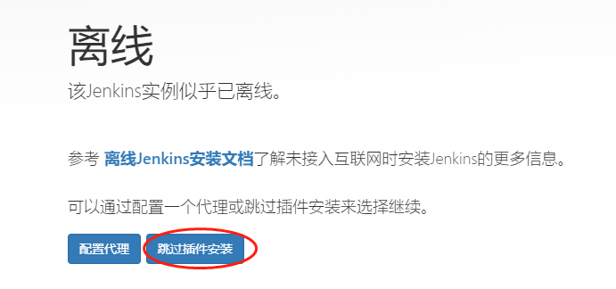

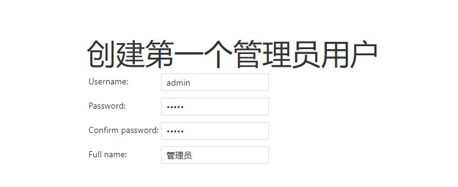


### 1.3 Jenkins插件管理

1. 修改插件源

Manage Plugins点击Advanced，首先把Update Site改为`http://updates.jenkins-zh.cn/update-center.json`来解除https校验


然后点击`available`待全部载入完毕

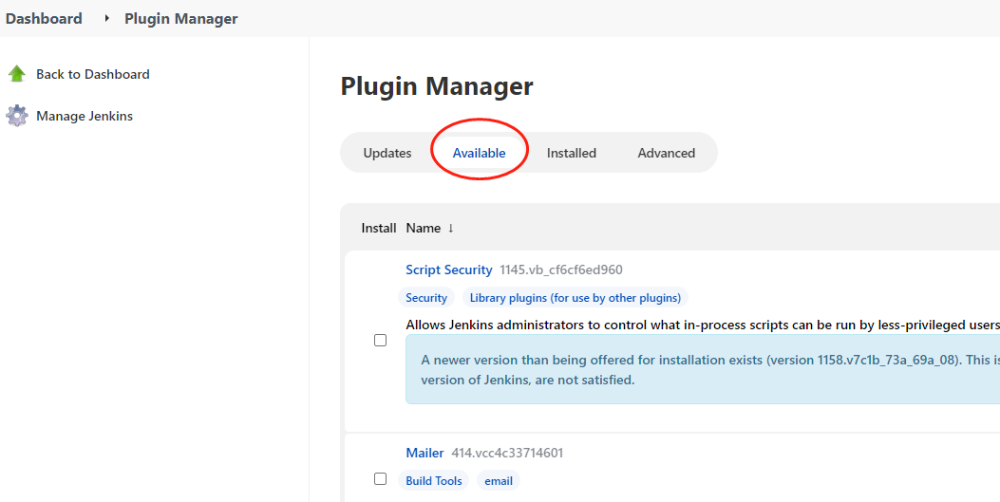

更换清华大学源
```bash
https://mirrors.tuna.tsinghua.edu.cn/jenkins/updates/update-center.json
```


修改插件下载地址

```bash
cd /var/lib/jenkins/updates
sed -i 's/http:\/\/updates.jenkinsci.org\/download/https:\/\/mirrors.tuna.tsinghua.edu.cn\/jenkins/g' default.json
sed -i 's/http:\/\/www.google.com/https:\/\/www.baidu.com/g' default.json
```

?>重启服务：http://192.168.3.200:8888/restart


2. 汉化插件


插件下载错误，需要下载skip-certificate-check，用于ssl无法识别问题以及插件安装超时问题，可以到国内清华大学开源软件镜像站的插件中心
https://mirrors.tuna.tsinghua.edu.cn/jenkins/plugins/skip-certificate-check
下载后直接放在你的Jenkins的plugins目录下即可，需要重启两次完成加载

### 1.4 Jenkins用户权限管理

#### 1.4.1 忘记密码


1. 修改密码
   
编辑config.xml文件，替换passwordHash行的内容123456

```bash
vim /var/lib/jenkins/users/admin_1679382529066310837/config.xml
<passwordHash>#jbcrypt:$2a$10$MiIVR0rr/UhQBqT.bBq0QehTiQVqgNpUGyWW2nJObaVAM/2xSQdSq</passwordHash>
systemctl restart jenkins
```

2. 关闭安全功能

```bash
vim /var/lib/jenkins/config.xml
<useSecurity>false</useSecurity>
systemctl restart jenkins
```

#### 1.4.1 权限设置

安装Role-based Authorization Strategy插件，开启权限全局安全配置，授权策略切换为"Role-Based Strategy"，创建角色

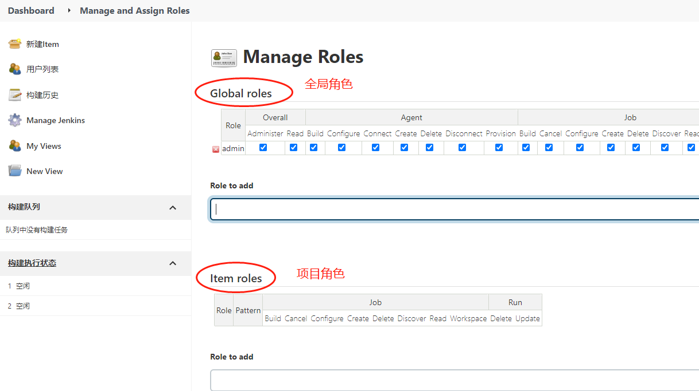

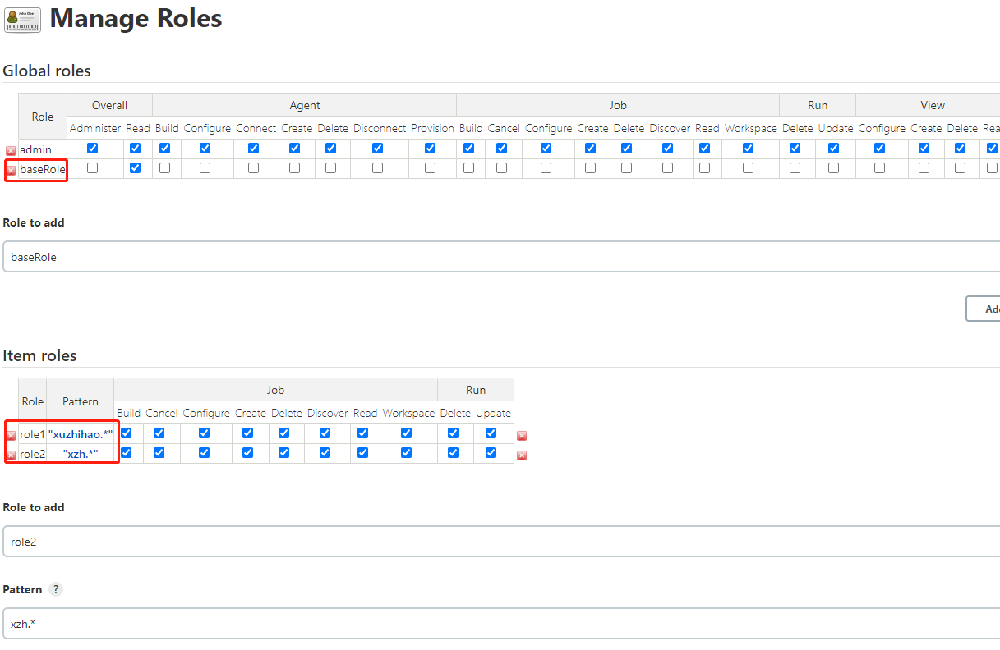


### 1.5 Jenkins凭证管理

#### 1.5.1 安装Credentials Binding插件

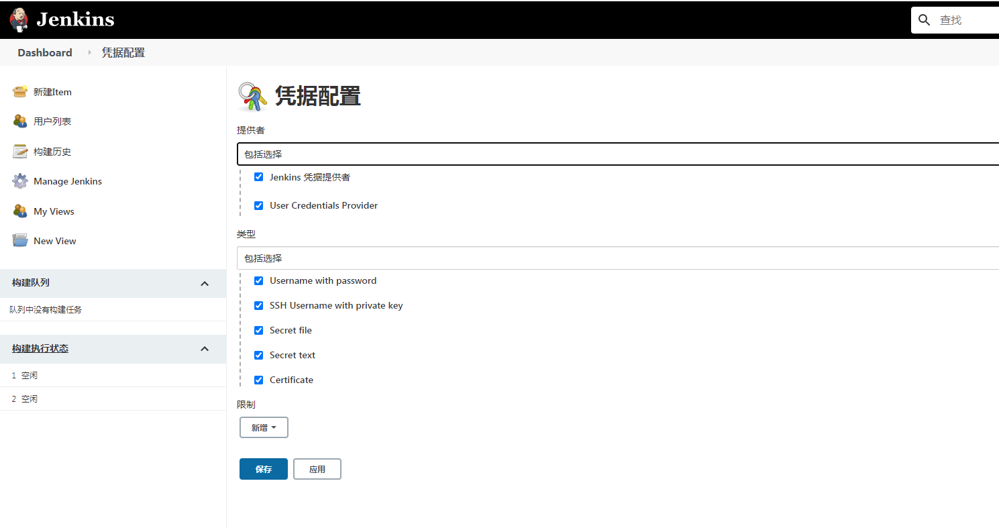

#### 1.5.2 安装Git插件和Git工具

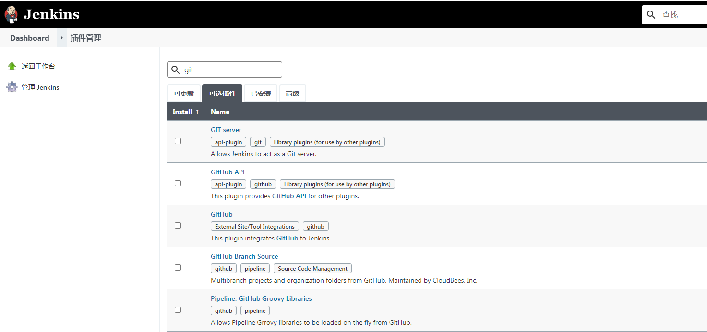

```bash
yum install git -y
```

#### 1.5.3 用户密码类型凭证

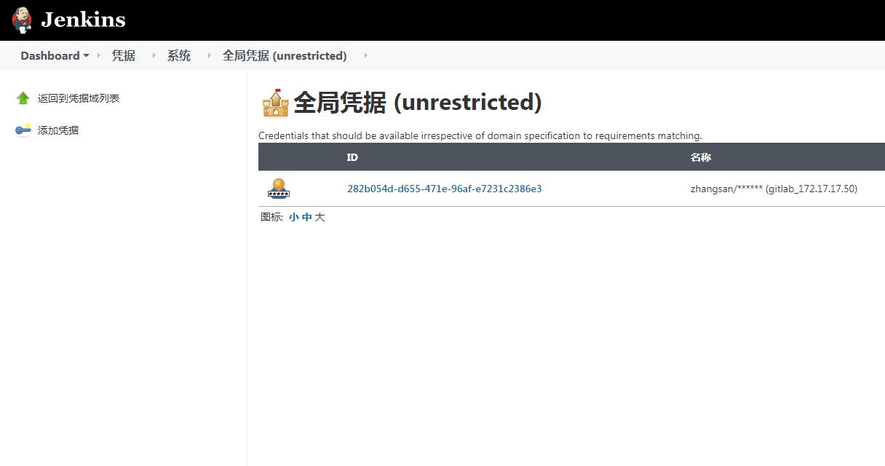


代码的构建目录
> /var/lib/jenkins/workspace

#### 1.5.4 SSH密钥类型凭证

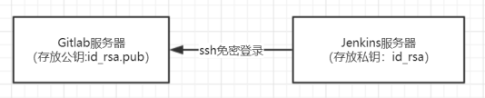

1. gitlab服务器使用root用户生成公钥和私钥在/root/.ssh/目录

> ssh-keygen -t rsa

id_rsa：私钥文件

id_rsa.pub：公钥文件

2. 把生成的公钥放在Gitlab中

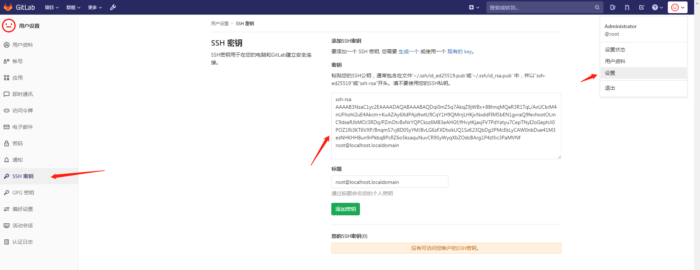

3. 在Jenkins中添加凭证，配置私钥

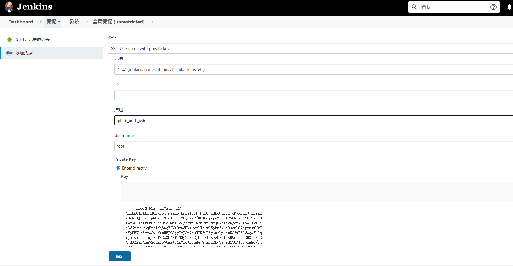

### 1.6 Maven安装和配置

#### 1.6.1 Maven安装

```bash
tar -xzf apache-maven-3.6.2-bin.tar.gz #解压
mkdir -p /opt/maven #创建目录
mv apache-maven-3.6.2/* /opt/maven #移动文件

vi /etc/profile
export JAVA_HOME=/usr/lib/jvm/java-1.8.0-openjdk
export MAVEN_HOME=/opt/maven
export PATH=$PATH:$JAVA_HOME/bin:$MAVEN_HOME/bin

source /etc/profile #配置生效
mvn -v #查找Maven版本
```

#### 1.6.2 全局工具配置关联

JDK配置
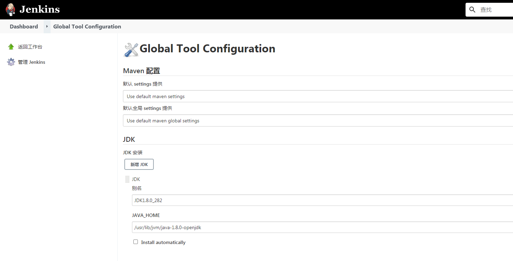

Maven配置
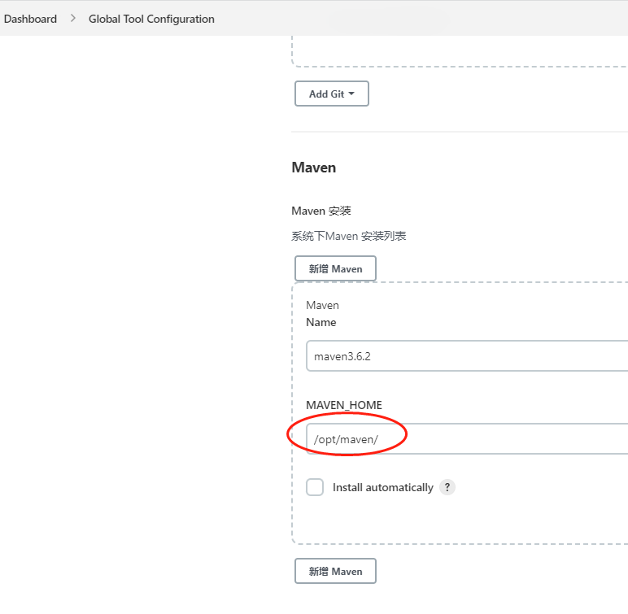

添加Jenkins全局变量
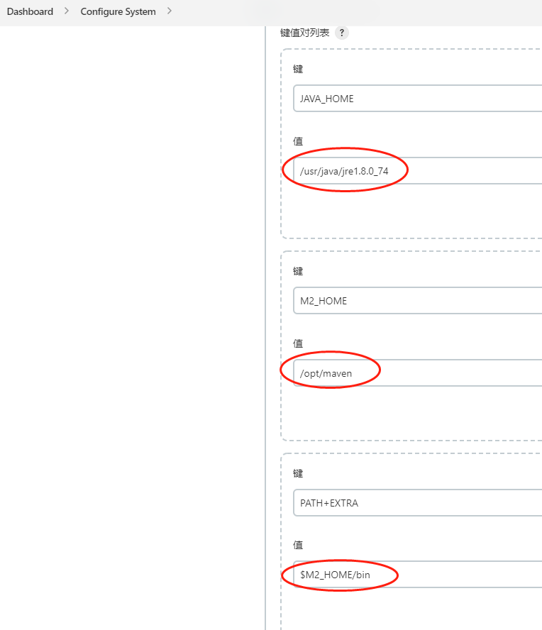

修改Maven的settings.xml

```bash
mkdir /root/repo #仓库目录
vi /opt/maven/conf/settings.xml
```

```xml
<localRepository>/root/repo/</localRepository>

<mirrors>
    <mirror>
            <id>nexus-aliyun</id>
            <mirrorOf>*,!jeecg,!jeecg-snapshots</mirrorOf>
            <name>Nexus aliyun</name>
            <url>http://maven.aliyun.com/nexus/content/groups/public</url>
    </mirror>
</mirrors>
```

测试Maven是否配置成功

> mvn clean package

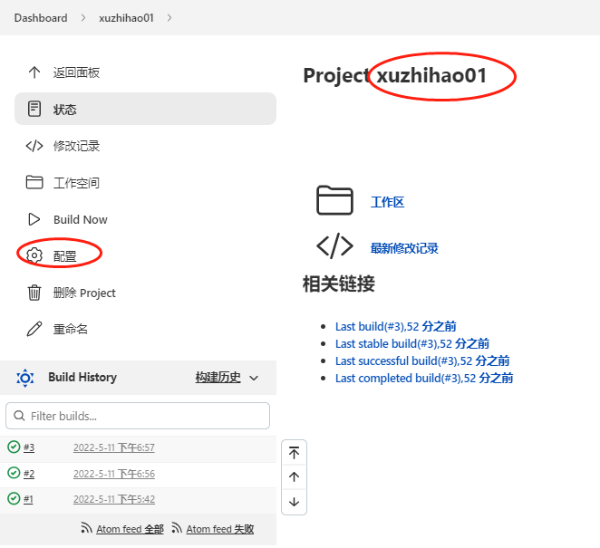


### 1.7 Tomcat安装和配置

#### 1.7.1 安装Tomcat8.5.47

```bash
yum install java-1.8.0-openjdk* -y #安装JDK
tar -xzf apache-tomcat-8.5.47.tar.gz #解压
mkdir -p /opt/tomcat 创建目录
mv /root/apache-tomcat-8.5.47/* /opt/tomcat #移动
/opt/tomcat/bin/startup.sh #启动
```

#### 1.7.2 配置Tomcat用户角色权限

> vi /opt/tomcat/conf/tomcat-users.xml

```xml
<tomcat-users>
    <role rolename="tomcat"/>
    <role rolename="role1"/>
    <role rolename="manager-script"/>
    <role rolename="manager-gui"/>
    <role rolename="manager-status"/>
    <role rolename="admin-gui"/>
    <role rolename="admin-script"/>
    <user username="tomcat" password="tomcat" roles="manager-gui,manager-script,tomcat,admin-gui,admin-script"/>
</tomcat-users>
```

> vi /opt/tomcat/webapps/manager/META-INF/context.xml

掉注释
```xml
<!--
<Valve className="org.apache.catalina.valves.RemoteAddrValve"
allow="127\.\d+\.\d+\.\d+|::1|0:0:0:0:0:0:0:1" />
-->
```

## 2. Jenkins构建Maven项目

### 2.1 自由风格软件项目（FreeStyle Project）

> 拉取代码->编译->打包->部署


```bash
echo "开始编译和打包"
mvn clean package
echo "编译和打包结束"
```

安装 Deploy to container插件

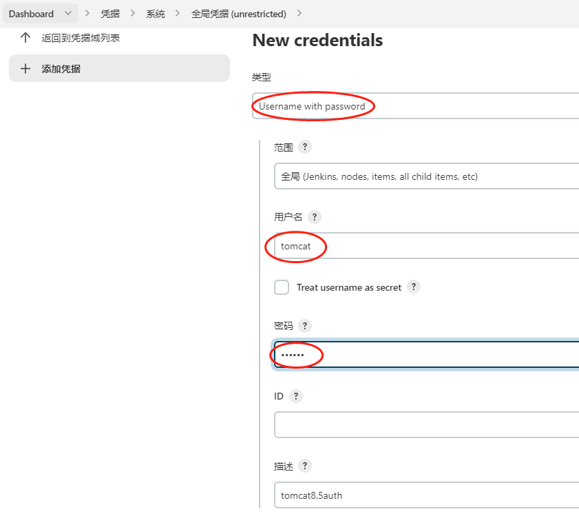

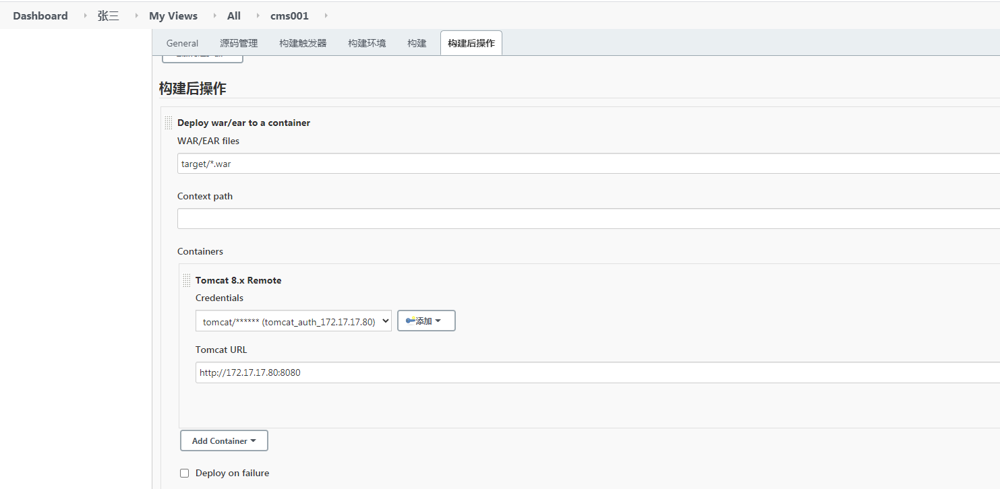

### 2.2 Maven项目（Maven Project）

安装Maven Integration插件

拉取代码和远程部署的过程和自由风格项目一样，只是"构建"部分不同

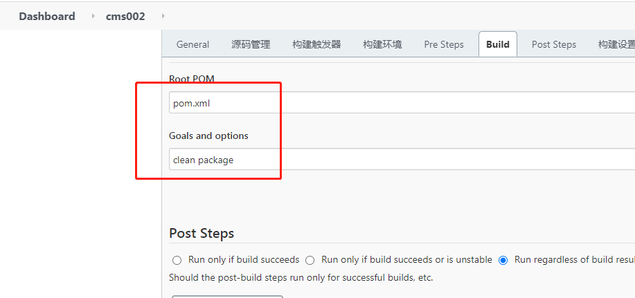


### 2.3 流水线项目（Pipeline Project）

- Pipeline 脚本是由 Groovy 语言实现的
- Pipeline 支持两种语法：Declarative(声明式)和 Scripted Pipeline(脚本式)语法
- Pipeline 也有两种创建方法：可以直接在 Jenkins 的 Web UI 界面中输入脚本；也可以通过创建一个 Jenkinsfile 脚本文件放入项目源码库中（一般我们都推荐在 Jenkins 中直接从源代码控制(SCM)中直接载入 Jenkinsfile Pipeline 这种方法）。

#### 2.3.1 Declarative声明式-Pipeline

安装 Pipeline 插件

> 流水线->选择HelloWorld模板

```shell
pipeline {
   agent any

   stages {
      stage('代码拉取') {
         steps {
            checkout([$class: 'GitSCM', branches: [[name: '*/master']], extensions: [], userRemoteConfigs: [[credentialsId: '282b054d-d655-471e-96af-e7231c2386e3', url: 'git@172.17.17.50:vjsp/web_demo.git']]])
         }
      }
      stage('编译构建') {
         steps {
            sh 'mvn clean package'
         }
      }
      stage('项目部署') {
         steps {
            deploy adapters: [tomcat8(credentialsId: 'f303f062-1ef0-4a1c-969b-972bb57244a2', path: '', url: 'http://172.17.17.80:8080')], contextPath: '/cms003_p01', war: 'target/*.war'
         }
      }
   }
}
```

stages：代表整个流水线的所有执行阶段。通常stages只有1个，里面包含多个stage

stage：代表流水线中的某个阶段，可能出现n个。一般分为拉取代码，编译构建，部署等阶段。

steps：代表一个阶段内需要执行的逻辑。steps里面是shell脚本，git拉取代码，ssh远程发布等任意内容。


#### 2.3.2 Scripted Pipeline脚本式-Pipeline

```shell
node {
    def mvnHome
    stage('拉取代码') { // for display purposes
        echo '拉取代码'
    }
    stage('编译构建') {
        echo '编译构建'
    }
    stage('项目部署') {
        echo '项目部署'
    }
}
```
Node：节点，一个 Node 就是一个 Jenkins 节点，Master 或者 Agent，是执行 Step 的具体运行环境，后续讲到Jenkins的Master-Slave架构的时候用到。

Stage：阶段，一个 Pipeline 可以划分为若干个 Stage，每个 Stage 代表一组操作，比如：Build、Test、Deploy，Stage 是一个逻辑分组的概念。

Step：步骤，Step 是最基本的操作单元，可以是打印一句话，也可以是构建一个 Docker 镜像，由各类 Jenkins 插件提供，比如命令：sh ‘make’，就相当于我们平时 shell 终端中执行 make 命令
一样。


#### 2.3.3 Pipeline Script from SCM

在项目根目录建立Jenkinsfile文件，把内容复制到该文件中并上传到Gitlab

```shell
pipeline {
   agent any

   stages {
      stage('代码拉取') {
         steps {
            checkout([$class: 'GitSCM', branches: [[name: '*/master']], extensions: [], userRemoteConfigs: [[credentialsId: '282b054d-d655-471e-96af-e7231c2386e3', url: 'git@172.17.17.50:vjsp/web_demo.git']]])
         }
      }
	  stage('code checking') {
         steps {
            script {
                 //引入SonarQubeScanner工具
                scannerHome = tool 'sonarqube-scanner'
            }
            //引入SonarQube的服务器环境
            withSonarQubeEnv('sonarqube6.7.4') {
                sh "${scannerHome}/bin/sonar-scanner"
            }
         }
      }  
      stage('编译构建') {
         steps {
            sh 'mvn clean package'
         }
      }
      stage('项目部署') {
         steps {
            deploy adapters: [tomcat8(credentialsId: 'f303f062-1ef0-4a1c-969b-972bb57244a2', path: '', url: 'http://172.17.17.80:8080')], contextPath: '/cms003S', war: 'target/*.war'
         }
      }
   }
   post {
         always {
            emailext(
               subject: '构建通知：${PROJECT_NAME} - Build # ${BUILD_NUMBER} - ${BUILD_STATUS}!',
               body: '${FILE,path="email.html"}',
               to: 'xcg992224@163.com'
            )
         }
   }
}
```

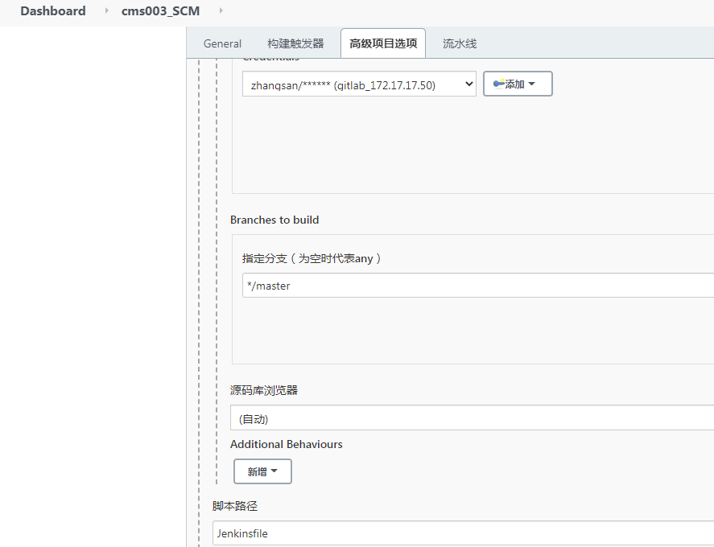


### 2.4 常用的构建触发器

#### 2.4.1 触发远程构建

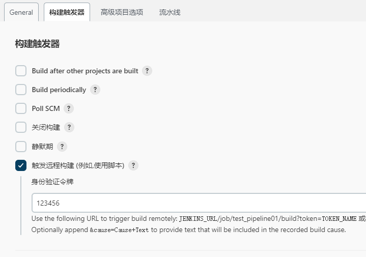

触发构建url：http://172.17.17.50:8888/job/cms003_SCM/build?token=xuzhihao


#### 2.4.2 其他工程构建后触发

#### 2.4.3 定时构建（Build periodically）

#### 2.4.4 轮询SCM（Poll SCM）

#### 2.4.5 Git hook自动触发构建(*)

利用Gitlab的webhook实现代码push到仓库，立即触发项目自动构建

安装插件：Gitlab Hook和GitLab


### 2.5 Jenkins的参数化构建

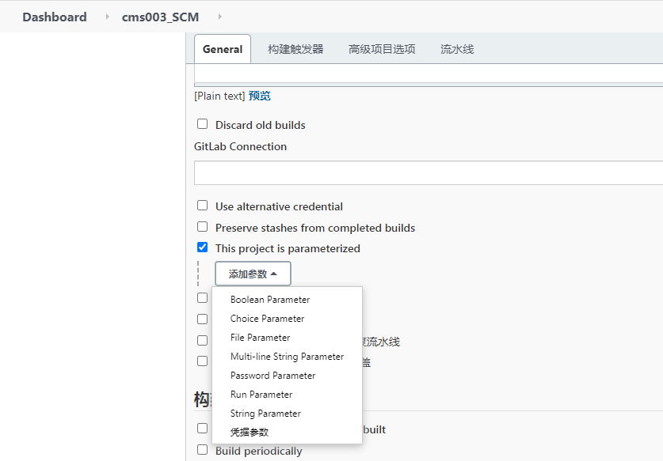

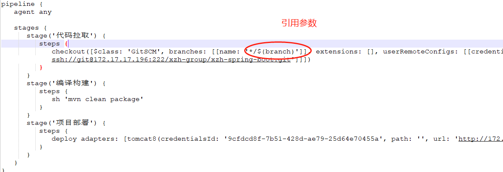

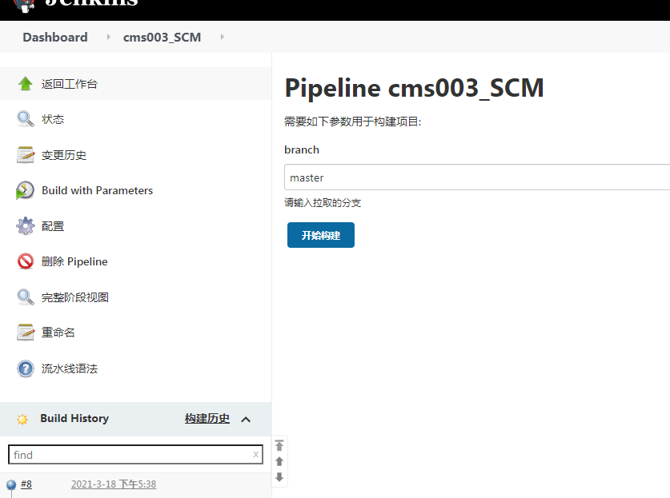


### 2.6 配置邮箱服务器发送构建结果

安装Email Extension Template插件

Jenkins设置邮箱相关参数

> Manage Jenkins->Configure System

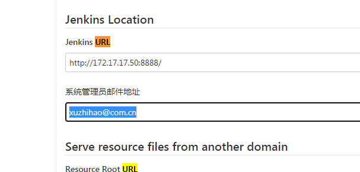

> 邮件相关全局参数参考列表系统设置->Extended E-mail Notification->Content Token Reference，点击旁边的?号

### 2.7 SonarQube代码审查

#### 2.7.1 安装SonarQube

解压sonar，并设置权限

```bash
unzip sonarqube-6.7.4.zip #解压
mkdir /opt/sonar #创建目录
mv sonarqube-6.7.4/* /opt/sonarqube-6.7.4 #移动文件
useradd sonar #创建sonar用户，必须sonar用于启动，否则报错
chown -R sonar. /opt/sonarqube-6.7.4 #更改sonar目录及文件权限
```

修改sonar配置文件

> vi /opt/sonarqube-6.7.4/conf/sonar.properties

```
sonar.jdbc.username=root 
sonar.jdbc.password=root
sonar.jdbc.url=jdbc:mysql://172.17.17.80:3306/sonar?useUnicode=true&characterEncoding=utf8&rewriteBatchedStatements=true&useConfigs=maxPerformance&useSSL=false
```

启动sonar

```bash
cd /opt/sonarqube-6.7.4
su sonar /opt/sonarqube-6.7.4/bin/linux-x86-64/sonar.sh start #启动
su sonar /opt/sonarqube-6.7.4/bin/linux-x86-64/sonar.sh status #查看状态
su sonar /opt/sonarqube-6.7.4/bin/linux-x86-64/sonar.sh stop #停止
tail -f logs/sonar.logs 查看日志
firewall-cmd --zone=public --add-port=9000/tcp --permanent
firewall-cmd --reload

```

默认账户：admin/admin

xuzhihao: 571ca3e519108b01b9c7cbc8f621c34e9edc7d64


#### 2.7.2 代码审查配置

安装SonarQube Scanner插件

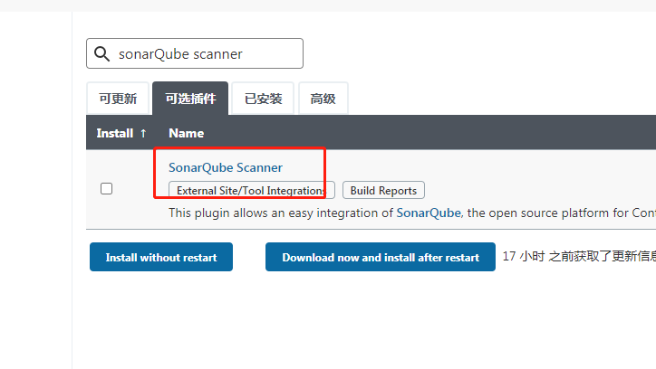

添加SonarQube凭证

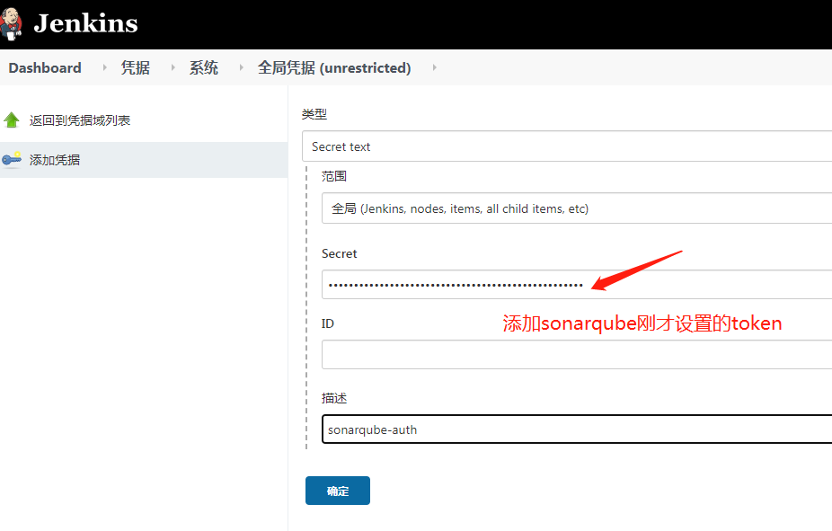

Jenkins进行SonarQube配置

> Manage Jenkins->Configure System->SonarQube servers

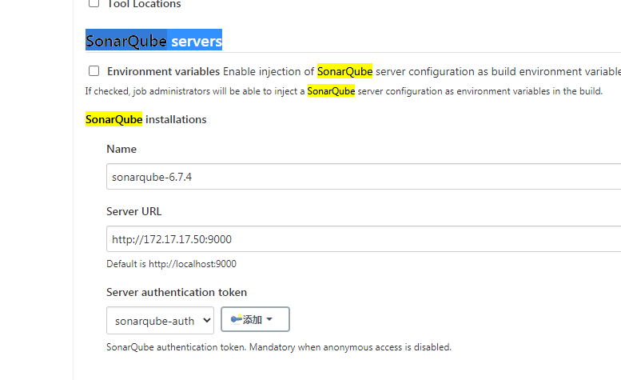

> Manage Jenkins->Global Tool Configuration

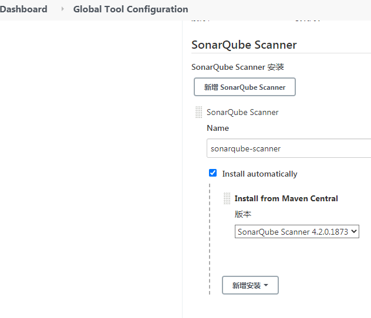

在项目添加SonaQube代码审查（非流水线项目）

```properties
sonar.projectKey=web_demo
sonar.projectName=web_demo
sonar.projectVersion=1.0-SNAPSHOT
sonar.sourceEncoding=UTF-8
sonar.sources=.
sonar.exclusions=**/test/**,**/target/**
sonar.java.source=1.8
sonar.java.target=1.8
sonar.login=admin
sonar.password=admin
sonar.java.binaries=target/classes
```

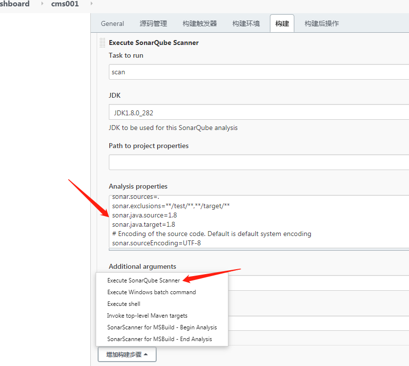

在项目添加SonaQube代码审查（流水线项目）`巨坑`

项目根目录中配置sonar-project.properties

```properties
sonar.projectKey=web_demo
sonar.projectName=web_demo
sonar.projectVersion=1.0-SNAPSHOT


sonar.sources=.
sonar.exclusions=**/test/**,**/target/**

sonar.java.source=1.8
sonar.java.target=1.8

sonar.sourceEncoding=UTF-8
sonar.java.binaries=target/classes

sonar.forceAuthentication=true
sonar.login=令牌令牌令牌令牌令牌令牌令牌令牌令牌令牌令牌令牌令牌令牌令牌令牌令牌令牌令牌令牌
sonar.password=
```

## 3. 微服务持续集成

### 3.1 docker安装

[Docker安装](linux/docker.md)

### 3.2 使用Dockerfile制作微服务镜像

[构建镜像](linux/docker.md?id=_4-dockerfile)

### 3.3 Harbor镜像仓库安装及使用

#### 3.3.1 Harbor安装

> wget https://github.com/goharbor/harbor/releases/download/v2.0.1/harbor-offline-installer-v2.0.1.tgz

```shell
tar xf harbor-offline-installer-v2.0.1.tgz
mkdir /opt/harbor
mv harbor/* /opt/harbor
cd /opt/harbor
# 复制配置文件
cp harbor.yml.tmpl harbor.yml
# 编辑
vi harbor.yml
```

```yml
#修改配置文件(如果不用https就注释掉https的几项，我是用的http就注释掉了https的，其他几项修改为自己的信息)
···
hostname: 192.168.3.200
···
# http related config
http:
  # port for http, default is 80. If https enabled, this port will redirect to https port
  port: 88
···
# https related config
#https:
  # https port for harbor, default is 443
  #port: 443
  # The path of cert and key files for nginx
  #certificate: /your/certificate/path
  #private_key: /your/private/key/path
····
harbor_admin_password: Harbor12345
···
data_volume: /data
···
```

安装

```shell
./install.sh 
docker-compose up -d #启动
docker-compose stop #停止
docker-compose restart #重新启动
```

默认账户密码：admin/Harbor12345

#### 3.3.2 在Harbor创建用户和项目

#### 3.3.3 把镜像上传到Harbor

```bash
docker tag eureka:v0.0.1 192.168.3.200:88/test/eureka:v0.0.1

docker push 192.168.3.200:88/test/eureka:v0.0.1

vi /etc/docker/daemon.json

{
"registry-mirrors": ["xxx.xxx.xxx.xxx"],
"insecure-registries": ["192.168.3.200:88"]
}

sudo systemctl daemon-reload
sudo systemctl restart docker 


docker login -u 用户名 -p 密码 192.168.3.200:88

```


#### 3.3.2 从Harbor下载镜像

```bash
vi /etc/docker/daemon.json

{
"registry-mirrors": ["xxx.xxx.xxx.xxx"],
"insecure-registries": ["192.168.3.200:88"]
}

docker login -u 用户名 -p 密码 192.168.3.200:88

docker pull 192.168.3.200:88/test/eureka:v0.0.1

```


### 3.4 拉取镜像发布应用

#### 3.4.1 安装 Publish Over SSH 插件

拷贝公钥到远程服务器

```bash
cd /root/.ssh/
ssh-keygen
ssh-copy-id 192.168.3.200
```
系统配置->添加远程服务器

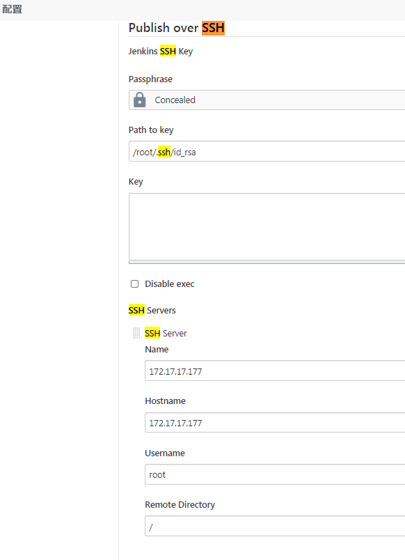


#### 3.4.2 Jenkinsfile构建脚本

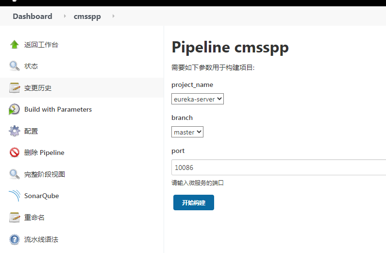

```
//git凭证ID
def git_auth = "282b054d-d655-471e-96af-e7231c2386e3"
//git的url地址
def git_url = "git@172.17.17.50:zhangsan/springcloud-platform.git"
//构建版本的名称
def tag = "latest"
//Harbor私服地址
def harbor_url = "172.17.17.80:88"
//Harbor的项目名称
def harbor_project_name = "test"
//Harbor的凭证
def harbor_auth = "17c792fd-30fc-4320-aebe-7646cfa09008"
//远程发布服务器名称
def sshPublisherName="172.17.17.177"

node {
   //获取当前选择的项目名称
   def selectedProjectNames = "${project_name}".split(",")
   
   //获取当前选择的服务器名称
   //def selectedServers = "${publish_server}".split(",")

   stage('拉取代码') {
      checkout([$class: 'GitSCM', branches: [[name: "*/${branch}"]], doGenerateSubmoduleConfigurations: false, extensions: [], submoduleCfg: [], userRemoteConfigs: [[credentialsId: "${git_auth}", url: "${git_url}"]]])
   }   
  
   stage('代码审查') {
		def scannerHome = tool 'sonarqube-scanner'
		withSonarQubeEnv('sonarqube6.7.4') {
			sh """
				cd ${project_name}
				${scannerHome}/bin/sonar-scanner
			"""
		}
	}
	
	stage('编译，构建镜像') {
		//定义镜像名称
		def imageName = "${project_name}:${tag}"
		
		//编译，安装公共工程
		//sh "mvn -f tensquare_common clean install"
		
		//编译，构建本地镜像
		sh "mvn -f ${project_name} clean package dockerfile:build"
		
		//给镜像打标签
		sh "docker tag ${imageName} ${harbor_url}/${harbor_project_name}/${imageName}"
		
		//登录Harbor，并上传镜像
		withCredentials([usernamePassword(credentialsId: "${harbor_auth}", passwordVariable: 'password', usernameVariable: 'username')]) {
			   //登录到Harbor
               sh "docker login -u ${username} -p ${password} ${harbor_url}"
               //镜像上传
               sh "docker push ${harbor_url}/${harbor_project_name}/${imageName}"
		}
		
		//删除本地镜像
		sh "docker rmi -f ${imageName}"
		sh "docker rmi -f ${harbor_url}/${harbor_project_name}/${imageName}"		
	}
	
	stage('远程发布') {
		sshPublisher(publishers: [sshPublisherDesc(configName: "${sshPublisherName}",transfers: [sshTransfer(cleanRemote: false, excludes: '', execCommand:"/opt/jenkins_shell/deploy.sh $harbor_url $harbor_project_name $project_name $tag $port", execTimeout: 120000, flatten: false, makeEmptyDirs: false,noDefaultExcludes: false, patternSeparator: '[, ]+', remoteDirectory: '',remoteDirectorySDF: false, removePrefix: '', sourceFiles: '')],usePromotionTimestamp: false, useWorkspaceInPromotion: false, verbose: false)])
	}
}
```

#### 3.4.3 编写deploy.sh部署脚本

上传[deploy.sh](/file/jenkins/deploy/deploy)文件到/opt/jenkins_shell目录下，且文件至少有执行权限！

> chmod +x deploy.sh

```sh
#! /bin/sh
#接收外部参数
harbor_url=$1
harbor_project_name=$2
project_name=$3
tag=$4
port=$5

imageName=$harbor_url/$harbor_project_name/$project_name:$tag

echo "$imageName"

#查询容器是否存在，存在则删除
containerId=`docker ps -a | grep -w ${project_name}:${tag}  | awk '{print $1}'`
if [ "$containerId" !=  "" ] ; then
    #停掉容器
    docker stop $containerId

    #删除容器
    docker rm $containerId
	
	echo "成功删除容器"
fi

#查询镜像是否存在，存在则删除
imageId=`docker images | grep -w $project_name  | awk '{print $3}'`

if [ "$imageId" !=  "" ] ; then
      
    #删除镜像
    docker rmi -f $imageId
	
	echo "成功删除镜像"
fi

# 登录Harbor
docker login -u username -p password $harbor_url

# 下载镜像
docker pull $imageName

# 启动容器
docker run -di -p $port:$port $imageName

echo "容器启动成功"

```


### 3.5 前端静态web网站

#### 3.5.1 安装Nginx服务器

[Nginx安装](/linux/linux?id=_10-nginx安装)

#### 3.5.2 安装NodeJS插件

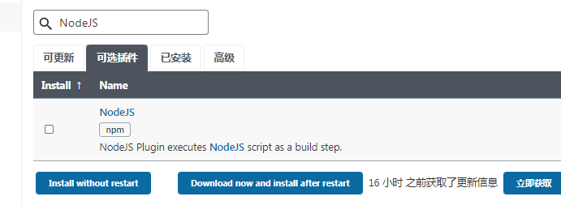

Manage Jenkins->Global Tool Configuration

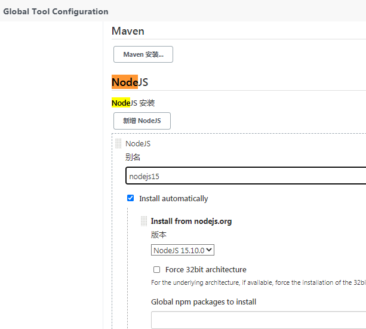


```
//gitlab的凭证
def git_auth = "282b054d-d655-471e-96af-e7231c2386e3"
//git的url地址
def git_url = "git@172.17.17.50:zhangsan/web.git"

node {
   stage('拉取代码') {
      checkout([$class: 'GitSCM', branches: [[name: '*/${branch}']],doGenerateSubmoduleConfigurations: false, extensions: [], submoduleCfg: [],
      userRemoteConfigs: [[credentialsId: "${git_auth}", url:"${git_url}"]]])
   }
   stage('打包，部署网站') {
      nodejs('nodejs12'){
         sh '''
            npm install
            npm run build
         '''
      }
      //=====以下为远程调用进行项目部署========
      sshPublisher(publishers: [sshPublisherDesc(configName: 'master_server',transfers: [sshTransfer(cleanRemote: false, excludes: '', execCommand: '',
      execTimeout: 120000, flatten: false, makeEmptyDirs: false, noDefaultExcludes:false, patternSeparator: '[, ]+', remoteDirectory: '/usr/share/nginx/html',
      remoteDirectorySDF: false, removePrefix: 'dist', sourceFiles: 'dist/**')],usePromotionTimestamp: false, useWorkspaceInPromotion: false, verbose: false)])
   }
}
```

## 4. 微服务持续集成优化

上面部署方案存在的问题：

1. 一次只能选择一个微服务部署
2. 只有一台生产者部署服务器
3. 每个微服务只有一个实例，容错率低

优化方案：

1. 在一个Jenkins工程中可以选择多个微服务同时发布
2. 在一个Jenkins工程中可以选择多台生产服务器同时部署
3. 每个微服务都是以集群高可用形式部署


Extended Choice Parameter插件安装

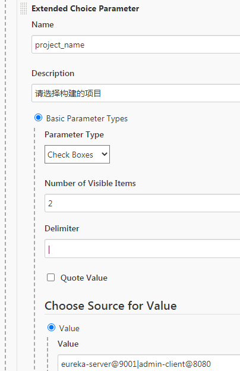

```
//git凭证ID
def git_auth = "282b054d-d655-471e-96af-e7231c2386e3"
//git的url地址
def git_url = "git@172.17.17.50:zhangsan/springcloud-platform-all.git"
//构建版本的名称
def tag = "latest"
//Harbor私服地址
def harbor_url = "172.17.17.80:88"
//Harbor的项目名称
def harbor_project = "test-all"
//Harbor的凭证
def harbor_auth = "17c792fd-30fc-4320-aebe-7646cfa09008"
//远程发布服务器名称
def sshPublisherName="172.17.17.177"

node {
   //获取当前选择的项目名称
   def selectedProjectNames = "${project_name}".split(",")
   
   //获取当前选择的服务器名称
   //def selectedServers = "${publish_server}".split(",")

   stage('拉取代码') {
      checkout([$class: 'GitSCM', branches: [[name: "*/${branch}"]], doGenerateSubmoduleConfigurations: false, extensions: [], submoduleCfg: [], userRemoteConfigs: [[credentialsId: "${git_auth}", url: "${git_url}"]]])
	}   
  
   stage('代码审查') {
		for(int i=0;i<selectedProjectNames.length;i++){
		
            //eureka_server@9001
            def projectInfo = selectedProjectNames[i];
            //当前遍历的项目名称
            def currentProjectName = "${projectInfo}".split("@")[0]
            //当前遍历的项目端口
            def currentProjectPort = "${projectInfo}".split("@")[1]

            def scannerHome = tool 'sonarqube-scanner'
            withSonarQubeEnv('sonarqube6.7.4') {
                 sh """
                         cd ${currentProjectName}
                         ${scannerHome}/bin/sonar-scanner
                 """
            }
        }
    }
	
	stage('编译，安装公共子工程') {
      //sh "mvn -f shop_common clean install"
    }
	
	stage('编译，打包微服务工程，上传镜像') {
       for(int i=0;i<selectedProjectNames.length;i++){
	   
			 //eureka_server@9001
			 def projectInfo = selectedProjectNames[i];
			 //当前遍历的项目名称
			 def currentProjectName = "${projectInfo}".split("@")[0]
			 //当前遍历的项目端口
			 def currentProjectPort = "${projectInfo}".split("@")[1]

			 sh "mvn -f ${currentProjectName} clean package dockerfile:build"

			 //定义镜像名称
			 def imageName = "${currentProjectName}:${tag}"
			 //对镜像打上标签
			 sh "docker tag ${imageName} ${harbor_url}/${harbor_project}/${imageName}"

			//把镜像推送到Harbor
			withCredentials([usernamePassword(credentialsId: "${harbor_auth}", passwordVariable: 'password', usernameVariable: 'username')]) {
				//登录到Harbor
				sh "docker login -u ${username} -p ${password} ${harbor_url}"
				//镜像上传
				sh "docker push ${harbor_url}/${harbor_project}/${imageName}"

			}
			
			//删除本地镜像
			sh "docker rmi -f ${imageName}"
			sh "docker rmi -f ${harbor_url}/${harbor_project}/${imageName}"	
			
			//遍历所有服务器，分别部署
			for(int j=0;j<selectedServers.length;j++){
				   //获取当前遍历的服务器名称
				def currentServerName = selectedServers[j]

				//加上的参数格式：--spring.profiles.active=eureka-server1/eureka-server2
				
				def activeProfile = "--spring.profiles.active="

				//根据不同的服务名称来读取不同的Eureka配置信息
				if(currentServerName=="master_server"){
				  activeProfile = activeProfile+"eureka-server1"
				}else if(currentServerName=="slave_server"){
				  activeProfile = activeProfile+"eureka-server2"
				}

				//部署应用
				//sshPublisher(publishers: [sshPublisherDesc(configName: "${currentServerName}", transfers: [sshTransfer(cleanRemote: false, excludes: '', execCommand: "/opt/jenkins_shell/deployCluster.sh $harbor_url //$harbor_project $currentProjectName $tag $currentProjectPort $activeProfile", execTimeout: 120000, flatten: false, makeEmptyDirs: false, noDefaultExcludes: false, patternSeparator: '[, ]+', //remoteDirectory: '', remoteDirectorySDF: false, removePrefix: '', sourceFiles: '')], usePromotionTimestamp: false, useWorkspaceInPromotion: false, verbose: false)])			
			}
        }
   }
}
```

上传[deployCluster.sh](/file/jenkins/deploy/deployCluster)部署脚本

```
#! /bin/sh
#接收外部参数
harbor_url=$1
harbor_project_name=$2
project_name=$3
tag=$4
port=$5
profile=$6

imageName=$harbor_url/$harbor_project_name/$project_name:$tag

echo "$imageName"

#查询容器是否存在，存在则删除
containerId=`docker ps -a | grep -w ${project_name}:${tag}  | awk '{print $1}'`

if [ "$containerId" !=  "" ] ; then
    #停掉容器
    docker stop $containerId

    #删除容器
    docker rm $containerId
	
	echo "成功删除容器"
fi

#查询镜像是否存在，存在则删除
imageId=`docker images | grep -w $project_name  | awk '{print $3}'`

if [ "$imageId" !=  "" ] ; then
      
    #删除镜像
    docker rmi -f $imageId
	
	echo "成功删除镜像"
fi


# 登录Harbor
docker login -u usernmae -p password $harbor_url

# 下载镜像
docker pull $imageName

# 启动容器
docker run -di -p $port:$port $imageName $profile

echo "容器启动成功"
```

## 5. 基于Kubernetes/K8S构建Jenkins持续集成

### 5.1 实现Master-Slave分布式构建

开启代理程序的TCP端口

> Manage Jenkins -> Configure Global Security

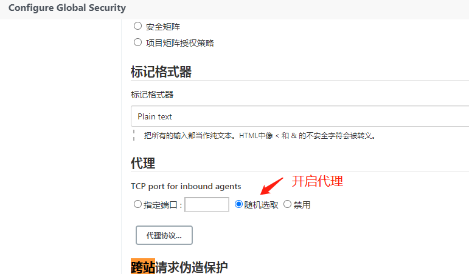

新建Slave节点

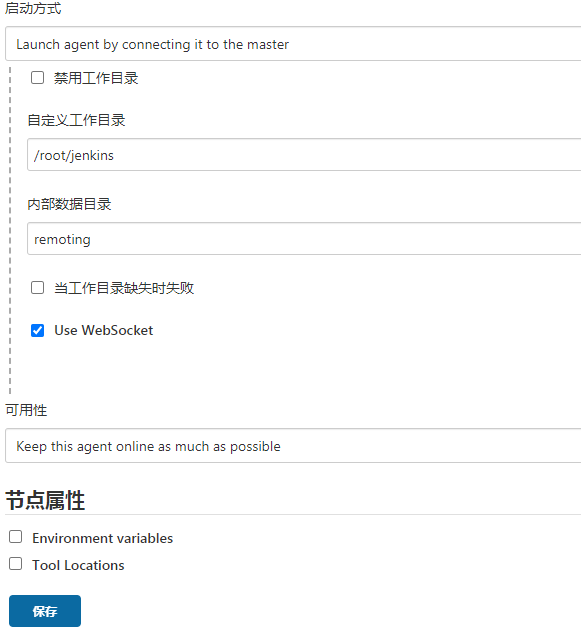

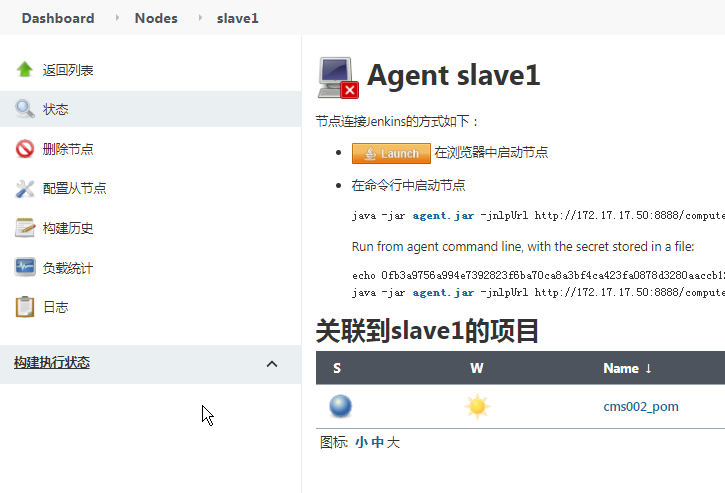

安装和配置节点选择第2种

自由风格和Maven风格的项目：

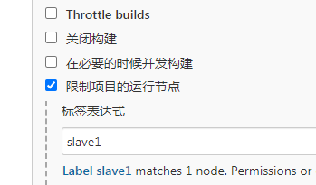

流水线风格的项目：

```
node('slave1') {
   stage('check out') {
   }
}
```

传统Jenkins的Master-Slave方案的缺陷

1. Master节点发生单点故障时，整个流程都不可用了
2. 每个 Slave节点的配置环境不一样，来完成不同语言的编译打包等操作，但是这些差异化的配置导致管理起来非常不方便，维护起来也是比较费劲
3. 资源分配不均衡，有的Slave节点要运行的job出现排队等待，而有的Slave节点处于空闲状态
4. 资源浪费，每台Slave节点可能是实体机或者VM，当Slave节点处于空闲状态时，也不会完全释放掉资源

### 5.2 Kubernates+Docker+Jenkins持续集成方案

大致工作流程：手动/自动构建 -> Jenkins 调度 K8S API -> 动态生成 Jenkins Slave pod -> Slave pod拉取 Git 代码／编译／打包镜像 -> 推送到镜像仓库 Harbor -> Slave 工作完成，Pod 自动销毁 -> 部署到测试或生产 Kubernetes平台。（完全自动化，无需人工干预）


Kubernates+Docker+Jenkins持续集成方案好处

1. 服务高可用：当 Jenkins Master 出现故障时，Kubernetes会自动创建一个新的Jenkins Master容器，并且将Volume分配给新创建的容器，保证数据不丢失，从而达到集群服务高可用。
2. 动态伸缩，合理使用资源：每次运行Jo 时，会自动创建一个Jenkins Slave，Job完成后，Slave自动注销并删除容器，资源自动释放，而且Kubernetes会根据每个资源的使用情况，动态分配
Slave到空闲的节点上创建，降低出现因某节点资源利用率高，还排队等待在该节点的情况。
3. 扩展性好：当Kubernetes集群的资源严重不足而导致Job排队等待时，可以很容易的添加一个Kubernetes Node到集群中，从而实现扩展。

### 5.3 Kubernates安装

[k8s集群安装](/linux/kubernetes)

### 5.4 在Kubernetes安装Jenkins-Master

#### 5.4.1 创建NFS client provisioner

上传nfs-client部署文件
1. [class.yaml](/file/jenkins/nfs-client/class)
2. [deployment.yaml](/file/jenkins/nfs-client/deployment)
3. [rbac.yaml](/file/jenkins/nfs-client/rbac)

```bash
cd nfs-client
kubectl create -f .
kubectl get pods     # 查看pod是否创建成功
```

#### 5.4.2 安装Jenkins-Master

上传Jenkins-Master构建文件
1. [rbac.yaml](/file/jenkins/master/rbac)
2. [Service.yaml](/file/jenkins/master/Service)
3. [ServiceaAcount.yaml](/file/jenkins/master/ServiceaAcount)
4. [StatefulSet.yaml](/file/jenkins/master/StatefulSet)

创建kube-ops的namespace

```bash
kubectl create namespace kube-ops
cd jenkins-master
kubectl create -f .
kubectl get pods -n kube-ops        # 查看pod是否创建成功
kubectl get pod --namespace kube-ops -o wide
kubectl describe pods -n kube-ops   # 查看Pod运行在那个Node上
kubectl get service -n kube-ops     # 查看分配的端口    
```

kubernetes v1.20版本创建pvc报错，解决方法是编辑/etc/kubernetes/manifests/kube-apiserver.yaml
```bash
kubectl describe pvc --namespace kube-ops
vi /etc/kubernetes/manifests/kube-apiserver.yaml

spec:
  containers:
  - command:
    - kube-apiserver
# 添加这一行
- --feature-gates=RemoveSelfLink=false
```


### 5.5 Jenkins与Kubernetes整合

先安装基本的插件
- Localization:Chinese
- Git
- Pipeline
- Extended Choice Parameter

安装Kubernetes插件

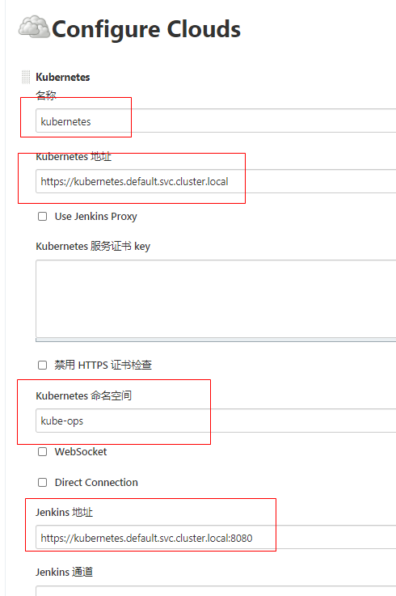

- kubernetes地址采用了kube的服务器发现：https://kubernetes.default.svc.cluster.local
- namespace填kube-ops，然后点击Test Connection，如果出现 Connection test successful 的提示信息证明 Jenkins 已经可以和 Kubernetes 系统正常通信
- Jenkins URL 地址：http://jenkins.kube-ops.svc.cluster.local:8080

### 5.6 构建Jenkins-Slave自定义镜像

Jenkins-Master在构建Job的时候，Kubernetes会创建Jenkins-Slave的Pod来完成Job的构建。我们选择运行Jenkins-Slave的镜像为官方推荐镜像：jenkins/jnlp-slave:latest，但是这个镜像里面并没有Maven环境，为了方便使用，我们需要自定义一个新的镜像：

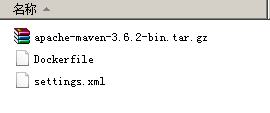

[Dockerfile](/file/jenkins/slave/Dockerfile)，[settings.xml](/file/jenkins/slave/settings)文件内容如下：

```bash
FROM jenkins/jnlp-slave:latest

MAINTAINER xuzhihao
# 切换到 root 账户进行操作
USER root

# 安装 maven
COPY apache-maven-3.6.2-bin.tar.gz .

RUN tar -zxf apache-maven-3.6.2-bin.tar.gz && \
    mv apache-maven-3.6.2 /usr/local && \
    rm -f apache-maven-3.6.2-bin.tar.gz && \
    ln -s /usr/local/apache-maven-3.6.2/bin/mvn /usr/bin/mvn && \
    ln -s /usr/local/apache-maven-3.6.2 /usr/local/apache-maven && \
    mkdir -p /usr/local/apache-maven/repo

COPY settings.xml /usr/local/apache-maven/conf/settings.xml

USER jenkins
```
构建出一个新镜像：jenkins-slave-maven:latest

然把镜像上传到Harbor的公共库library中
```bash
docker build -t jenkins-slavemaven:latest .
docker tag jenkins-slavemaven:latest 172.17.17.80:88/library/jenkins-slavemaven:latest
docker login -u admin -p Harbor12345 172.17.17.80:88
docker push 172.17.17.80:88/library/jenkins-slavemaven:latest
```

### 5.7 测试Jenkins-Slave是否可以创建

#### 5.7.1 从节点拉取代码

创建一个Jenkins流水线项目，编写Pipeline，从GItlab拉取代码
```bash
def git_address = "http://172.17.17.50:82/vjsp/web_demo.git"
def git_auth = "9d9a2707-eab7-4dc9-b106-e52f329cbc95"

//创建一个Pod的模板，label为jenkins-slave
podTemplate(label: 'jenkins-slave', cloud: 'kubernetes', containers: [
    containerTemplate(
        name: 'jnlp', 
        image: "172.17.17.80:88/library/jenkins-slavemaven:latest"
    )
  ]
) 
{
  //引用jenkins-slave的pod模块来构建Jenkins-Slave的pod
  node("jenkins-slave"){
      // 第一步
      stage('拉取代码'){
         checkout([$class: 'GitSCM', branches: [[name: 'master']], userRemoteConfigs: [[credentialsId: "${git_auth}", url: "${git_address}"]]])
      }
  }
}
```

#### 5.7.2 构建镜像

主节点创建NFS共享目录，让所有Jenkins-Slave构建指向NFS的Maven的共享仓库目录
```bash
vi /etc/exports

/opt/nfs/jenkins *(rw,no_root_squash)
/opt/nfs/maven *(rw,no_root_squash)
systemctl restart nfs   # 重启NFS
chown -R jenkins:jenkins /opt/nfs/maven
chmod -R 777 /opt/nfs/maven
chmod 777 /var/run/docker.sock
```

```bash

def git_address = "http://192.168.66.100:82/itheima_group/tensquare_back_cluster.git"
def git_auth = "9d9a2707-eab7-4dc9-b106-e52f329cbc95"
//构建版本的名称
def tag = "latest"
//Harbor私服地址
def harbor_url = "192.168.66.102:85"
//Harbor的项目名称
def harbor_project_name = "test"
//Harbor的凭证
def harbor_auth = "71eff071-ec17-4219-bae1-5d0093e3d060"
def secret_name = "registry-auth-secret"
//k8s凭证
def k8s_auth = "c5fe8670-f5a7-4b1a-811c-48ab5de2aed9";


podTemplate(label: 'jenkins-slave', cloud: 'kubernetes', containers: [
    containerTemplate(
        name: 'jnlp', 
        image: "192.168.66.102:85/library/jenkins-slave-maven:latest"
    ),
    containerTemplate(
        name: 'docker', 
        image: "docker:stable",
        ttyEnabled: true,
        command: 'cat'
    ),
  ],
  volumes: [
    hostPathVolume(mountPath: '/var/run/docker.sock', hostPath: '/var/run/docker.sock'),
    nfsVolume(mountPath: '/usr/local/apache-maven/repo', serverAddress: '192.168.66.101' , serverPath: '/opt/nfs/maven'),
  ],
) 
{
  node("jenkins-slave"){
      // 第一步
      stage('拉取代码'){
         checkout([$class: 'GitSCM', branches: [[name: '${branch}']], userRemoteConfigs: [[credentialsId: "${git_auth}", url: "${git_address}"]]])
      }
      // 第二步
      stage('代码编译'){
           //编译并安装公共工程
         sh "mvn -f shop_common clean install" 
      }
      // 第三步
      stage('构建镜像，部署项目'){
	        //把选择的项目信息转为数组
			def selectedProjects = "${project_name}".split(',')
			
            for(int i=0;i<selectedProjects.size();i++){
                //取出每个项目的名称和端口
                def currentProject = selectedProjects[i];
                //项目名称
                def currentProjectName = currentProject.split('@')[0]
                //项目启动端口
                def currentProjectPort = currentProject.split('@')[1]

                 //定义镜像名称
                 def imageName = "${currentProjectName}:${tag}"
				 
				 //编译，构建本地镜像
				 sh "mvn -f ${currentProjectName} clean package dockerfile:build"
				 container('docker') {

					 //给镜像打标签
					 sh "docker tag ${imageName} ${harbor_url}/${harbor_project_name}/${imageName}"

					 //登录Harbor，并上传镜像
					 withCredentials([usernamePassword(credentialsId: "${harbor_auth}", passwordVariable: 'password', usernameVariable: 'username')]) {
						  //登录
						  sh "docker login -u ${username} -p ${password} ${harbor_url}"
						  //上传镜像
						  sh "docker push ${harbor_url}/${harbor_project_name}/${imageName}"
					 }

					 //删除本地镜像
					 sh "docker rmi -f ${imageName}"
					 sh "docker rmi -f ${harbor_url}/${harbor_project_name}/${imageName}"
				 }
				 
				 def deploy_image_name = "${harbor_url}/${harbor_project_name}/${imageName}"
				 
				 //部署到K8S
			     sh """
                        sed -i 's#\$IMAGE_NAME#${deploy_image_name}#' ${currentProjectName}/deploy.yml
						sed -i 's#\$SECRET_NAME#${secret_name}#' ${currentProjectName}/deploy.yml
                 """
                      
                 kubernetesDeploy configs: "${currentProjectName}/deploy.yml", kubeconfigId: "${k8s_auth}"
         } 
      }
  }
}
```

需要手动上传父工程依赖到NFS的Maven共享仓库目录中

修改每个微服务的application.yml

```yml
server:
  port: ${PORT:10086}
spring:
  application:
    name: eureka

eureka:
  server:
    # 续期时间，即扫描失效服务的间隔时间（缺省为60*1000ms）
    eviction-interval-timer-in-ms: 5000
    enable-self-preservation: false
    use-read-only-response-cache: false
  client:
    # eureka client间隔多久去拉取服务注册信息 默认30s
    registry-fetch-interval-seconds: 5
    serviceUrl:
      defaultZone: ${EUREKA_SERVER:http://127.0.0.1:${server.port}/eureka/}
  instance:
    # 心跳间隔时间，即发送一次心跳之后，多久在发起下一次（缺省为30s）
    lease-renewal-interval-in-seconds: 5
    # 在收到一次心跳之后，等待下一次心跳的空档时间，大于心跳间隔即可，即服务续约到期时间（缺省为90s）
    lease-expiration-duration-in-seconds: 10
    instance-id: ${EUREKA_INSTANCE_HOSTNAME:${spring.application.name}}:${server.port}@${random.long(1000000,9999999)}
    hostname: ${EUREKA_INSTANCE_HOSTNAME:${spring.application.name}}
```

### 5.8 微服务部署到K8S

#### 5.8.1 安装Kubernetes Continuous Deploy插件

#### 5.8.2 建立k8s认证凭证

kubeconfig到k8s的Master节点复制
```
cat /root/.kube/config
```

#### 5.8.3 生成Docker凭证

Docker凭证，用于Kubernetes到Docker私服拉取镜像
```bash
docker login -u admin -p Harbor12345 172.17.17.80:88
kubectl create secret docker-registry registry-auth-secret --docker-server=172.17.17.80:88 --docker-username=admin --docker-password=admin --docker-email=xuzhihao@163.com    # 生成秘钥
kubectl get secret    # 查看密钥

```

在每个项目下建立[deploy.yml](/file/jenkins/deploy/deploy-k8s)，加入密钥参数

```yml
spec:
  serviceName: "eureka"
  replicas: 2
  selector:
    matchLabels:
      app: eureka
  template:
    metadata:
      labels:
        app: eureka
    spec:
      imagePullSecrets:
        - name: $SECRET_NAME
```

项目构建后，查看服务创建情况
```
kubectl get pods -owide
kubectl get service
```

