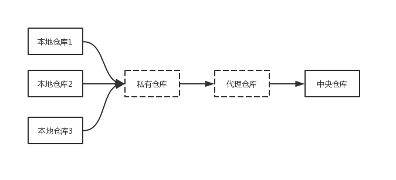
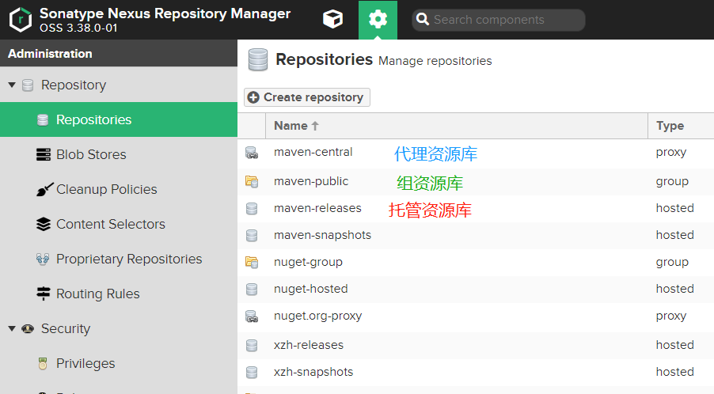
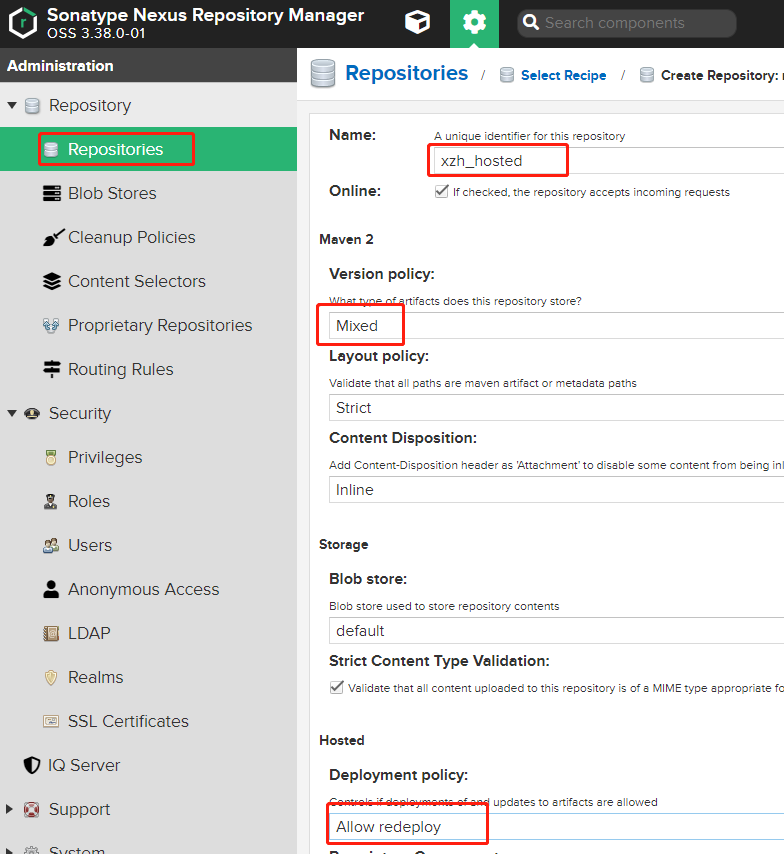
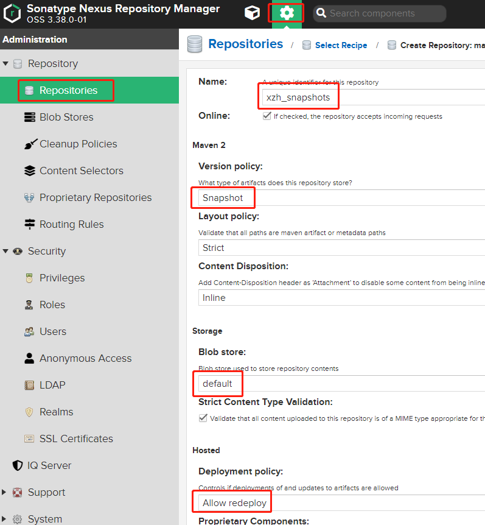
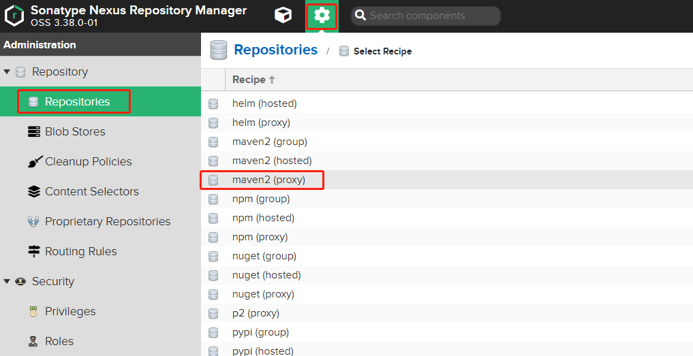
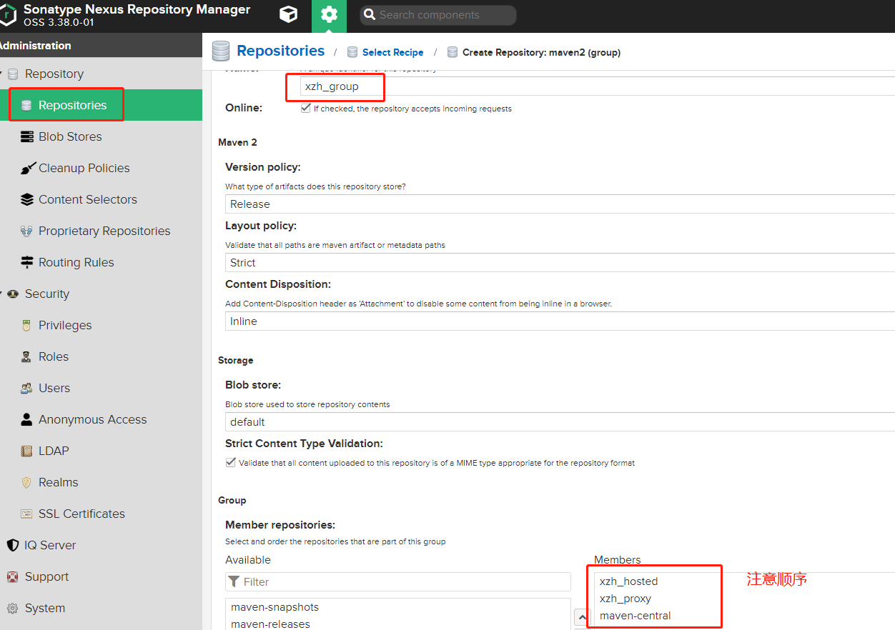

# 基于Nexus3快速搭建Maven私有仓库

## 1. 安装

```bash
docker pull sonatype/nexus3:3.38.0
docker volume create --name nexus-data
docker run -d -p 8081:8081 --name nexus -v nexus-data:/nexus-data sonatype/nexus3:3.38.0
```

使用默认管理员身份登录，帐号：**admin**，密码：`cat /nexus-data/admin.password`


?> 为什么要搭建私有仓库



通常都是通过本机的Maven直接访问到中央仓库，并没有使用到虚线标识的区域，直接使用中央仓库可能会给我们带来的问题
- 网络问题
    - 中央仓库在国外，需要科学上网，私服搭建好以后，本地开发环境优先连接私服，当私服没有的资源的时候去中央仓库下载，只需要私服从中央仓库下载一次即可
- 私有项目的管理
    - 企业内部资源，如封装的类库，框架等更新直接上传到私服即可
- 三方未上传到中央仓库的类库
    - 如：oracle.jar，paoding-analysis等，直接通过本地环境直接上传到私服，项目组所有成员可共享

## 2. 配置


默认仓库
- maven-central：maven中央库，默认https://repo1.maven.org/maven2
- maven-releases：私库发行版，首次安装请将Deployment policy设置为Allow redeploy
- maven-snapshots：私库快照版本
- maven-public：仓库组

Nexus仓库类型
- hosted：本地仓库，通常我们会部署自己的构件到这一类型的仓库。比如公司的第二方库。
- proxy：代理仓库，它们被用来代理远程的公共仓库，如maven中央仓库。
- group：仓库组，用来合并多个hosted/proxy仓库，当你的项目希望在多个repository使用资源时就不需要多次引用了，只需要引用一个group即可。




### 2.1 创建Blob Stores


### 2.2 创建托管仓库







### 2.3 创建代理仓库




?> 阿里云的maven中央仓库地址：http://maven.aliyun.com/nexus/content/groups/public/

### 2.4 创建仓库组



### 2.5 settings配置

修改Maven的settings.xml文件，加入认证机制

```xml
<!--nexus服务器,id为组仓库name-->
  <servers>  
    <server>  
        <id>xzh-group</id>  
        <username>admin</username>  
        <password>admin</password>  
    </server>
    <server>  
        <id>xzh-hosted</id>  
        <username>admin</username>  
        <password>admin</password>  
    </server>
    <server>  
        <id>xzh-snapshots</id>  
        <username>admin</username>  
        <password>admin</password>  
    </server>
    <server>  
        <id>xzh-releases</id>  
        <username>admin</username>  
        <password>admin</password>  
    </server>   
  </servers>  
<!--仓库组的url地址，id和name可以写组仓库name，mirrorOf的值设置为central-->  
  <mirrors>     
    <mirror>  
        <id>xzh-group</id>  
        <name>xzh-group</name>  
        <url>http://172.17.17.200:8081/repository/xzh-group/</url>  
        <mirrorOf>central</mirrorOf>  
    </mirror>     
  </mirrors>
```

```bash
mvn deploy              # 编译上传
mvn clean compile -U    # 更新拉取资源使用以下指令(强制刷新)
```

### 2.6 命令上传三方jar包

```
mvn install:install-file -Dfile=D:\paoding-analysis.jar -DgroupId=net.paoding -DartifactId=paoding-analysis -Dversion=1.0 -Dpackaging=jar -DgeneratePom=true -DcreateChecksum=true 
mvn install:install-file -Dfile=D:\ojdbc6.jar -DgroupId=com.oracle -DartifactId=ojdbc6 -Dversion=10.2.0.5.0 -Dpackaging=jar -DgeneratePom=true -DcreateChecksum=true  
mvn install:install-file -Dfile=D:/iTextAsian.jar -DgroupId=com.lowagie -DartifactId=itextasian -Dversion=1.0 -Dpackaging=jar 
mvn install:install-file -Dfile=D:/tools.jar -DgroupId=com.sun2 -DartifactId=tools -Dversion=1.6.0 -Dpackaging=jar
mvn deploy:deploy-file -DgroupId=net.xzh -DartifactId=spring-boot-email -Dversion=2.3.0.RELEASE -Dpackaging=jar -Dfile=spring-boot-email-2.3.0.RELEASE.jar -Durl=http://172.17.17.200:8081/repository/xzh-hosted/ -DrepositoryId=xzh-hosted
```

指令说明
- -DgroupId：jar的groupId
- -DartifactId：jar的artifactId
- -Dversion：jar的版本
- -Dpackaging：指定包为jar
- -Dfile：文件地址，可以设置绝对路径，由于我cmd进入了对应的目录，下面的指令使用的相对路径
- -Durl：本地仓库的地址
- -DgeneratePom：是否生成pom文件，ture:生成，false：不生成
- -DrepositoryId：仓库名称


### 2.7 Idea上传至私有库

pom文件添加本地仓库的配置

```xml
<!-- 配置资源上传的仓库地址，与settings.xml中  -->
<distributionManagement>
    <repository>
        <id>xzh-release</id>
        <url>http://172.17.17.200:8081/repository/xzh-release/</url>
    </repository>
    <snapshotRepository>
        <id>xzh-snapshots</id>
        <url>http://172.17.17.200:8081/repository/xzh-snapshots/</url>
    </snapshotRepository>
</distributionManagement>
```

snapshots和releases的区别

snapshot：每次都会从服务器拉取一个最新的版本使用，不管本地是否存在，都会强制刷新，但是刷新并不意味着把jar重新下载一遍。只下载几个比较小的文件，通过这几个小文件确定本地和远程仓库的版本是否一致，再决定是否下载

releases：当检测到本地的maven仓库有相应的版本之后，不会去服务器拉取，就直接使用本地的版本了。