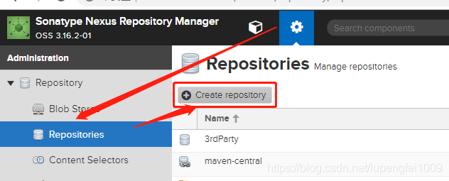
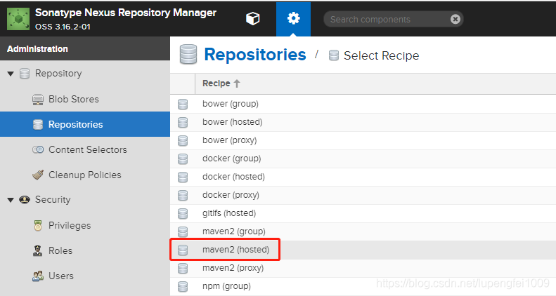
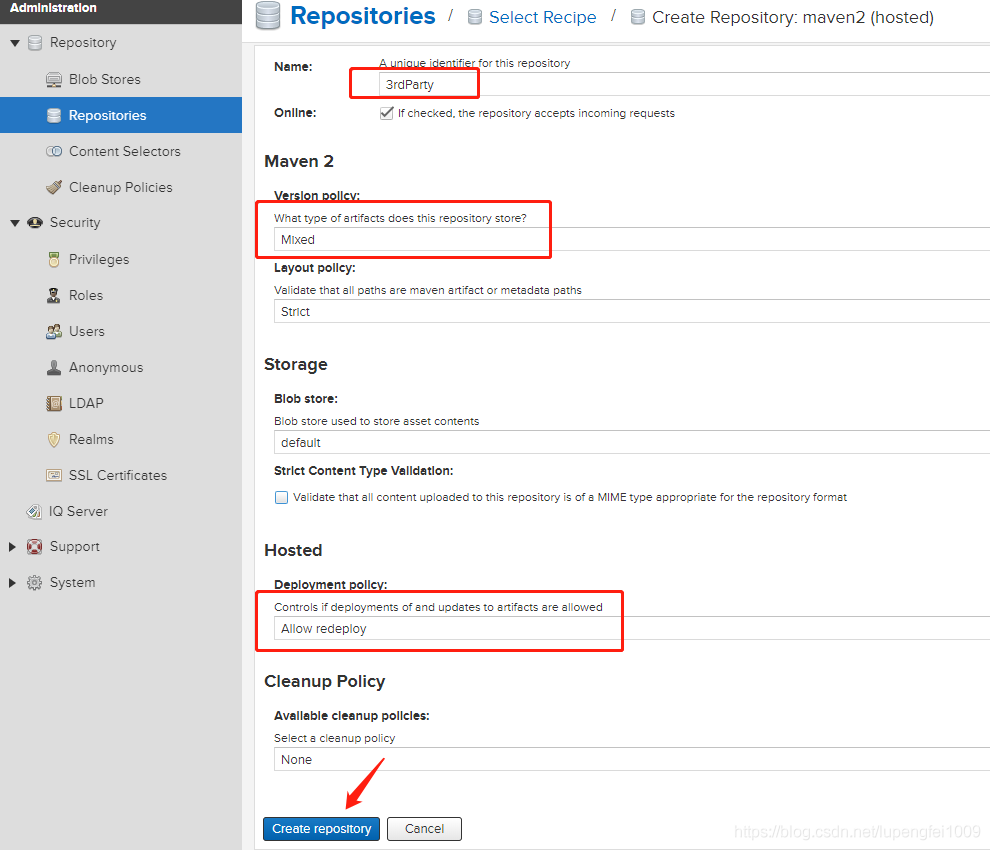

# 基于Nexus3快速搭建Maven私有仓库

## 1. 安装

```bash
docker pull sonatype/nexus3
mkdir -p /home/mvn/nexus-data  && chown -R 200 /home/mvn/nexus-data
docker run -d -p 8081:8081 --name nexus -v /home/mvn/nexus-data:/nexus-data sonatype/nexus3
```

使用默认管理员身份登录，帐号：**admin**，密码：**admin123**


?> 为什么要搭建私有仓库


通常都是通过本机的Maven直接访问到中央仓库，并没有使用到虚线标识的区域，直接使用中央仓库可能会给我们带来的问题
- 网络问题
    - 中央仓库在国外，需要科学上网，私服搭建好以后，本地开发环境优先连接私服，当私服没有的资源的时候去中央仓库下载，只需要私服从中央仓库下载一次即可
- 私有项目的管理
    - 企业内部资源，如封装的类库，框架等更新直接上传到私服即可
- 三方未上传到中央仓库的类库
    - 如：oracle.jar，paoding-analysis等，直接通过本地环境直接上传到私服，项目组所有成员可共享

## 2. 配置

### 2.1 创建本地库



第二步



第三步




### 2.2 本地Maven配置

修改Maven的settings.xml文件，加入认证机制

```xml
<server>
	<id>nexus-releases</id>
	<username>admin</username>
	<password>admin123</password>
</server>
<server>
	<id>nexus-snapshots</id>
	<username>admin</username>
	<password>admin123</password>
</server>
<server>
	<id>3rdParty</id>
	<username>admin</username>
	<password>admin123</password>
</server>

```

添加mirrors配置

```xml
<mirror>
    <id>nexus</id>
    <name>nexus Mirror chenshu repository</name>
    <url>http://192.168.3.200:8181/repository/maven-public/</url>
    <mirrorOf>*</mirrorOf>
  </mirror>
<mirror>
    <id>3rdParty</id>
    <name>3rd party repository</name>
    <url>http://192.168.3.200:8181/repository/3rdParty/</url>
    <mirrorOf>3rdParty</mirrorOf>
</mirror>

```

配置profiles

```xml
<profile>
	<id>jdk1.8</id>
	<activation>
	<activeByDefault>true</activeByDefault>
	<jdk>1.8</jdk>
	</activation>
	<properties>
		<maven.compiler.source>1.8</maven.compiler.source>
		<maven.compiler.target>1.8</maven.compiler.target>
		<maven.compiler.compilerVersion>1.8</maven.compiler.compilerVersion>
	</properties>
	<repositories>
		<repository>
			<id>maven-public</id>
			<url>http://192.168.3.200:8181/repository/maven-public/</url>
			<releases>
				<enabled>true</enabled>
			</releases>
			<snapshots>
				<enabled>true</enabled>
				<updatePolicy>always</updatePolicy>
			</snapshots>
		</repository>
		<repository>
			<id>3rdParty</id>
			<url>http://192.168.3.200:8181/repository/3rdParty/</url>
			<releases>
				<enabled>true</enabled>
			</releases>
			<snapshots>
				<enabled>true</enabled>
				<updatePolicy>always</updatePolicy>
			</snapshots>
			</repository>
		</repositories>
</profile>
```

### 2.3 本地Jar上传

```
mvn install:install-file -Dfile=D:\paoding-analysis.jar -DgroupId=net.paoding -DartifactId=paoding-analysis -Dversion=1.0 -Dpackaging=jar -DgeneratePom=true -DcreateChecksum=true 
mvn install:install-file -Dfile=D:\ojdbc6.jar -DgroupId=com.oracle -DartifactId=ojdbc6 -Dversion=10.2.0.5.0 -Dpackaging=jar -DgeneratePom=true -DcreateChecksum=true  
mvn install:install-file -Dfile=D:/iTextAsian.jar -DgroupId=com.lowagie -DartifactId=itextasian -Dversion=1.0 -Dpackaging=jar 
mvn install:install-file -Dfile=D:/tools.jar -DgroupId=com.sun2 -DartifactId=tools -Dversion=1.6.0 -Dpackaging=jar
mvn deploy:deploy-file -DgroupId=com.lupf -DartifactId=mymaven -Dversion=1.0.0 -Dpackaging=jar -Dfile=mymaven.jar -Durl=http://192.168.3.200:8081/repository/3rdParty/ -DrepositoryId=3rdParty
```

指令说明
- -DgroupId：jar的groupId
- -DartifactId：jar的artifactId
- -Dversion：jar的版本
- -Dpackaging：指定包为jar
- -Dfile：文件地址，可以设置绝对路径，由于我cmd进入了对应的目录，下面的指令使用的相对路径
- -Durl：本地仓库的地址
- -DgeneratePom：是否生成pom文件，ture:生成，false：不生成
- -DrepositoryId：仓库名称


## 3. Idea上传本地项目至私有库

pom文件添加本地仓库的配置

```xml
    <repositories>
        <repository>
            <id>nexus</id>
            <name>Nexus Repository</name>
            <url>http://192.168.3.200:8181/repository/maven-public/</url>
            <snapshots>
                <enabled>true</enabled>
            </snapshots>
            <releases>
                <enabled>true</enabled>
            </releases>
        </repository>
    </repositories>
    <pluginRepositories>
        <pluginRepository>
            <id>nexus</id>
            <name>Nexus Plugin Repository</name>
            <url>http://192.168.3.200:8181/repository/maven-public/</url>
            <snapshots>
                <enabled>true</enabled>
            </snapshots>
            <releases>
                <enabled>true</enabled>
            </releases>
        </pluginRepository>
    </pluginRepositories>
    <distributionManagement>
        <repository>
            <id>nexus-releases</id>
            <name>Nexus Release Repository</name>
            <url>http://192.168.3.200:8181/repository/maven-releases/</url>
        </repository>
        <snapshotRepository>
            <id>nexus-snapshots</id>
            <name>Nexus Snapshot Repository</name>
            <url>http://192.168.3.200:8181/repository/maven-snapshots/</url>
        </snapshotRepository>
    </distributionManagement>
```


```bash
mvn deploy      # 编译上传
mvn compile -U  # 更新拉取资源使用以下指令(强制刷新)
```

snapshots和releases的区别

snapshot：每次都会从服务器拉取一个最新的版本使用，不管本地是否存在，都会强制刷新，但是刷新并不意味着把jar重新下载一遍。只下载几个比较小的文件，通过这几个小文件确定本地和远程仓库的版本是否一致，再决定是否下载

releases：当检测到本地的maven仓库有相应的版本之后，不会去服务器拉取，就直接使用本地的版本了。