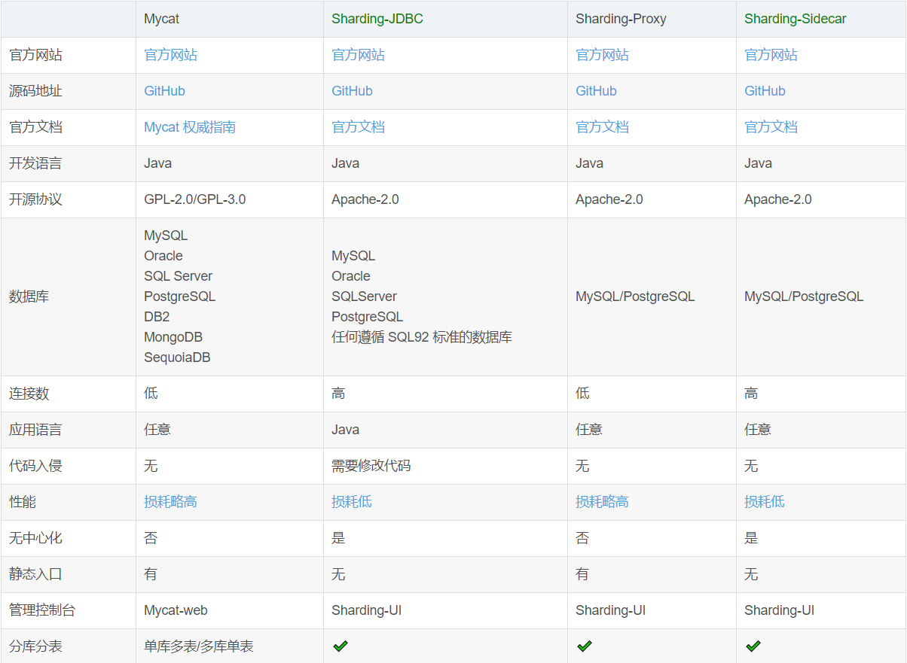
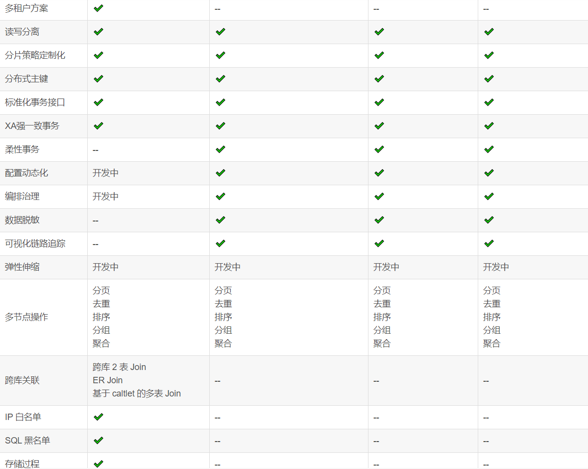

# ShardingSphere

Sharding-JDBC采用无中心化架构，适用于Java开发的高性能的轻量级OLTP应用

Sharding-Proxy提供静态入口以及异构语言的支持，适用于OLAP应用以及对分片数据库进行管理和运维的场景。

数据处理大致可以分成两大类：联机事务处理OLTP（on-line transaction processing）、联机分析处理OLAP（On-Line Analytical Processing）。

- OLTP是传统的关系型数据库的主要应用，主要是基本的、日常的事务处理，例如银行交易。
- OLAP是数据仓库系统的主要应用，支持复杂的分析操作，侧重决策支持，并且提供直观易懂的查询结果。 
- OLTP 系统强调数据库内存效率，强调内存各种指标的命令率，强调绑定变量，强调并发操作；
- OLAP 系统则强调数据分析，强调SQL执行市场，强调磁盘I/O，强调分区等

