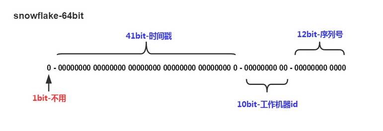

# 分布式全局ID

## 1. 分布式系统唯一ID的实现方案
### 1.1 UUID

UUID(Universally Unique Identifier)的标准型式包含32个16进制数字，以连字号分为五段，形式为8-4-4-4-12的36个字符，示例：550e8400-e29b-41d4-a716-446655440000，到目前为止业界一共有5种方式生成UUID，详情见IETF发布的UUID规范 A Universally Unique IDentifier (UUID) URN Namespace

**优点：**
   - 性能非常高：本地生成，没有网络消耗

**缺点：**
   - 不易于存储：UUID太长，16字节128位，通常以36长度的字符串表示，很多场景不适用。
   - 信息不安全：基于MAC地址生成UUID的算法可能会造成MAC地址泄露，这个漏洞曾被用于寻找梅丽莎病毒的制作者位置。
   - ID作为主键时在特定的环境会存在一些问题，比如做DB主键的场景下，UUID就非常不适用

### 1.2 数据库生成

以MySQL举例，利用给字段设置auto_increment_increment和auto_increment_offset来保证ID自增，每次业务使用下列SQL读写MySQL得到ID号

**优点：**
   - 非常简单，利用现有数据库系统的功能实现，成本小，有DBA专业维护
   - ID号单调自增，可以实现一些对ID有特殊要求的业务

**缺点：**
   - 强依赖DB，当DB异常时整个系统不可用，属于致命问题。配置主从复制可以尽可能的增加可用性，但是数据一致性在特殊情况下难以保证。主从切换时的不一致可能会导致重复发号
   - ID发号性能瓶颈限制在单台MySQL的读写性能

### 1.3 Redis生成ID

当使用数据库来生成ID性能不够要求的时候，我们可以尝试使用Redis来生成ID。

这主要依赖于Redis是单线程的，所以也可以用生成全局唯一的ID。可以用Redis的原子操作 INCR和INCRBY来实现。

比较适合使用Redis来生成每天从0开始的流水号。比如订单号=日期+当日自增长号。可以每天在Redis中生成一个Key，使用INCR进行累加

**优点：**
   - 不依赖于数据库，灵活方便，且性能优于数据库
   - 数字ID天然排序，对分页或者需要排序的结果很有帮助

**缺点：**
   - 如果系统中没有Redis，还需要引入新的组件，增加系统复杂度
   - 需要编码和配置的工作量比较大

### 1.4 利用zookeeper生成唯一ID

zookeeper主要通过其znode数据版本来生成序列号，可以生成32位和64位的数据版本号，客户端可以使用这个版本号来作为唯一的序列号

很少会使用zookeeper来生成唯一ID。主要是由于需要依赖zookeeper，并且是多步调用API，如果在竞争较大的情况下，需要考虑使用分布式锁。因此，性能在高并发的分布式环境下，也不甚理想

### 1.5 snowflake（雪花算法）方案

这种方案大致来说是一种以划分命名空间（UUID也算，由于比较常见，所以单独分析）来生成ID的一种算法，这种方案把64-bit分别划分成多段，分开来标示机器、时间等，比如在snowflake中的64-bit分别表示如下图所示：

41-bit的时间可以表示（1L<<41）/(1000L*3600*24*365)=69年的时间，10-bit机器可以分别表示1024台机器。如果我们对IDC划分有需求，还可以将10-bit分5-bit给IDC，分5-bit给工作机器。这样就可以表示32个IDC，每个IDC下可以有32台机器，可以根据自身需求定义。12个自增序列号可以表示2^12个ID，理论上snowflake方案的QPS约为409.6w/s，这种分配方式可以保证在任何一个IDC的任何一台机器在任意毫秒内生成的ID都是不同的。

**优点：**
   - 毫秒数在高位，自增序列在低位，整个ID都是趋势递增的
   - 不依赖数据库等第三方系统，以服务的方式部署，稳定性更高，生成ID的性能也是非常高的
   - 可以根据自身业务特性分配bit位，非常灵活

**缺点：**
   - 强依赖机器时钟，如果机器上时钟回拨，会导致发号重复或者服务会处于不可用状态

应用举例Mongdb objectID

MongoDB官方文档 ObjectID可以算作是和snowflake类似方法，通过“时间+机器码+pid+inc”共12个字节，通过4+3+2+3的方式最终标识成一个24长度的十六进制字符
