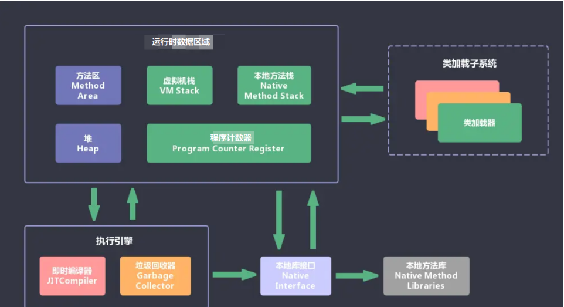
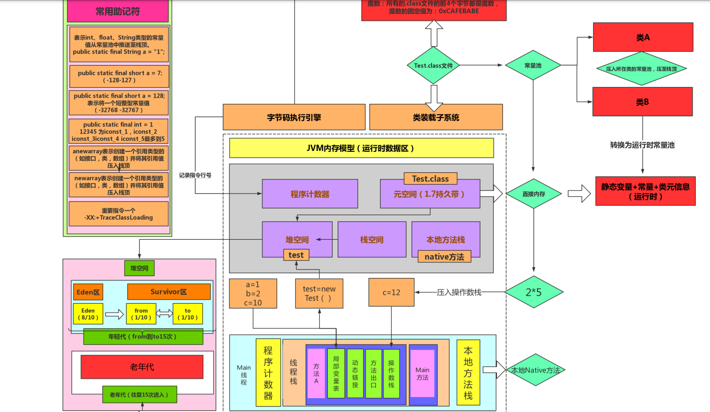
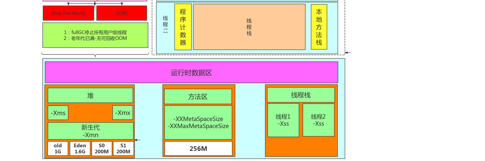
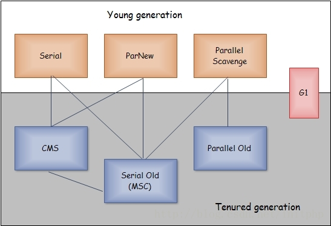
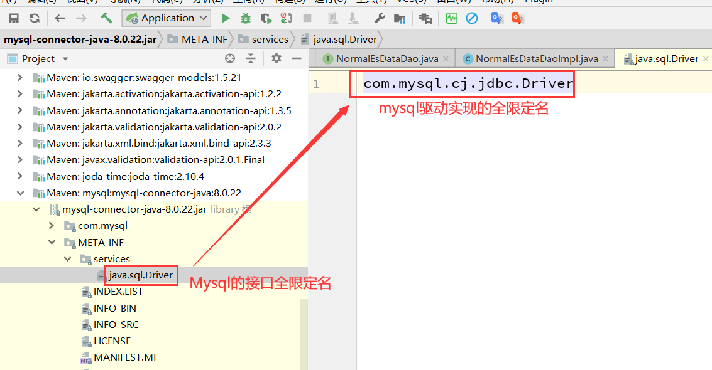
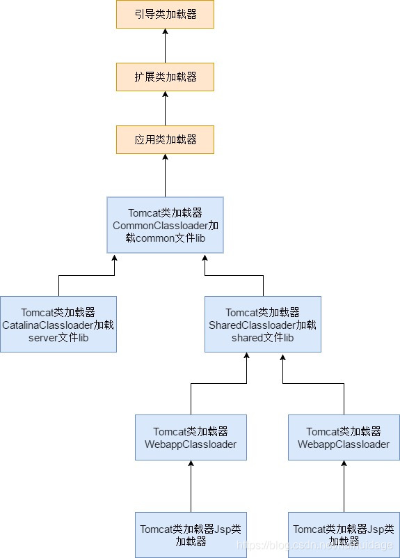

# JVM底层原理

## 1. JVM内存模型







### 1.1 方法区(元空间/永久代)-常量池

方法区也是所有线程共享。主要用于存储类的信息、常量池、方法数据、方法代码等。方法区逻辑上属于堆的一部分，但是为了与堆进行区分，通常又叫“非堆”

Java7及以前版本的Hotspot中方法区位于永久代中

在Java8中，时代变了，Hotspot取消了永久代。永久代的参数-XX:PermSize和-XX：MaxPermSize也随之失效

- -XX:MetaspaceSize，初始空间大小
- -XX:MaxMetaspaceSize，最大空间 默认是没有限制的。

### 1.2 Java虚拟机栈及栈帧内部结构

栈的大小通过-Xss来设置，当栈中存储数据比较多时，需要适当调大这个值，否则会出现java.lang.StackOverflowError异常。常见的出现这个异常的是无法返回的递归，因为此时栈中保存的信息都是方法返回的记录点

为什么要把堆和栈区分出来呢？栈中不是也可以存储数据吗？

第一，从软件设计的角度看，栈代表了处理逻辑，而堆代表了数据。这样分开，使得处理逻辑更为清晰。分而治之的思想。这种隔离、模块化的思想在软件设计的方方面面都有体现。

第二，堆与栈的分离，使得堆中的内容可以被多个栈共享（也可以理解为多个线程访问同一个对象）。这种共享的收益是很多的。一方面这种共享提供了一种有效的数据交互方式(如：共享内存)，另一方面，堆中的共享常量和缓存可以被所有栈访问，节省了空间。

第三，栈因为运行时的需要，比如保存系统运行的上下文，需要进行地址段的划分。由于栈只能向上增长，因此就会限制住栈存储内容的能力。而堆不同，堆中的对象是可以根据需要动态增长的，因此栈和堆的拆分，使得动态增长成为可能，相应栈中只需记录堆中的一个地址即可。

第四，面向对象就是堆和栈的完美结合。其实，面向对象方式的程序与以前结构化的程序在执行上没有任何区别。但是，面向对象的引入，使得对待问题的思考方式发生了改变，而更接近于自然方式的思考。当我们把对象拆开，你会发现，对象的属性其实就是数据，存放在堆中；而对象的行为（方法），就是运行逻辑，放在栈中。我们在编写对象的时候，其实即编写了数据结构，也编写的处理数据的逻辑。不得不承认，面向对象的设计，确实很美。


### 1.3 堆内存分代机制详解

```java
Object ob = new Object();
```

它所占的空间为：4byte+8byte,4byte是Java栈中保存引用的所需要的空间。而那8byte则是Java堆中对象的信息。因为所有的Java非基本类型的对象都需要默认继承Object对象，因此不论什么样的Java对象，其大小都必须是大于8byte。

有了Object对象的大小，我们就可以计算其他对象的大小了。
```java
Class NewObject { //空对象大小(8byte)
    int count; //int大小(4byte)
    boolean flag;//Boolean大小(1byte)
    Object ob;//空Object引用的大小(4byte)
}
//8+4+1+4=17byt,Java在对对象内存分配时都是以8的整数倍来分,因此大于17byte的最接近8的整数倍的是24，因此此对象的大小为24byte
```

`对象空间占用理论上是可以计算出来的，因为无限的叠加，出现了java对象的管理工具spring,来控制对象的数量和复用，java存在一天，spring不会消失`

### 1.4 程序计数器详解
### 1.5 本地方法栈详解


## 2. 垃圾收集器分类和算法


1. 并行（Parallel）
    指多条垃圾收集线程并行工作，但此时用户线程仍然处于等待状态（挂起）；
    如ParNew、Parallel Scavenge、Parallel Old；
2. 并发（Concurrent）
    指用户线程与垃圾收集线程同时执行（但不一定是并行的，可能会交替执行），
    用户程序在继续运行，而垃圾收集程序线程运行于另一个CPU上，如CMS、G1（也有并行）

### 2.1 Serial（新生代串行）

采用复制算法，单线程收集，进行垃圾收集时，必须暂停所有工作线程，直到完成（ 即会"Stop The World）

对于限定单个CPU的环境来说，Serial收集器没有线程交互（切换）开销，可以获得最高的单线程收集效率，Client模式下默认的新生代收集器

### 2.2 ParNew（新生代并行复制）

Serial的多线程版本。一般运行在Server模式下首先的新生代收集器。 在Server模式下，ParNew收集器是一个非常重要的收集器，因为除Serial外，目前只有它能与CMS收集器配合工作；

参数：
- -XX:+UseConcMarkSweepGC：指定使用CMS后，会默认使用ParNew作为新生代收集器；
- -XX:+UseParNewGC：强制指定使用ParNew；    
- -XX:ParallelGCThreads：指定垃圾收集的线程数量，ParNew默认开启的收集线程与CPU的数量相同；

### 2.3 Parallel Scavenge（新生代并行复制）

与ParNew收集器相似，采用复制算法，多线程收集，目标则是达一个可控制的吞吐量（Throughput），说白了就是CPU的利用率，比较适合后端运算比较多的服务

参数:

- -XX:MaxGCPauseMillis：每次年轻代垃圾回收的最长时间(最大暂停时间)，收集器尽量保证内存回收时间不大于这个值，应该设置一个合理的值。
- -XX:GCTimeRatio：设置垃圾回收时间占程序运行时间的百分比，与上面的参数互斥
- -XX:+UseAdaptiveSizePolicy： 设置此选项后,并行收集器会自动选择年轻代区大小和相应的Survivor区比例,以达到目标系统规定的最低相应时间或者收集频率等,此值建议使用并行收集器时,一直打开.

### 2.4 Serial Old收集器（老年代串行）

单线程串行的老年代收集器。主要用于Client模式
1. 在JDK1.5及之前，与Parallel Scavenge收集器搭配使用（JDK1.6有Parallel Old收集器可搭配，就基本不用parallel+serial old）；
2. 作为CMS收集器的后备预案，在并发收集发生Concurrent Mode Failure时使用；

### 2.5 Parallel Old收集器（老年代并行标记整理）

适合和Parallel Scavenge收集器进行组合。-XX:+UseParallelOldGC

### 2.6 CMS垃圾收集器（老年代标记复制清除）

CMS(Concurrent Mark Sweep)收集器是一种以获取最短回收停顿时间为目标的收集器，目前大部分的B/S系统都使用CMS的收集器。一般CMS是老生代收集器，和PerNew进行组合

工作流程：初始标记->并发标记->重新标记->并发清除

CMS收集器的优点：并发收集、低停顿

缺点:
1. CMS收集器对CPU资源非常敏感。在并发阶段，虽然不会导致用户线程停顿，但是会占用CPU资源而导致引用程序变慢，总吞吐量下降。CMS默认启动的回收线程数是：(CPU数量+3) / 4。
2. CMS收集器无法处理浮动垃圾（ 在并发清除时，注意不是重新标记，用户线程新产生的垃圾，称为浮动垃圾），可能出现“Concurrent Mode Failure“，失败后而导致另一次Full GC的产生。这使得并发清除时需要预留一定的内存空间，不能像其他收集器在老年代几乎填满再进行收集

设置参数 "-XX:+UseConcMarkSweepGC"：指定使用CMS收集器；

### 2.7 G1垃圾收集器（整堆并发并行复制）

工作流程：初始标记->并发标记->最终标记->（并发）筛选回收

特点：
1. 并行与并发
2. 分代收集
3. 结合多种垃圾收集算法，空间整合，不产生碎片
4. 可预测的停顿：低停顿的同时实现高吞吐量  （优先回收价值高，成本高的Region对象，以提高吞吐量）相比CMS（标记-清除），G1总体上更像是基于标记-整理（不产生碎片），从局部（两个Region间）看，是基于复制算法；

## 3. 垃圾收集算法详解

### 3.1 标记清除算法

标记-清除算法采用从根集合（GC Roots）进行扫描，对存活的对象进行标记，标记完毕后，再扫描整个空间中未被标记的对象，进行回收，如下图所示。标记-清除算法不需要进行对象的移动，只需对不存活的对象进行处理，在存活对象比较多的情况下极为高效，但由于标记-清除算法直接回收不存活的对象，因此会造成内存碎片。

### 3.2 复制算法

复制算法将内存划分为两个区间，在任意时间点，所有动态分配的对象都只能分配在其中一个区间（称为活动区间），而另外一个区间（称为空闲区间）则是空闲的。

当有效内存空间耗尽时，JVM将暂停程序运行，开启复制算法GC线程。接下来GC线程会将活动区间内的存活对象，全部复制到空闲区间，且严格按照内存地址依次排列，与此同时，GC线程将更新存活对象的内存引用地址指向新的内存地址

复制算法弥补了标记/清除算法中，内存布局混乱的缺点。不过与此同时，它的缺点也是相当明显的。

### 3.3 标记整理算法

标记-整理算法采用标记-清除算法一样的方式进行对象的标记，但在清除时不同，在回收不存活的对象占用的空间后，会将所有的存活对象往空闲空间移动，并更新对应的指针。标记-整理算法是在标记-清除算法的基础上，又进行了对象的移动，因此成本更高，但是却解决了内存碎片的问题

### 3.4 分代垃圾收集算法

分代收集算法是目前大部分JVM的垃圾收集器采用的算法。它的核心思想是根据对象存活的生命周期将内存划分为若干个不同的区域。一般情况下将堆区划分为老年代（Tenured Generation）和新生代（Young Generation），在堆区之外还有一个代就是永久代（Permanet Generation）。老年代的特点是每次垃圾收集时只有少量对象需要被回收，而新生代的特点是每次垃圾回收时都有大量的对象需要被回收，那么就可以根据不同代的特点采取最适合的收集算法。

#### 3.4.1 年轻代（Young Generation）的回收算法
1. 所有新生成的对象首先都是放在年轻代的。年轻代的目标就是尽可能快速的收集掉那些生命周期短的对象。
2. 新生代内存按照8-1-1的比例分为一个eden区和两个survivor(survivor0,survivor1)区。一个Eden区，两个 Survivor区(一般而言)。大部分对象在Eden区中生成。回收时先将eden区存活对象复制到一个survivor0区，然后清空eden区，当这个survivor0区也存放满了时，则将eden区和survivor0区存活对象复制到另一个survivor1区，然后清空eden和这个survivor0区，此时survivor0区是空的，然后将survivor0区和survivor1区交换，即保持survivor1区为空， 如此往复。
3. 当survivor1区不足以存放 eden和survivor0的存活对象时，就将存活对象直接存放到老年代。若是老年代也满了就会触发一次Full GC，也就是新生代、老年代都进行回收。
4. 新生代发生的GC也叫做Minor GC，MinorGC发生频率比较高(不一定等Eden区满了才触发)。

#### 3.4.2 年老代（Old Generation）的回收算法
1. 在年轻代中经历了N次垃圾回收后仍然存活的对象，就会被放到年老代中。因此，可以认为年老代中存放的都是一些生命周期较长的对象
2. 内存比新生代也大很多(大概比例是1:2)，当老年代内存满时触发Major GC即Full GC，Full GC发生频率比较低，老年代对象存活时间比较长，存活率标记高。

## 4. JVM类加载机制

虚拟机加载Class文件（二进制字节流）到内存，并对数据进行校验、转换解析和初始化，最终形成可被虚拟机直接使用的Java类型，这一系列过程就是类的加载机制。

### 4.1 类加载的生命周期详解


生命周期包括：加载——验证——准备——解析——初始化——使用——卸载 这7个阶段。其中验证、准备、解析3个部分统称为连接

其中加载、验证、准备、初始化、卸载这5个阶段顺序是确定的，类的加载过程必须按照这种顺序进行开始，而解析阶段则不一定：它在某种情况下可以在初始化之后再开始，这也是为了支持Java语言的动态绑定

<font color=red>类的加载过程</font>

1. 加载
   - 通过类的全限定名来获取定义此类的二进制字节流
   - 将这个字节流所代表的静态存储结构转化成方法区的运行时数据结构
   - 在内存中生成一个代表此类的java.lang.Object对象，作为方法区这个类的各种数据的访问入口

相对于类加载的其他阶段，加载阶段（准确的说，是加载阶段中获取类的二进制字节流的动作）是开发人员可控性最强的。因为加载阶段既可以使用系统提供的引导类加载器来完成，也可以由开发人员自定义的类加载器来完成（即重写类加载器的loadClass()方法）

对于HotSpot虚拟而言，Class对象较为特殊，其被放置在方法区而不是堆中


2. 验证
   - 文件格式验证：验证字节流是否符合Class文件格式规范。例如：是否以魔数 0xCAFEBABE 开头、主次版本号是否在当前虚拟机处理范围内、常量池中的常量是否有不被支持的类型
   - 元数据验证：基于方法区的存储结构，对字节码描述的信息进行语义分析，确保不存在不符合java语言规范的元数据信息
   - 字节码验证：通过对数据流和控制流的分析，保证被检验类的方法在运行时不会做出危害虚拟机的动作
   - 符号引用验证：发生在解析阶段，确保能够将符号引用成功的解析为直接引用，其目的是确保解析动作正常执行。换句话说就是对类自身以外的信息进行匹配性校验


3. 准备
   
   正式为类变量分配内存并设置类变量初始值。这些变量所使用的内存都将在方法区中进行分配
   - 此时被分配的仅仅是静态变量，而不是实例变量，实例变量将随着对象实例一起分配在Java堆中
   - 初始值通常情况下是数据类型的零值。假如定义一个静态变量 public static int value = 123；那么value在准备阶段初始值为0而不是123。而value=123这个过程发生在类构造器的<clinit>()方法中
   - 被final修饰的变量在准备阶段就初始化为属性所指定的值。例如： public static final int value = 123；那么value在准备阶段初始值就是123。因为用final修饰的类变量在javac执行编译期间就会分配
  
4. 解析

解析阶段是虚拟机将常量池内的符号引用替换为直接引用的过程。解析动作主要针对类或接口、字段、类方法、接口方法、方法类型、方法句柄和调用点限定符7类符号引用进行

符号引用：以一组符号来描述引用的目标，符号可以是任何形式的字面量

直接引用：指向目标的指针、相对偏移量或是一个能间接定位到目标的句柄

5. 初始化

初始化阶段是执行类构造器<clinit>()方法的过程。在准备阶段，变量已经赋过一次系统要求的初始值，而在初始化阶段，则根据程序员制定的参数值去初始化类变量和其他资源。

虚拟机会保证一个类的<clinit>()方法在多线程中被正确的加锁、同步，如果多个线程去初始化一个类，那么只会有一个线程去执行类的<clinit>()方法，其他线程都处于等待状态。只能活动线程执行完毕。如果在一个类的<clinit>()方法中有耗时很长的操作，那就可能造成多个线程阻塞，在实际应用中这种阻塞往往是很隐蔽的


哪些情况能触发类的初始化阶段？（前提：加载、验证、准备自然是已经执行完了）
1. 遇到new、getstatic、putstatic、invokestatic 这4条指令时如果类没有初始化则会触发其初始化，（工作中触发这4种指令最常见的场景：new实例化对象、读取or设置类的静态字段【final修饰或者已经把静态字段放入常量池的除外】、调用类的静态方法）
2. 使用反射的时候
3. 初始化类的时候如果其父类还没进行初始化，则需要先触发父类的初始化
4. 虚拟机启动时，需要指定一个要执行的主类（包含main方法的那个类），虚拟机会先初始化这个类
5. 使用jdk1.7动态语言支持时，如果一个java.lang.invoke.MethodHandle实例最后的解析结果是REF_getStatic、REF_putStatic、REF_invokeStatic的方法句柄。切这个句柄对应的类没有初始化，则需要先触发其初始化
 
注意：所有引用类的方式都不会触发初始化（被动引用）例如：创建数组、引用final修饰的变量、子类引用父类的静态变量 不会触发子类初始化但是会触发父类初始化


### 4.2 启动、扩展、应用程序类加载器详解

虚拟机设计团队把类加载中的“通过一个类的全限定名来获取描述此类的二进制字节流”这个动作放到Java虚拟机外部去实现，以便让应用程序自己决定如何去获取所需要的类。实现这个动作的代码块称为类加载器。

`启动类加载器（Bootstrap Classloader）`：负责将存放在<JAVA_HOME>\lib（Javahome即jdk的安装目录）目录中的，或者被-Xbootclasspath参数所指定的路径中的，并且是虚拟机识别的（仅按照文件名识别，如rt.jar，名字不符合的类库即使放在lib下面也不会被加载）类库加载到虚拟机内存中。启动类加载器无法被Java程序直接使用。

`扩展类加载器（Extension Classloader）`：该加载器由sun.misc.Launcher$ExtClassLoader实现，它负责加载<JAVA_HOME>\lib\ext目录中的，或者被java.ext.dirs系统变量所指定的系统路径中的所有类库。开发者可以直接使用扩展类加载器。

`应用程序类加载器（Application Classloader）`：该加载器由sun.misc.Launcher$AppClassLoader实现，它负责加载用户类路径（ClassPath）上所指定的类库。开发者可以直接使用此加载器。如果应用程序中没有自定义的类加载器，那么这个就是程序默认执行的类加载器。（系统加载器）


### 4.3 手写自定义类加载器以及自定义类加载器的使用场景分析

- 两个模块依赖于某个类库的不同版本，如果分别被不同的容器加载实现模块隔离
- 热加载和部署，tomcat
- 自定义生成字节码混淆加密实现对jar的保护

```java
package com.xuzhihao.design.mode;

public class Attachment {
	public void say() {
		System.out.println("Attachment Say Hello !" + System.currentTimeMillis());
	}
}
```

```java
package com.xuzhihao.design.mode;

import java.io.ByteArrayOutputStream;
import java.io.FileInputStream;
import java.io.FileOutputStream;
import java.io.IOException;
import java.io.InputStream;
import java.io.OutputStream;

public class DecodeClassLoader extends ClassLoader {

	private String pathDir;

	public DecodeClassLoader(String pathDir) {
		this.pathDir = pathDir;
	}

	@Override
	protected Class<?> findClass(String name) throws ClassNotFoundException {
		String classFileName = pathDir + "\\" + name.substring(0, name.lastIndexOf(".")) + ".class";
		System.out.println(classFileName);
		try {
			FileInputStream fis = new FileInputStream(classFileName);
			ByteArrayOutputStream bos = new ByteArrayOutputStream();
			cypher(fis, bos);
//			uncypher(fis, bos);
			fis.close();
			byte[] bytes = bos.toByteArray();
			return defineClass(null, bytes, 0, bytes.length);
		} catch (Exception e) {
			e.printStackTrace();
		}
		return super.findClass(name);
	}

	public static void cypher(InputStream ips, OutputStream ops) throws IOException {
		int b = -1;
		while ((b = ips.read()) != -1) {
			ops.write(b ^ 0xff);
		}
	}

	public static void uncypher(InputStream ips, OutputStream ops) throws IOException {
		int b = -1;
		while ((b = ips.read()) != -1) {
			ops.write(b & 0xff);
		}
	}

	public static void main(String[] args) throws Exception {

		// 源文件路径
		String srcPath = "E:\\gitlocal2\\shop\\shop\\design-learn\\target\\classes\\com\\xuzhihao\\design\\mode\\Attachment.class";
		// 目标文件的目录
		String descDir = "D:\\";
		// 目标文件名称
		String descFileName = srcPath.substring(srcPath.lastIndexOf("\\"));
		String descPath = descDir + descFileName;
		FileInputStream fis = new FileInputStream(srcPath);
		FileOutputStream fos = new FileOutputStream(descPath);
		DecodeClassLoader.cypher(fis, fos);
		fis.close();
		fos.close();

		DecodeClassLoader dcl = new DecodeClassLoader("D:\\");
		Class<?> aClass = dcl.loadClass("Attachment.class");
		Object o = aClass.newInstance();
		System.out.println(o.getClass().getName());
		System.out.println(o.getClass().getClassLoader());
		aClass.getMethod("say", null).invoke(o, null);

	}
}
```

JVM入口
```java
public Launcher() {
        // Create the extension class loader
        ClassLoader extcl;
        try {
            extcl = ExtClassLoader.getExtClassLoader();
        } catch (IOException e) {
            throw new InternalError(
                "Could not create extension class loader", e);
        }

        // Now create the class loader to use to launch the application
        try {
            loader = AppClassLoader.getAppClassLoader(extcl);
        } catch (IOException e) {
            throw new InternalError(
                "Could not create application class loader", e);
        }

        // Also set the context class loader for the primordial thread.
        Thread.currentThread().setContextClassLoader(loader);

        // Finally, install a security manager if requested
        String s = System.getProperty("java.security.manager");
        if (s != null) {
            SecurityManager sm = null;
            if ("".equals(s) || "default".equals(s)) {
                sm = new java.lang.SecurityManager();
            } else {
                try {
                    sm = (SecurityManager)loader.loadClass(s).newInstance();
                } catch (IllegalAccessException e) {
                } catch (InstantiationException e) {
                } catch (ClassNotFoundException e) {
                } catch (ClassCastException e) {
                }
            }
            if (sm != null) {
                System.setSecurityManager(sm);
            } else {
                throw new InternalError(
                    "Could not create SecurityManager: " + s);
            }
        }
    }
```

### 4.4 双亲委派模型及如何打破，什么场景下需要打破双亲委派

#### 4.4.1 父类委托的优点

1. 防止重复加载同一个.class。通过委托去向上查找，加载过了，就不用再加载一遍。保证数据安全。
2. 保证核心.class不能被篡改，`这也是为什么不能重写java.lang.String 中toString方法的根本原因`

#### 4.4.2 经典案例
   
1. 驱动加载
>我们在使用 JDBC 时，都需要加载 Driver 驱动，不知道你注意到没有，不写
Class.forName("com.mysql.jdbc.Driver")，也是可以让 com.mysql.jdbc.Driver 正确加载的

在启动类加载DriverManager时候，加载Mysql驱动
```java
public class DriverManager {
    // 注册驱动的集合
    private final static CopyOnWriteArrayList<DriverInfo> registeredDrivers= new CopyOnWriteArrayList<>();
    // 初始化驱动
    static {
        loadInitialDrivers();
        println("JDBC DriverManager initialized");
```

```java
private static void loadInitialDrivers() {
    String drivers;
    try {
        drivers = AccessController.doPrivileged(new PrivilegedAction<String>
                () {
            public String run() {
                return System.getProperty("jdbc.drivers");
            }
        });
    } catch (Exception ex) {
        drivers = null;
    }
    // 1）使用 ServiceLoader 机制加载驱动，即 SPI
    AccessController.doPrivileged(new PrivilegedAction<Void>() {
        public Void run() {
            ServiceLoader<Driver> loadedDrivers =
                    ServiceLoader.load(Driver.class);
            Iterator<Driver> driversIterator = loadedDrivers.iterator();
            try{
                while(driversIterator.hasNext()) {
                    driversIterator.next();
                }
            } catch(Throwable t) {
            // Do nothing
            } return null;
        }
    });
    println("DriverManager.initialize: jdbc.drivers = " + drivers);
    // 2）使用 jdbc.drivers 定义的驱动名加载驱动
    if (drivers ** null || drivers.equals("")) {
        return;
    } 
    String[] driversList = drivers.split(":");
    println("number of Drivers:" + driversList.length);
    for (String aDriver : driversList) {
        try {
            println("DriverManager.Initialize: loading " + aDriver);
            // 这里的 ClassLoader.getSystemClassLoader() 就是应用程序类加载器
            Class.forName(aDriver, true,
                    ClassLoader.getSystemClassLoader());
          //Class.forName的源码
          //public static Class<?> forName(String name, boolean initialize,ClassLoader loader)
        } catch (Exception ex) {
            println("DriverManager.Initialize: load failed: " + ex);
        }
    }
}
```

2. Service Provider Interface（SPI）

约定如下，在jar包的META-INF/services包下，以接口全限定名名为文件，文件内容是实现类名称



>使用SPI思想，就可以用下面的方式，来加载类

```java
ServiceLoader<接口类型> allImpls = ServiceLoader.load(接口类型.class);
Iterator<接口类型> iter = allImpls.iterator();
while(iter.hasNext()) {
    iter.next();
}
```

>接着看 ServiceLoader.load 方法：
发现，在加载的时候，是获取当前线程的类加载器（当前线程的类加载器，就是应用程序类加载器）

```java
public static <S> ServiceLoader<S> load(Class<S> service) {
    // 获取线程上下文类加载器
    ClassLoader cl = Thread.currentThread().getContextClassLoader();
    return ServiceLoader.load(service, cl);
}
```

3. tomcat类加载器模型
   1. commonLoader：Tomcat最基本的类加载器，加载路径中的class可以被Tomcat容器本身以及各个Webapp访问；
   2. catalinaLoader：Tomcat容器私有的类加载器，加载路径中的class对于Webapp不可见；
   3. sharedLoader：各个Webapp共享的类加载器，加载路径中的class对于所有Webapp可见，但是对于Tomcat容器不可见；
   4. WebappClassLoader：各个Webapp私有的类加载器，加载路径中的class只对当前Webapp可见；



CommonClassLoader能加载的类都可以被Catalina ClassLoader和SharedClassLoader使用，从而实现了公有类库的共用，而CatalinaClassLoader和Shared ClassLoader自己能加载的类则与对方相互隔离。

WebAppClassLoader可以使用SharedClassLoader加载到的类，但各个WebAppClassLoader实例之间相互隔离。

而JasperLoader的加载范围仅仅是这个JSP文件所编译出来的那一个.Class文件，它出现的目的就是为了被丢弃：当Web容器检测到JSP文件被修改时，会替换掉目前的JasperLoader的实例，并通过再建立一个新的Jsp类加载器来实现JSP文件的HotSwap功能。


## 5. JVM调优工具

### 5.1 JDK自带Jstat、Jinfo、Jmap、Jhat及Jstack调优命令详解
### 5.2 Jvisualvm、Jconsole调优工具详解
### 5.3 阿里巴巴JVM调优工具Arthas详解

[阿里开源的诊断神器Arthas](java/tools/arthas)

## 6. GC日志分析

- -XX:+PrintGC 输出GC日志
- -XX:+PrintGCDetails 输出GC的详细日志
- -XX:+PrintGCTimeStamps 输出GC的时间戳（以基准时间的形式）
- -XX:+PrintGCDateStamps 输出GC的时间戳（以日期的形式，如 2013-05-04T21:53:59.234+0800）
- -XX:+PrintHeapAtGC 在进行GC的前后打印出堆的信息
- -Xloggc:../logs/gc.log 日志文件的输出路径

Tomcat则直接加在JAVA_OPTS变量里

### 6.1 GCEasy日志分析工具使用
