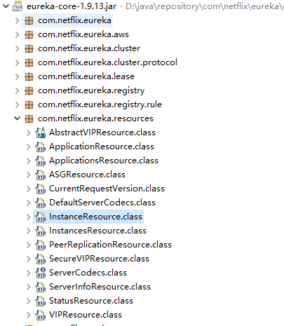
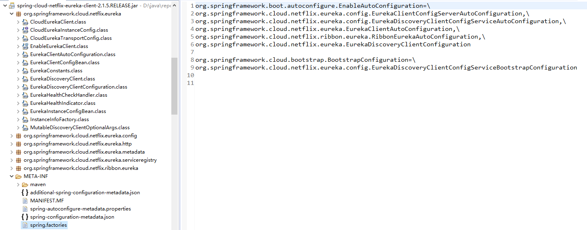
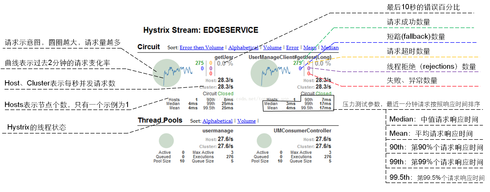
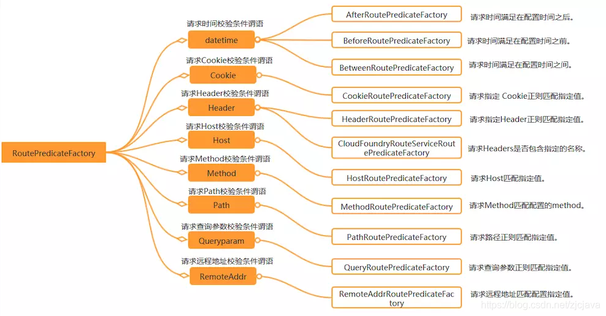
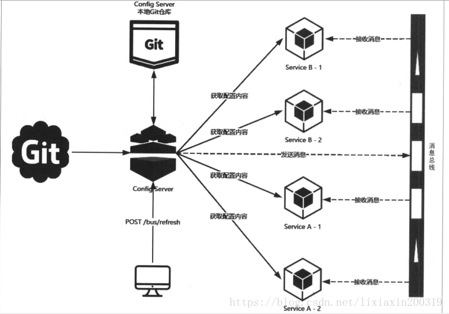

# Spring Cloud Netflix

## 1. Eureka的源码分析

### 1.1 服务器端

依赖springboot的自动装配原理定位到spring-cloud-netflix-eureka-server包下的spring.factories文件

org.springframework.cloud.netflix.eureka.server.EurekaServerAutoConfiguration


Jersey是一个RESTFUL请求服务JAVA框架，与常规的JAVA编程使用的struts框架类似，它主要用于处理业务逻辑层

与`SpringMvc`的区别：

```
1. jersey同样提供DI，是由glassfish hk2实现，也就是说，如果想单独使用jersey一套，需要另外学习Bean容器；
2. MVC出发点即是WEB，但jersey出发点确实RESTFull，体现点在与接口的设计方面，如MVC返回复杂结构需要使用ModelAndView,而jersey仅仅需要返回一个流或者文件句柄；
3. jersey提供一种子资源的概念，这也是RESTFull中提倡所有url都是资源；
4. jersey直接提供application.wadl资源url说明；
5. MVC提供Session等状态管理，jersey没有，这个源自RESTFull设计无状态化；
6. Response方法支持更好返回结果，方便的返回Status，包括200，303，401，403；
7. 提供超级特别方便的方式访问RESTFull;

```

Jersey是一个是 webservice框架，常用注解解释

```
@Path
uri路径
定义资源的访问路径，client通过这个路径访问资源。比如：@Path("user")

@Produces
返回
指定返回MIME格式
资源按照那种数据格式返回，可取的值有：MediaType.APPLICATION_XXX。比如：@Produces(MediaType.APPLICATION_XML)

@Consumes
接收入参
接受指定的MIME格式
只有符合这个参数设置的请求再能访问到这个资源。比如@Consumes("application/x-www-form-urlencoded")

@PathParam
uri路径参数
写在方法的参数中，获得请求路径参数。比如：@PathParam("username")  String userName
```


由于集成了Jersey，我们可以找到在EurekaServer的依赖包中的 eureka-core-1.9.8.jar ,可以看到一些列的XXXResource



eureka信息查看 get: {ip:port}/eureka/status
>注册到eureka的服务信息查看 get: {ip:port}/eureka/apps

注册到eureka的具体的服务查看
>get: {ip:port}/eureka/apps/{appname}/{id}
<br>
>对应eureka源码的：InstanceResource.getInstanceInfo


服务续约
>put：{ip:port}/eureka/apps/{appname}/{id}?lastDirtyTimestamp={}&status=up
<br>
>对应eureka源码的：InstanceResource.renewLease


更改服务状态
>put：{ip:port}/eureka/apps/{appname}/{id}/status?lastDirtyTimestamp={}&value={UP/DOWN}
<br>
>对应eureka源码的：InstanceResource.statusUpdate


删除状态更新
>delete：{ip:port}/eureka/apps/{appname}/{id}/status?lastDirtyTimestamp={}&value={UP/DOWN}
<br>
>对应eureka源码的：InstanceResource.deleteStatusUpdate

删除服务
>delete: {ip:port}/eureka/apps/{appname}/{id}
<br>
>对应eureka源码的：InstanceResource.cancelLease


### 1.2 客户端



```java
@Configuration
@EnableConfigurationProperties
@ConditionalOnClass(EurekaClientConfig.class)
@Import(DiscoveryClientOptionalArgsConfiguration.class)
@ConditionalOnBean(EurekaDiscoveryClientConfiguration.Marker.class)
@ConditionalOnProperty(value = "eureka.client.enabled", matchIfMissing = true)
@ConditionalOnDiscoveryEnabled
@AutoConfigureBefore({ NoopDiscoveryClientAutoConfiguration.class,
		CommonsClientAutoConfiguration.class, ServiceRegistryAutoConfiguration.class })
@AutoConfigureAfter(name = {
		"org.springframework.cloud.autoconfigure.RefreshAutoConfiguration",
		"org.springframework.cloud.netflix.eureka.EurekaDiscoveryClientConfiguration",
		"org.springframework.cloud.client.serviceregistry.AutoServiceRegistrationAutoConfiguration" })
public class EurekaClientAutoConfiguration {
    ...
@Bean
public DiscoveryClient discoveryClient(EurekaClient client,
        EurekaClientConfig clientConfig) {
    return new EurekaDiscoveryClient(client, clientConfig);
}
```

```java
@Singleton
public class DiscoveryClient implements EurekaClient {
    ...
/**
* Register with the eureka service by making the appropriate REST call.
*/
boolean register() throws Throwable {
    logger.info(PREFIX + "{}: registering service...", appPathIdentifier);
    EurekaHttpResponse<Void> httpResponse;
    try {
        httpResponse = eurekaTransport.registrationClient.register(instanceInfo);
    } catch (Exception e) {
        logger.warn(PREFIX + "{} - registration failed {}", appPathIdentifier, e.getMessage(), e);
        throw e;
    }
    if (logger.isInfoEnabled()) {
        logger.info(PREFIX + "{} - registration status: {}", appPathIdentifier, httpResponse.getStatusCode());
    }
    return httpResponse.getStatusCode() == Status.NO_CONTENT.getStatusCode();
}

```

```java
public interface EurekaHttpClient {

    EurekaHttpResponse<Void> register(InstanceInfo info);

    EurekaHttpResponse<Void> cancel(String appName, String id);

    EurekaHttpResponse<InstanceInfo> sendHeartBeat(String appName, String id, InstanceInfo info, InstanceStatus overriddenStatus);

    EurekaHttpResponse<Void> statusUpdate(String appName, String id, InstanceStatus newStatus, InstanceInfo info);

    EurekaHttpResponse<Void> deleteStatusOverride(String appName, String id, InstanceInfo info);

    EurekaHttpResponse<Applications> getApplications(String... regions);

    EurekaHttpResponse<Applications> getDelta(String... regions);

    EurekaHttpResponse<Applications> getVip(String vipAddress, String... regions);

    EurekaHttpResponse<Applications> getSecureVip(String secureVipAddress, String... regions);

    EurekaHttpResponse<Application> getApplication(String appName);

    EurekaHttpResponse<InstanceInfo> getInstance(String appName, String id);

    EurekaHttpResponse<InstanceInfo> getInstance(String id);

    void shutdown();
}
```

### 1.3 Eureka心跳机制

```
1.服务器启动成功，等待客户（服务）端注册，在启动过程中如果我们配置了集群，集群之间会同步注册表，每一个Eureka serve都会存在这个集群完整的服务注册表信息
2.Eureka client 启动时根据配置信息，去注册到指定的注册中心
3.Eureka client会每30秒向Eureka server 发送一次心跳请求，证明该客户端服务正常
4.当Eureka server90s内没有接受客户端服务正常，注册中心会认为该节点失效，会注销该实列 （从注册表中删除注册信息）
5.单位时间内如果服务端统计到大量客户端没有发送心跳，则认为网络异常，进去自我保护机制，不在剔除没有发送心跳的客户端
6.当客户端恢复正常之后，服务端就会退出自我保护模式
7.客户端定时全量或增量从注册中心获取服务注册表，并且会缓存到本地
8.服务调用时，客户端会先从本地缓存找到调用服务，如果调取不到 先从注册中心刷新注册表，在同步到本地
9.客户端获取不到目标服务器信息发起服务调用
10.客户端程序关闭时向服务端发送取消请求，服务器将实例从注册表中删除
```

### 1.4 注册中心的比较


## 2. Ribbon源码分析和客服端负载均衡

## 3. Feign的源码分析


@EnableFeignClients 应用到@Import 导入ImportBeanDefinitionRegistrar的实现类方式

```java
@Import(FeignClientsRegistrar.class)
public @interface EnableFeignClients {
    ...
```

```java
class FeignClientsRegistrar
		implements ImportBeanDefinitionRegistrar, ResourceLoaderAware, EnvironmentAware {
...

@Override
public void registerBeanDefinitions(AnnotationMetadata metadata,
        BeanDefinitionRegistry registry) {
    registerDefaultConfiguration(metadata, registry);
    registerFeignClients(metadata, registry);
}
```

扫描注解
```java
public void registerFeignClients(AnnotationMetadata metadata,
			BeanDefinitionRegistry registry) {
		ClassPathScanningCandidateComponentProvider scanner = getScanner();
		scanner.setResourceLoader(this.resourceLoader);

		Set<String> basePackages;

		Map<String, Object> attrs = metadata
				.getAnnotationAttributes(EnableFeignClients.class.getName());
		AnnotationTypeFilter annotationTypeFilter = new AnnotationTypeFilter(
				FeignClient.class);//扫描当前工程所有使用FeignClient标签
		final Class<?>[] clients = attrs == null ? null
				: (Class<?>[]) attrs.get("clients");
		if (clients == null || clients.length == 0) {
			scanner.addIncludeFilter(annotationTypeFilter);
			basePackages = getBasePackages(metadata);
		}
		else {
			final Set<String> clientClasses = new HashSet<>();
			basePackages = new HashSet<>();
			for (Class<?> clazz : clients) {
				basePackages.add(ClassUtils.getPackageName(clazz));
				clientClasses.add(clazz.getCanonicalName());
			}
			AbstractClassTestingTypeFilter filter = new AbstractClassTestingTypeFilter() {
				@Override
				protected boolean match(ClassMetadata metadata) {
					String cleaned = metadata.getClassName().replaceAll("\\$", ".");
					return clientClasses.contains(cleaned);
				}
			};
			scanner.addIncludeFilter(
					new AllTypeFilter(Arrays.asList(filter, annotationTypeFilter)));
		}

		for (String basePackage : basePackages) {
			Set<BeanDefinition> candidateComponents = scanner
					.findCandidateComponents(basePackage);
			for (BeanDefinition candidateComponent : candidateComponents) {
				if (candidateComponent instanceof AnnotatedBeanDefinition) {
					// verify annotated class is an interface
					AnnotatedBeanDefinition beanDefinition = (AnnotatedBeanDefinition) candidateComponent;
					AnnotationMetadata annotationMetadata = beanDefinition.getMetadata();
					Assert.isTrue(annotationMetadata.isInterface(),
							"@FeignClient can only be specified on an interface");

					Map<String, Object> attributes = annotationMetadata
							.getAnnotationAttributes(
									FeignClient.class.getCanonicalName());

					String name = getClientName(attributes);
					registerClientConfiguration(registry, name,
							attributes.get("configuration"));

					registerFeignClient(registry, annotationMetadata, attributes);//完成相关注册的功能
				}
			}
		}
	}
```

通过`BeanDefinitionBuilder`构建bean对象
```java
private void registerFeignClient(BeanDefinitionRegistry registry,
			AnnotationMetadata annotationMetadata, Map<String, Object> attributes) {
		String className = annotationMetadata.getClassName();
		BeanDefinitionBuilder definition = BeanDefinitionBuilder
				.genericBeanDefinition(FeignClientFactoryBean.class);//构建bean对象
		validate(attributes);
		definition.addPropertyValue("url", getUrl(attributes));
		definition.addPropertyValue("path", getPath(attributes));
		String name = getName(attributes);
		definition.addPropertyValue("name", name);
		String contextId = getContextId(attributes);
		definition.addPropertyValue("contextId", contextId);
		definition.addPropertyValue("type", className);
		definition.addPropertyValue("decode404", attributes.get("decode404"));
		definition.addPropertyValue("fallback", attributes.get("fallback"));
		definition.addPropertyValue("fallbackFactory", attributes.get("fallbackFactory"));
		definition.setAutowireMode(AbstractBeanDefinition.AUTOWIRE_BY_TYPE);

		String alias = contextId + "FeignClient";
		AbstractBeanDefinition beanDefinition = definition.getBeanDefinition();
		beanDefinition.setAttribute(FactoryBean.OBJECT_TYPE_ATTRIBUTE, className);

		// has a default, won't be null
		boolean primary = (Boolean) attributes.get("primary");

		beanDefinition.setPrimary(primary);

		String qualifier = getQualifier(attributes);
		if (StringUtils.hasText(qualifier)) {
			alias = qualifier;
		}

		BeanDefinitionHolder holder = new BeanDefinitionHolder(beanDefinition, className,
				new String[] { alias });
		BeanDefinitionReaderUtils.registerBeanDefinition(holder, registry);
	}
```

```java
class FeignClientFactoryBean
		implements FactoryBean<Object>, InitializingBean, ApplicationContextAware {
    ...
@Override
public Object getObject() throws Exception {
    return getTarget();
}
...
<T> T getTarget() {
    FeignContext context = this.applicationContext.getBean(FeignContext.class);
    Feign.Builder builder = feign(context);

    if (!StringUtils.hasText(this.url)) {
        if (!this.name.startsWith("http")) {
            this.url = "http://" + this.name;
        }
        else {
            this.url = this.name;
        }
        this.url += cleanPath();
        return (T) loadBalance(builder, context,
                new HardCodedTarget<>(this.type, this.name, this.url));
    }
    if (StringUtils.hasText(this.url) && !this.url.startsWith("http")) {
        this.url = "http://" + this.url;
    }
    String url = this.url + cleanPath();
    Client client = getOptional(context, Client.class);
    if (client != null) {
        if (client instanceof LoadBalancerFeignClient) {
            // not load balancing because we have a url,
            // but ribbon is on the classpath, so unwrap
            client = ((LoadBalancerFeignClient) client).getDelegate();
        }
        if (client instanceof FeignBlockingLoadBalancerClient) {
            // not load balancing because we have a url,
            // but Spring Cloud LoadBalancer is on the classpath, so unwrap
            client = ((FeignBlockingLoadBalancerClient) client).getDelegate();
        }
        builder.client(client);
    }
    Targeter targeter = get(context, Targeter.class);
    return (T) targeter.target(this, builder, context,
            new HardCodedTarget<>(this.type, this.name, url));//基于jdk的动态代理实现入口
}

```

```java
class DefaultTargeter implements Targeter {

	@Override
	public <T> T target(FeignClientFactoryBean factory, Feign.Builder feign,
			FeignContext context, Target.HardCodedTarget<T> target) {
		return feign.target(target);
	}

}
```

`ReflectiveFeign.java`

```java
@SuppressWarnings("unchecked")
  @Override
  public <T> T newInstance(Target<T> target) {
    Map<String, MethodHandler> nameToHandler = targetToHandlersByName.apply(target);
    Map<Method, MethodHandler> methodToHandler = new LinkedHashMap<Method, MethodHandler>();
    List<DefaultMethodHandler> defaultMethodHandlers = new LinkedList<DefaultMethodHandler>();

    for (Method method : target.type().getMethods()) {
      if (method.getDeclaringClass() == Object.class) {
        continue;
      } else if (Util.isDefault(method)) {
        DefaultMethodHandler handler = new DefaultMethodHandler(method);
        defaultMethodHandlers.add(handler);
        methodToHandler.put(method, handler);
      } else {
        methodToHandler.put(method, nameToHandler.get(Feign.configKey(target.type(), method)));
      }
    }
    InvocationHandler handler = factory.create(target, methodToHandler);
    T proxy = (T) Proxy.newProxyInstance(target.type().getClassLoader(),
        new Class<?>[] {target.type()}, handler);

    for (DefaultMethodHandler defaultMethodHandler : defaultMethodHandlers) {
      defaultMethodHandler.bindTo(proxy);
    }
    return proxy;
  }
```

```java
public class ReflectiveFeign extends Feign {
... 
 @Override
    public Object invoke(Object proxy, Method method, Object[] args) throws Throwable {
      if ("equals".equals(method.getName())) {
        try {
          Object otherHandler =
              args.length > 0 && args[0] != null ? Proxy.getInvocationHandler(args[0]) : null;
          return equals(otherHandler);
        } catch (IllegalArgumentException e) {
          return false;
        }
      } else if ("hashCode".equals(method.getName())) {
        return hashCode();
      } else if ("toString".equals(method.getName())) {
        return toString();
      }

      return dispatch.get(method).invoke(args);
    }
    ...
```

```java
final class SynchronousMethodHandler implements MethodHandler {
    ...
 @Override
  public Object invoke(Object[] argv) throws Throwable {
    RequestTemplate template = buildTemplateFromArgs.create(argv);
    Options options = findOptions(argv);
    Retryer retryer = this.retryer.clone();
    while (true) {
      try {
        return executeAndDecode(template, options);
      } catch (RetryableException e) {
        try {
          retryer.continueOrPropagate(e);
        } catch (RetryableException th) {
          Throwable cause = th.getCause();
          if (propagationPolicy == UNWRAP && cause != null) {
            throw cause;
          } else {
            throw th;
          }
        }
        if (logLevel != Logger.Level.NONE) {
          logger.logRetry(metadata.configKey(), logLevel);
        }
        continue;
      }
    }
  }
```


FeignClient标签的常用属性如下

```bash
@FeignClient(name = "github-client" , url = "https://api.github.com" , configuration = GitHubExampleConfig. class )
public interface GitHubClient {
     @RequestMapping(value = "/search/repositories" , method = RequestMethod.GET)
     String searchRepo(@RequestParam("q") String queryStr);
}
```
- name：指定FeignClient的名称，如果项目使用了Ribbon，name属性会作为微服务的名称，用于服务发现
- url: url一般用于调试，可以手动指定@FeignClient调用的地址
- decode404:当发生http 404错误时，如果该字段位true，会调用decoder进行解码，否则抛出FeignException
- configuration: Feign配置类，可以自定义Feign的Encoder、Decoder、LogLevel、Contract
- fallback: 定义容错的处理类，当调用远程接口失败或超时时，会调用对应接口的容错逻辑，fallback指定的类必须实现@FeignClient标记的接口
- fallbackFactory: 工厂类，用于生成fallback类示例，通过这个属性我们可以实现每个接口通用的容错逻辑，减少重复的代码
- path: 定义当前FeignClient的统一前缀

```yml
feign:
   okhttp:
      enabled: true
   hystrix:
      enabled: true
hystrix:
   command:
      default:
         execution:
            isolation:
               thread:
                  timeoutInMilliseconds: 5000 # 熔断器超时时间，默认：1000/毫秒
ribbon:
   ConnectTimeout: 3000 #服务请求连接超时时间（毫秒）
   ReadTimeout: 3000 #服务请求处理超时时间（毫秒）
```


## 4. Hystrix 熔断、降级、限流

### 4.1 熔断

熔断这一概念来源于电子工程中的断路器（Circuit Breaker）。在互联网系统中，当下游服务因访问压力过大而响应变慢或失败，上游服务为了保护系统整体的可用性，可以暂时切断对下游服务的调用。这种牺牲局部，保全整体的措施就叫做熔断

```yml
management:
  endpoints:
    web:
      exposure:
        include: '*'
        
feign:
  hystrix:
    enabled: true
  httpclient:
    enabled: false
  okhttp:
    enabled: true
hystrix:
   command:
      default:
         circuitBreaker:
            requestVolumeThreshold: 20 #触发熔断的最小请求次数，默认20
            sleepWindowInMilliseconds: 10000 #熔断多少秒后去尝试请求
            errorThresholdPercentage: 50 #触发熔断的失败请求最小占比，默认50%
         execution:
            isolation:
               thread:
                  timeoutInMilliseconds: 5000 # 熔断器超时时间，默认：1000/毫秒
```

### 4.2 降级

所谓降级，就是当某个服务熔断之后，服务器将不再被调用，此时客户端可以自己准备一个本地的fallback回调，返回一个缺省值。 也可以理解为兜底
`因为熔断所以降级`

```java
//指定需要调用的微服务名称
@FeignClient(name="shop-service-product",fallback =
ProductFeginClientCallBack.class)
public interface ProductFeginClient {
//调用的请求路径
@RequestMapping(value = "/product/{id}",method = RequestMethod.GET)
public Product findById(@PathVariable("id") Long id);
}
```

```java
/**
* 实现自定义的ProductFeginClient接口
* 在接口实现类中编写熔断降级方法
*/
@Component
public class ProductFeginClientCallBack implements ProductFeginClient {
/**
* 降级方法
*/
public Product findById(Long id) {
Product product = new Product();
product.setId(-1l);
product.setProductName("熔断:触发降级方法");
return product;
}
```


### 4.3 限流

Hystrix能做什么

1. 在通过第三方客户端访问（通常是通过网络）依赖服务出现高延迟或者失败时，为系统提供保护和控制
2. 在分布式系统中防止级联失败
3. 快速失败（Fail fast）同时能快速恢复
4. 提供失败回退（Fallback）和优雅的服务降级机制
5. 提供近似实时的监控、报警和运维控制手段


隔离策略

线程池隔离模式

`请求并发量大，耗时长（计算量大或者读取数据库），采用线程池隔离策略，可以保证大量容器线程可用`

使用一个线程池来存储当前的请求，线程池对请求作处理，设置任务返回处理超时时间，堆积的请求堆积入线程池队列。这种方式需要为每个依赖的服务申请线程池，有一定的资源消耗，好处是可以应对突发流量（流量洪峰来临时，处理不完可将数据存储到线程池队里慢慢处理）。


信号量隔离模式

`请求并发量大，耗时短（计算量小或者读缓存），采用信号量策略，可以减少线程切换开销提高效率`

使用一个原子计数器（或信号量）来记录当前有多少个线程在运行，请求来先判断计数器的数值，若超过设置的最大线程个数则丢弃改类型的新请求，若不超过则执行计数操作请求来计数器+1，请求返回计数器-1。这种方式是严格的控制线程且立即返回模式，无法应对突发流量（流量洪峰来临时，处理的线程超过数量，其他的请求会直接返回，不继续去请求依赖的服务）。

线程池隔离模式 VS 信号量隔离模式


- hystrix.command.default.execution.isolation.strategy : 配置隔离策略
- ExecutionIsolationStrategy.SEMAPHORE 信号量隔离
- ExecutionIsolationStrategy.THREAD 线程池隔离
- hystrix.command.default.execution.isolation.maxConcurrentRequests : 最大信号量上限

Hystrix主要配置项


Hystrix 底层基于 RxJava，RxJava 是响应式编程开发库，因此Hystrix的整个实现策略简单说即：把一个HystrixCommand封装成一个Observable（待观察者），针对自身要实现的核心功能，对Observable进行各种装饰，并在订阅各步装饰的Observable，以便在指定事件到达时，添加自己的业务

```java
@Service
public class HelloService {

    @HystrixCommand(fallbackMethod = "helloError",
            commandProperties = {
                    @HystrixProperty(name = "execution.isolation.strategy", value = "THREAD"),
                    @HystrixProperty(name = "execution.isolation.thread.timeoutInMilliseconds", value = "1000"),
                    @HystrixProperty(name = "circuitBreaker.enabled", value = "true"),
                    @HystrixProperty(name = "circuitBreaker.requestVolumeThreshold", value = "2")},
            threadPoolProperties = {
                    @HystrixProperty(name = "coreSize", value = "5"),
                    @HystrixProperty(name = "maximumSize", value = "5"),
                    @HystrixProperty(name = "maxQueueSize", value = "10")
            })
    public String sayHello(String name) {
        try {
            Thread.sleep( 15000 );
            return "Hello " + name + " !";
        } catch (InterruptedException e) {
            e.printStackTrace();
        }
        return null;
    }

    public String helloError(String name) {
        return "服务器繁忙，请稍后访问~";
    }

}
```


## 5. Hystrix Doashboard、聚合监控Turbine

### 5.1 Hystrix配置

```xml
<dependency>
    <groupId>org.springframework.cloud</groupId>
    <artifactId>spring-cloud-starter-netflix-hystrix-dashboard</artifactId>
</dependency>
```

```yml
turbine:
# 要监控的微服务列表，多个用,分隔
appConfig: shop-service-order
clusterNameExpression: "'default'"
```

在启动类使用@EnableHystrixDashboard注解和@EnableTurbine激活仪表盘项目



### 5.2 Hystrix替代方案 

[Alibaba Sentinel分布式系统流量防卫兵](/share/microservice/springclouda?id=_1-sentinel分布式系统的流量防卫兵)


## 6. GateWay

### 6.1 核心概念

1. 路由（route） 路由是网关最基础的部分，路由信息由一个ID、一个目的URL、一组断言工厂和一组Filter组成。如果断言为真，则说明请求URL和配置的路由匹配。
2. 断言（predicates） Java8中的断言函数，Spring Cloud Gateway中的断言函数输入类型是Spring5.0框架中的ServerWebExchange。Spring Cloud Gateway中的断言函数允许开发者去定义匹配来自Http Request中的任何信息，比如请求头和参数等。`实现灰度发布`



3. 过滤器（filter） 一个标准的Spring webFilter，Spring Cloud Gateway中的Filter分为两种类型，分别是Gateway Filter和Global Filter。过滤器Filter可以对请求和响应进行处理。

### 6.2 配置文件

```yml
server:
   port: 8201
spring:
   zipkin:
      base-url: http://debug-registry:9411/ #zipkin server的请求地址
      discoveryClientEnabled: false #让nacos把它当成一个URL，而不要当做服务名
   sleuth:
      sampler:
         probability: 1.0 #采样的百分比
   cloud:
      nacos:
          discovery:
            server-addr: http://debug-registry:8848
          config:
            server-addr: http://debug-registry:8848
            file-extension: yaml
      gateway:
         discovery:
            locator:
               enabled: true
               lower-case-service-id: true #使用小写service-id
         routes: #配置路由路径
         -  id: shop-auth
            uri: lb://shop-auth
            predicates:
            - After=2017-01-20T17:42:47.789-07:00[America/Denver]
            - Before=2017-01-20T17:42:47.789-07:00[America/Denver]
            - Between=2017-01-20T17:42:47.789-07:00[America/Denver], 2017-01-21T17:42:47.789-07:00[America/Denver]
            - Cookie=chocolate, ch.p
            - Header=X-Request-Id, \d+
            - Host=**.somehost.org,**.anotherhost.org
            - Method=GET
            - Path=/foo/{segment},/bar/{segment}
            - Query=baz
            - RemoteAddr=192.168.3.200/24
            - Path=/shop-auth/**
            filters:
            - StripPrefix=1
         -  id: shop-admin
            uri: lb://shop-admin
            predicates:
            - Path=/shop-admin/**
            filters:
            - StripPrefix=1
   security:
      oauth2:
         resourceserver:
            jwt:
               jwk-set-uri: http://127.0.0.1:8201/shop-auth/rsa/publicKey #配置RSA的公钥访问地址
   redis:
      host: debug-registry # Redis服务器地址
      database: 10 # Redis数据库索引（默认为0）
      port: 6379 # Redis服务器连接端口
      password: null # Redis服务器连接密码（默认为空）
      timeout: 3000ms # 连接超时时间（毫秒
      pool:
         max-active: 8 # 连接池最大连接数（使用负值表示没有限制）
         max-wait: -1 # 连接池最大阻塞等待时间（使用负值表示没有限制）
         max-idle: 8 # 连接池中的最大空闲连接
         min-idle: 0 # 连接池中的最小空闲连接
secure:
   ignore:
      urls: #配置白名单路径
      - /doc.html
      - /swagger-resources/**
      - /**/*.css
      - /shop-admin/minio/upload
management:
   endpoints:
      web:
         exposure:
            include: '*'
   endpoint:
      health:
         show-details: always
```

### 6.3 统一鉴权

```java
/**
 * 将登录用户的JWT转化成用户信息的全局过滤器
 */
@Component
public class AuthGlobalFilter implements GlobalFilter, Ordered {

    private static Logger LOGGER = LoggerFactory.getLogger(AuthGlobalFilter.class);

    @Override
    public Mono<Void> filter(ServerWebExchange exchange, GatewayFilterChain chain) {
        String token = exchange.getRequest().getHeaders().getFirst(AuthConstant.JWT_TOKEN_HEADER);
        if (StrUtil.isEmpty(token)) {
            return chain.filter(exchange);
        }
        try {
            //从token中解析用户信息并设置到Header中去
            String realToken = token.replace(AuthConstant.JWT_TOKEN_PREFIX, "");
            JWSObject jwsObject = JWSObject.parse(realToken);
            String userStr = jwsObject.getPayload().toString();
            LOGGER.info("AuthGlobalFilter.filter() user:{}",userStr);
            ServerHttpRequest request = exchange.getRequest().mutate().header(AuthConstant.USER_TOKEN_HEADER, userStr).build();
            exchange = exchange.mutate().request(request).build();
        } catch (ParseException e) {
            e.printStackTrace();
        }
        return chain.filter(exchange);
    }

    @Override
    public int getOrder() {
        return 0;
    }
}
```

集成Oauth2.0

```java
/**
 * 鉴权管理器，用于判断是否有资源的访问权限
 */
@Component
public class AuthorizationManager implements ReactiveAuthorizationManager<AuthorizationContext> {
    @Autowired
    private RedisTemplate<String, Object> redisTemplate;
    @Autowired
    private IgnoreUrlsConfig ignoreUrlsConfig;

    @Override
    public Mono<AuthorizationDecision> check(Mono<Authentication> mono, AuthorizationContext authorizationContext) {
        ServerHttpRequest request = authorizationContext.getExchange().getRequest();
        URI uri = request.getURI();
        PathMatcher pathMatcher = new AntPathMatcher();
        //白名单路径直接放行
        List<String> ignoreUrls = ignoreUrlsConfig.getUrls();
        for (String ignoreUrl : ignoreUrls) {
            if (pathMatcher.match(ignoreUrl, uri.getPath())) {
                return Mono.just(new AuthorizationDecision(true));
            }
        }
        //对应跨域的预检请求直接放行
        if(request.getMethod()==HttpMethod.OPTIONS){
            return Mono.just(new AuthorizationDecision(true));
        }
        //不同用户体系登录不允许互相访问
        try {
            String token = request.getHeaders().getFirst(AuthConstant.JWT_TOKEN_HEADER);
            if(StrUtil.isEmpty(token)){
                return Mono.just(new AuthorizationDecision(false));
            }
            String realToken = token.replace(AuthConstant.JWT_TOKEN_PREFIX, "");
            JWSObject jwsObject = JWSObject.parse(realToken);
            String userStr = jwsObject.getPayload().toString();
            UserDto userDto = JSONUtil.toBean(userStr, UserDto.class);
            if (AuthConstant.ADMIN_CLIENT_ID.equals(userDto.getClientId()) && !pathMatcher.match(AuthConstant.ADMIN_URL_PATTERN, uri.getPath())) {
                return Mono.just(new AuthorizationDecision(false));
            }
            if (AuthConstant.PORTAL_CLIENT_ID.equals(userDto.getClientId()) && pathMatcher.match(AuthConstant.ADMIN_URL_PATTERN, uri.getPath())) {
                return Mono.just(new AuthorizationDecision(false));
            }
        } catch (ParseException e) {
            e.printStackTrace();
            return Mono.just(new AuthorizationDecision(false));
        }
        //非管理端路径直接放行
        if (!pathMatcher.match(AuthConstant.ADMIN_URL_PATTERN, uri.getPath())) {
            return Mono.just(new AuthorizationDecision(true));
        }
        //管理端路径需校验权限
        Map<Object, Object> resourceRolesMap = redisTemplate.opsForHash().entries(AuthConstant.RESOURCE_ROLES_MAP_KEY);
        Iterator<Object> iterator = resourceRolesMap.keySet().iterator();
        List<String> authorities = new ArrayList<>();
        while (iterator.hasNext()) {
            String pattern = (String) iterator.next();
            if (pathMatcher.match(pattern, uri.getPath())) {
                authorities.addAll(Convert.toList(String.class, resourceRolesMap.get(pattern)));
            }
        }
        authorities = authorities.stream().map(i -> i = AuthConstant.AUTHORITY_PREFIX + i).collect(Collectors.toList());
        //认证通过且角色匹配的用户可访问当前路径
        return mono
                .filter(Authentication::isAuthenticated)
                .flatMapIterable(Authentication::getAuthorities)
                .map(GrantedAuthority::getAuthority)
                .any(authorities::contains)
                .map(AuthorizationDecision::new)
                .defaultIfEmpty(new AuthorizationDecision(false));
    }

}
```

### 6.4 网关限流

#### 6.4.1 限流算法

1. 计数器
2. 漏桶算法
3. 令牌桶算法

#### 6.4.2 基于Filter的限流

```xml
<!--redis的依赖-->
<dependency>
    <groupId>org.springframework.boot</groupId>
    <artifactId>spring-boot-starter-data-redis-reactive</artifactId>
</dependency>
```

```yml
server:
  port: 8888

spring:
  application:
    name: shop-gateway
  cloud:
    ## Spring Cloud Gateway 配置项，对应 GatewayProperties 类
    gateway:
      # 路由配置项，对应 RouteDefinition 数组
      routes:
        - id: shop-search
          uri: lb://shop-search # 路由到的目标地址
          predicates: # 断言，作为路由的匹配条件，对应 RouteDefinition 数组
            - Path=/shop-search/**
          filters:
            - StripPrefix=1
            - name: RequestRateLimiter
              args:
                redis-rate-limiter.replenishRate: 1 # 令牌桶的每秒放的数量/每秒填充平均速率
                redis-rate-limiter.burstCapacity: 2 # 令牌桶的最大令牌数
                key-resolver: "#{@ipKeyResolver}" # 获取限流 KEY 的 Bean 的名字/使用SpEL从容器中获取对象
  ##### Redis 配置项 #####
  redis:
    host: 127.0.0.1
    port: 6379
```

配置KeyResolver

```java
@Configuration
public class KeyResolverConfiguration {
	/**
	 * 基于请求路径的限流
	 */
	@Bean
	public KeyResolver pathKeyResolver() {
		return exchange -> Mono.just(exchange.getRequest().getPath().toString());
	}

	/**
	 * 基于请求ip地址的限流
	 */
	@Bean
	public KeyResolver ipKeyResolver() {
		return exchange -> Mono.just(exchange.getRequest().getHeaders().getFirst("X-Forwarded-For"));
	}

	/**
	 * 基于用户的限流
	 */
	@Bean
	public KeyResolver userKeyResolver() {
		return exchange -> Mono.just(exchange.getRequest().getQueryParams().getFirst("user"));
	}
}
```

### 6.5 限流实现request_rate_limiter.lua

源码位置在spring-cloud-gateway-core包下； 基于lua脚本实现

```lua
local tokens_key = KEYS[1]     -- 存放令牌数量的key
local timestamp_key = KEYS[2]   -- 存放最近一次拿令牌的时间
--redis.log(redis.LOG_WARNING, "tokens_key " .. tokens_key)

local rate = tonumber(ARGV[1])          -- 每秒往桶里放的令牌数
local capacity = tonumber(ARGV[2])     -- 桶最大容量
local now = tonumber(ARGV[3])         -- 当前时间
local requested = tonumber(ARGV[4])        -- 每次算几个令牌

local fill_time = capacity/rate       -- 从零开始多久满
local ttl = math.floor(fill_time*2)    -- key的存活时间，如果过了这个时间，肯定就满了，每必要存了

--redis.log(redis.LOG_WARNING, "rate " .. ARGV[1])
--redis.log(redis.LOG_WARNING, "capacity " .. ARGV[2])
--redis.log(redis.LOG_WARNING, "now " .. ARGV[3])
--redis.log(redis.LOG_WARNING, "requested " .. ARGV[4])
--redis.log(redis.LOG_WARNING, "filltime " .. fill_time)
--redis.log(redis.LOG_WARNING, "ttl " .. ttl)

local last_tokens = tonumber(redis.call("get", tokens_key))   -- 目前桶里的令牌数
if last_tokens == nil then
  last_tokens = capacity
end
--redis.log(redis.LOG_WARNING, "last_tokens " .. last_tokens)

local last_refreshed = tonumber(redis.call("get", timestamp_key))  --最近一次取令牌的时间
if last_refreshed == nil then
  last_refreshed = 0
end
--redis.log(redis.LOG_WARNING, "last_refreshed " .. last_refreshed)

local delta = math.max(0, now-last_refreshed)          --上次取令牌到现在过了多少秒
local filled_tokens = math.min(capacity, last_tokens+(delta*rate))    -- 放新令牌后的总数
local allowed = filled_tokens >= requested       -- 现在桶里令牌够不够执行一次
local new_tokens = filled_tokens      -- 当前令牌数
local allowed_num = 0
if allowed then
  new_tokens = filled_tokens - requested       -- 拿走一次令牌后剩余令牌数
  allowed_num = 1
end

--redis.log(redis.LOG_WARNING, "delta " .. delta)
--redis.log(redis.LOG_WARNING, "filled_tokens " .. filled_tokens)
--redis.log(redis.LOG_WARNING, "allowed_num " .. allowed_num)
--redis.log(redis.LOG_WARNING, "new_tokens " .. new_tokens)

if ttl > 0 then
  redis.call("setex", tokens_key, ttl, new_tokens)  -- 更新令牌数
  redis.call("setex", timestamp_key, ttl, now)      -- 更新最后一次执行时间
end

-- return { allowed_num, new_tokens, capacity, filled_tokens, requested, new_tokens }
return { allowed_num, new_tokens }
```

## 7. Zuul和Gateway的区别

### 7.1 二者联系

spring-cloud-Gateway是spring-cloud的一个子项目。而zuul则是netflix公司的项目，只是spring将zuul集成在spring-cloud中使用而已。因为zuul2.0连续跳票和zuul1的性能表现不是很理想，所以催生了spring团队开发了Gateway项目

Zuul：

使用的是阻塞式的 API，不支持长连接，比如 websockets。

底层是servlet，Zuul处理的是http请求

没有提供异步支持，流控等均由hystrix支持。

依赖包spring-cloud-starter-netflix-zuul。

Gateway：

Spring Boot和Spring Webflux提供的Netty底层环境，不能和传统的Servlet容器一起使用，也不能打包成一个WAR包。

依赖spring-boot-starter-webflux和/ spring-cloud-starter-gateway

提供了异步支持，提供了抽象负载均衡，提供了抽象流控，并默认实现了RedisRateLimiter。

### 7.2 相同

1、底层都是servlet

2、两者均是web网关，处理的是http请求


### 7.3 不同

1. 内部实现：
  - gateway对比zuul多依赖了spring-webflux，在spring的支持下，功能更强大，内部实现了限流、负载均衡等，扩展性也更强，但同时也限制了仅适合于Spring Cloud套件
  - zuul则可以扩展至其他微服务框架中，其内部没有实现限流、负载均衡等。
2. 是否支持异步
  - zuul仅支持同步
  - gateway支持异步。理论上gateway则更适合于提高系统吞吐量（但不一定能有更好的性能），最终性能还需要通过严密的压测来决定
3. 框架设计的角度
  - gateway具有更好的扩展性，并且其已经发布了2.0.0的RELESE版本，稳定性也是非常好的
4. 性能
  - WebFlux 模块的名称是 spring-webflux，名称中的 Flux 来源于 Reactor 中的类 Flux。Spring webflux 有一个全新的非堵塞的函数式Reactive Web框架，可以用来构建异步的、非堵塞的、事件驱动的服务，在伸缩性方面表现非常好。使用非阻塞API。 Websockets得到支持，并且由于它与Spring紧密集成，所以将会是一个更好的开发体验。
  - Zuul 1.x，是一个基于阻塞io的API Gateway。Zuul已经发布了Zuul 2.x，基于Netty，也是非阻塞的，支持长连接，但Spring Cloud暂时还没有整合计划。

### 7.4 总结

总的来说，在微服务架构，如果使用了Spring Cloud生态的基础组件，则Spring Cloud Gateway相比而言更加具备优势，单从流式编程+支持异步上就足以让开发者选择它了。
　　
对于小型微服务架构或是复杂架构（不仅包括微服务应用还有其他非Spring Cloud服务节点），zuul也是一个不错的选择。

## 8. 配置中心

### 8.1 服务器配置

```yml
spring:
   cloud:
      config:
         server:
            git:
               uri: https://gitee.com/xuzhihao-spring/springcloud-config
               clone-on-start: true #开启启动时直接从git获取配置
   rabbitmq:
      host: debug-registry
      port: 5672
      username: guest
      password: guest
```

### 8.2 客户端配置

```yml
spring:
   cloud:
      config: #Config客户端配置
         name: admin-client #应用名称,需要对应git中配置文件名称的前半部分
         profile: dev #启用配置后缀名称
         label: master #分支名称
         discovery:
            enabled: true #开启服务发现
            service-id: config-server
  rabbitmq:
      host: debug-registry
      port: 5672
      username: guest
      password: guest  
```

### 8.3 高可用配置

手动刷新：客户端使用post去触发refresh，获取最新数据，需要依赖springboot-starter-actuator

自动刷新：依赖rabbitmq完成，post去触发config服务器的bus-refresh端点完成全局通知s




## 9. 链路跟踪

### 9.1 Sleuth

```xml
<dependency>
    <groupId>org.springframework.cloud</groupId>
    <artifactId>spring-cloud-starter-sleuth</artifactId>
</dependency>
```

```yml
logging:
  level:
    root: INFO
      org.springframework.web.servlet.DispatcherServlet: DEBUG
      org.springframework.cloud.sleuth: DEBUG
```

### 9.2 Zipkin

```xml
<dependency>
    <groupId>org.springframework.cloud</groupId>
    <artifactId>spring-cloud-starter-zipkin</artifactId>
</dependency>
```

```yml
spring:
   zipkin:
      base-url: http://debug-registry:9411/ #zipkin server的请求地址
      discoveryClientEnabled: false #让nacos把它当成一个URL，而不要当做服务名
   sleuth:
      sampler:
         probability: 1.0 #采样的百分比
```

### 9.3 Zipkin+RabbitMQ

```bash
java -jar zipkin-server-2.12.9-exec.jar --RABBIT_ADDRESSES=127.0.0.1:5672
```

客户端配置

```xml
<dependency>
    <groupId>org.springframework.cloud</groupId>
    <artifactId>spring-cloud-starter-sleuth</artifactId>
</dependency>
<dependency>
    <groupId>org.springframework.cloud</groupId>
    <artifactId>spring-cloud-starter-zipkin</artifactId>
</dependency>
<dependency>
    <groupId>org.springframework.cloud</groupId>
      <artifactId>spring-cloud-sleuth-zipkin</artifactId>
</dependency>
<dependency>
    <groupId>org.springframework.amqp</groupId>
    <artifactId>spring-rabbit</artifactId>
</dependency>

```

```yml
  zipkin:
    base-url: http://127.0.0.1:9411/  #zipkin server的请求地址
    sender:
      type: rabbit
      type: web  #请求方式,默认以http的方式向zipkin server发送追踪数据
  sleuth:
    sampler:
      probability: 1.0  #采样的百分比
  rabbitmq:
    host: localhost
    port: 5672
    username: guest
    password: guest
    listener:  #这里配置了重试策略
      direct:
        retry:
          enabled: true
      simple:
        retry:
          enabled: true
```
### 9.4 存储跟踪数据

可以从官网找到Zipkin Server持久mysql的数据库脚本

```sql
/*
SQLyog Ultimate v11.33 (64 bit)
MySQL - 5.5.58 : Database - zipkin
*********************************************************************
*/


/*!40101 SET NAMES utf8 */;

/*!40101 SET SQL_MODE=''*/;

/*!40014 SET @OLD_UNIQUE_CHECKS=@@UNIQUE_CHECKS, UNIQUE_CHECKS=0 */;
/*!40014 SET @OLD_FOREIGN_KEY_CHECKS=@@FOREIGN_KEY_CHECKS, FOREIGN_KEY_CHECKS=0 */;
/*!40101 SET @OLD_SQL_MODE=@@SQL_MODE, SQL_MODE='NO_AUTO_VALUE_ON_ZERO' */;
/*!40111 SET @OLD_SQL_NOTES=@@SQL_NOTES, SQL_NOTES=0 */;
CREATE DATABASE /*!32312 IF NOT EXISTS*/`zipkin` /*!40100 DEFAULT CHARACTER SET utf8 */;

USE `zipkin`;

/*Table structure for table `zipkin_annotations` */

DROP TABLE IF EXISTS `zipkin_annotations`;

CREATE TABLE `zipkin_annotations` (
  `trace_id_high` bigint(20) NOT NULL DEFAULT '0' COMMENT 'If non zero, this means the trace uses 128 bit traceIds instead of 64 bit',
  `trace_id` bigint(20) NOT NULL COMMENT 'coincides with zipkin_spans.trace_id',
  `span_id` bigint(20) NOT NULL COMMENT 'coincides with zipkin_spans.id',
  `a_key` varchar(255) NOT NULL COMMENT 'BinaryAnnotation.key or Annotation.value if type == -1',
  `a_value` blob COMMENT 'BinaryAnnotation.value(), which must be smaller than 64KB',
  `a_type` int(11) NOT NULL COMMENT 'BinaryAnnotation.type() or -1 if Annotation',
  `a_timestamp` bigint(20) DEFAULT NULL COMMENT 'Used to implement TTL; Annotation.timestamp or zipkin_spans.timestamp',
  `endpoint_ipv4` int(11) DEFAULT NULL COMMENT 'Null when Binary/Annotation.endpoint is null',
  `endpoint_ipv6` binary(16) DEFAULT NULL COMMENT 'Null when Binary/Annotation.endpoint is null, or no IPv6 address',
  `endpoint_port` smallint(6) DEFAULT NULL COMMENT 'Null when Binary/Annotation.endpoint is null',
  `endpoint_service_name` varchar(255) DEFAULT NULL COMMENT 'Null when Binary/Annotation.endpoint is null',
  UNIQUE KEY `trace_id_high` (`trace_id_high`,`trace_id`,`span_id`,`a_key`,`a_timestamp`) COMMENT 'Ignore insert on duplicate',
  KEY `trace_id_high_2` (`trace_id_high`,`trace_id`,`span_id`) COMMENT 'for joining with zipkin_spans',
  KEY `trace_id_high_3` (`trace_id_high`,`trace_id`) COMMENT 'for getTraces/ByIds',
  KEY `endpoint_service_name` (`endpoint_service_name`) COMMENT 'for getTraces and getServiceNames',
  KEY `a_type` (`a_type`) COMMENT 'for getTraces',
  KEY `a_key` (`a_key`) COMMENT 'for getTraces',
  KEY `trace_id` (`trace_id`,`span_id`,`a_key`) COMMENT 'for dependencies job'
) ENGINE=InnoDB DEFAULT CHARSET=utf8 ROW_FORMAT=COMPRESSED;

/*Data for the table `zipkin_annotations` */

/*Table structure for table `zipkin_dependencies` */

DROP TABLE IF EXISTS `zipkin_dependencies`;

CREATE TABLE `zipkin_dependencies` (
  `day` date NOT NULL,
  `parent` varchar(255) NOT NULL,
  `child` varchar(255) NOT NULL,
  `call_count` bigint(20) DEFAULT NULL,
  UNIQUE KEY `day` (`day`,`parent`,`child`)
) ENGINE=InnoDB DEFAULT CHARSET=utf8 ROW_FORMAT=COMPRESSED;

/*Data for the table `zipkin_dependencies` */

/*Table structure for table `zipkin_spans` */

DROP TABLE IF EXISTS `zipkin_spans`;

CREATE TABLE `zipkin_spans` (
  `trace_id_high` bigint(20) NOT NULL DEFAULT '0' COMMENT 'If non zero, this means the trace uses 128 bit traceIds instead of 64 bit',
  `trace_id` bigint(20) NOT NULL,
  `id` bigint(20) NOT NULL,
  `name` varchar(255) NOT NULL,
  `parent_id` bigint(20) DEFAULT NULL,
  `debug` bit(1) DEFAULT NULL,
  `start_ts` bigint(20) DEFAULT NULL COMMENT 'Span.timestamp(): epoch micros used for endTs query and to implement TTL',
  `duration` bigint(20) DEFAULT NULL COMMENT 'Span.duration(): micros used for minDuration and maxDuration query',
  UNIQUE KEY `trace_id_high` (`trace_id_high`,`trace_id`,`id`) COMMENT 'ignore insert on duplicate',
  KEY `trace_id_high_2` (`trace_id_high`,`trace_id`,`id`) COMMENT 'for joining with zipkin_annotations',
  KEY `trace_id_high_3` (`trace_id_high`,`trace_id`) COMMENT 'for getTracesByIds',
  KEY `name` (`name`) COMMENT 'for getTraces and getSpanNames',
  KEY `start_ts` (`start_ts`) COMMENT 'for getTraces ordering and range'
) ENGINE=InnoDB DEFAULT CHARSET=utf8 ROW_FORMAT=COMPRESSED;

/*Data for the table `zipkin_spans` */

/*!40101 SET SQL_MODE=@OLD_SQL_MODE */;
/*!40014 SET FOREIGN_KEY_CHECKS=@OLD_FOREIGN_KEY_CHECKS */;
/*!40014 SET UNIQUE_CHECKS=@OLD_UNIQUE_CHECKS */;
/*!40111 SET SQL_NOTES=@OLD_SQL_NOTES */;
```

```bash
java -jar zipkin-server-2.12.9-exec.jar --STORAGE_TYPE=mysql --MYSQL_HOST=127.0.0.1 --MYSQL_TCP_PORT=3306 --MYSQL_DB=zipkin --MYSQL_USER=root --MYSQL_PASS=111111
```

- STORAGE_TYPE : 存储类型
- MYSQL_HOST： mysql主机地址
- MYSQL_TCP_PORT：mysql端口
- MYSQL_DB： mysql数据库名称
- MYSQL_USER：mysql用户名
- MYSQL_PASS ：mysql密码


### 9.5 Skywalking

APM (Application Performance Management) 即应用性能管理系统，是对企业系统即时监控以实现对应用程序性能管理和故障管理的系统化的解决方案。应用性能管理，主要指对企业的关键业务应用进行监测、优化，提高企业应用的可靠性和质量，保证用户得到良好的服务，降低IT总拥有成本

分布式链路跟踪最先由Google在Dapper论文中提出，而OpenTracing通过提供平台无关、厂商无关的API，使得开发人员能够方便的添加（或更换）追踪系统的实现

Skywalking的几大特点：
  1. 多语言自动探针，Java，.NET Core和Node.JS。
  2. 多种监控手段，语言探针和service mesh。
  3. 轻量高效。不需要额外搭建大数据平台。
  4. 模块化架构。UI、存储、集群管理多种机制可选。
  5. 支持告警。
  6. 优秀的可视化效果。


## 10. 开源配置中心Apollo

Apollo（阿波罗）是携程框架部门研发的分布式配置中心，通过官网提供的[下载](https://github.com/nobodyiam/apollo-build-scripts)连接下载安装包

```xml
<dependency>
    <groupId>com.ctrip.framework.apollo</groupId>
    <artifactId>apollo-client</artifactId>
    <version>1.1.0</version>
</dependency>
```

```yml
apollo:
  bootstrap:
    enabled: true
  meta: http://debug-registry:8080
app:
  id: platform-search
```