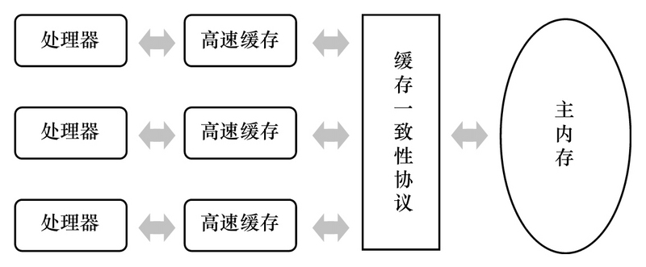

# JMM内存模型（java Memory Model）

## 1. 现代计算机模型基础理论知识
计算机之父冯诺依曼1945年提出计算机由五大组成部分，输入设置，输出设备存储器(内存和外存)，控制器，运算器

CPU缓存分成三个级别：L1,L2,L3 级别越小越靠近CPU，速度越块，容量越小

## 2. happens-before原则

### 2.1 为什么会出现线程可见性问题

要想解释为什么会出现线程可见性问题，需要从计算机处理器结构谈起。我们都知道计算机运算任务需要CPU和内存相互配合共同完成，其中CPU负责逻辑计算，内存负责数据存储。CPU要与内存进行交互，如读取运算数据、存储运算结果等。由于内存和CPU的计算速度有几个数量级的差距，为了提高CPU的利用率，现代处理器结构都加入了一层读写速度尽可能接近CPU运算速度的高速缓存来作为内存与CPU之间的缓冲：将运算需要使用的数据复制到缓存中，让CPU运算可以快速进行，计算结束后再将计算结果从缓存同步到主内存中，这样处理器就无须等待缓慢的内存读写了。
高速缓存的引入解决了CPU和内存之间速度的矛盾，但是在多CPU系统中也带来了新的问题：缓存一致性。在多CPU系统中，每个CPU都有自己的高速缓存，所有的CPU又共享同一个主内存。如果多个CPU的运算任务都涉及到主内存中同一个变量时，那同步回主内存时以哪个CPU的缓存数据为准呢？这就需要各个CPU在数据读写时都遵循同一个协议进行操作。



参考上图，假设有两个线程A、B分别在两个不同的CPU上运行，它们共享同一个变量X。如果线程A对X进行修改后，并没有将X更新后的结果同步到主内存，则变量X的修改对B线程是不可见的。所以CPU与内存之间的高速缓存就是导致线程可见性问题的一个原因。

CPU和主内存之间的高速缓存还会导致另一个问题——重排序。假设A、B两个线程共享两个变量X、Y，A和B分别在不同的CPU上运行。在A中先更改变量X的值，然后再更改变量Y的值。这时有可能发生Y的值被同步回主内存，而X的值没有同步回主内存的情况，此时对于B线程来说是无法感知到X变量被修改的，或者可以认为对于B线程来说，Y变量的修改被重排序到了X变量修改的前面。上面的程序NoVisibility类中有可能输出0就是这种情况，虽然在主线程中是先修改number变量，再修改ready变量，但对于读线程来说，ready变量的修改有可能被重排序到number变量修改之前。

此外，为了提高程序的执行效率，编译器在生成指令序列时和CPU执行指令序列时，都有可能对指令进行重排序。Java语言规范要求JVM只在单个线程内部维护一种类似串行的语义，即只要程序的最终结果与严格串行环境中执行的结果相同即可。所以在单线程环境中，我们无法察觉到重排序，因为程序重排序后的执行结果与严格按顺序执行的结果相同。就像在类NoVisibility的主线程中，先修改ready变量还是先修改number变量对于主线程自己的执行结果是没有影响的，但是如果number变量和ready变量的修改发生重排序，对读线程是有影响的。所以在编写并发程序时，我们一定要注意重排序对多线程执行结果的影响。

看到这里大家一定会发现，我们所讨论的CPU高速缓存、指令重排序等内容都是计算机体系结构方面的东西，并不是Java语言所特有的。事实上，很多主流程序语言(如C/C++)都存在多线程可见性的问题，这些语言是借助物理硬件和操作系统的内存模型来处理多线程可见性问题的，因此不同平台上内存模型的差异，会影响到程序的执行结果。Java虚拟机规范定义了自己的内存模型JMM(Java Memory Model)来屏蔽掉不同硬件和操作系统的内存模型差异，以实现让Java程序在各种平台下都能达到一致的内存访问结果。所以对于Java程序员，无需了解底层硬件和操作系统内存模型的知识，只要关注Java自己的内存模型，就能够解决Java语言中的内存可见性问题了。

### 2.2 原则

上面讨论了Java中多线程共享变量的可见性问题及产生这种问题的原因。下面我们看一下如何解决这个问题，即当一个多线程共享变量被某个线程修改后，如何让这个修改被需要读取这个变量的线程感知到

为了方便程序员开发，将底层的烦琐细节屏蔽掉，JMM定义了Happens-Before原则。只要我们理解了Happens-Before原则，无需了解JVM底层的内存操作，就可以解决在并发编程中遇到的变量可见性问题。

JVM定义的Happens-Before原则是一组偏序关系：对于两个操作A和B，这两个操作可以在不同的线程中执行。如果A Happens-Before B，那么可以保证，当A操作执行完后，A操作的执行结果对B操作是可见的。

#### 2.2.1 程序顺序规则
在一个线程内部，按照程序代码的书写顺序，书写在前面的代码操作Happens-Before书写在后面的代码操作。这时因为Java语言规范要求JVM在单个线程内部要维护类似严格串行的语义，如果多个操作之间有先后依赖关系，则不允许对这些操作进行重排序。

#### 2.2.2 锁定规则

对锁M解锁之前的所有操作Happens-Before对锁M加锁之后的所有操作。
```java
class HappensBeforeLock {
    private int value = 0;
    
    public synchronized void setValue(int value) {
        this.value = value;
    }
    
    public synchronized int getValue() {
        return value;
    }
}
```
同一时刻只能有一个线程执行锁中的操作，所以锁中的操作被重排序外界是不关心的，只要最终结果能被外界感知到就好。除了重排序，剩下影响变量可见性的就是CPU缓存了。在锁被释放时，A线程会把释放锁之前所有的操作结果同步到主内存中，而在获取锁时，B线程会使自己CPU的缓存失效，重新从主内存中读取变量的值。这样，A线程中的操作结果就会被B线程感知到了。

#### 2.2.3 volatile变量规则

对一个volatile变量的写操作及这个写操作之前的所有操作Happens-Before对这个变量的读操作及这个读操作之后的所有操作。
```java
Map configOptions;
char[] configText; //线程间共享变量，用于保存配置信息
// 此变量必须定义为volatile
volatile boolean initialized = false;

// 假设以下代码在线程A中执行
// 模拟读取配置信息，当读取完成后将initialized设置为true以通知其他线程配置可用configOptions = new HashMap();
configText = readConfigFile(fileName);
processConfigOptions(configText, configOptions);
initialized = true;

// 假设以下代码在线程B中执行
// 等待initialized为true，代表线程A已经把配置信息初始化完成
while (!initialized) {    
    sleep();
}
//使用线程A中初始化好的配置信息
doSomethingWithConfig();
```

在volatile变量写操作发生后，A线程会把volatile变量本身和书写在它之前的那些操作的执行结果一起同步到主内存中。最后，当B线程读取volatile变量时，B线程会使自己的CPU缓存失效，重新从主内存读取所需变量的值，这样无论是volatile本身，还是书写在volatile变量写操作之前的那些操作结果，都能让B线程感知到，也就是上面程序中的initialized和configOptions变量的最新值都可以让线程B感知到

原子变量与volatile变量在读操作和写操作上有着相同的语义

#### 2.2.4 线程启动规则

调用start方法时，会将start方法之前所有操作的结果同步到主内存中，新线程创建好后，需要从主内存获取数据。这样在start方法调用之前的所有操作结果对于新创建的线程都是可见的

#### 2.2.5 线程结束规则

当一个线程结束时，会把自己所有操作的结果都同步到主内存。而任何其它线程当发现这个线程已经执行结束了，就会从主内存中重新刷新最新的变量值。所以结束的线程A对共享变量的修改，对于其它检测了A线程是否结束的线程是可见的

#### 2.2.6 中断规则

一个线程在另一个线程上调用interrupt,Happens-Before被中断线程检测到interrupt被调用。
假设两个线程A和B，A先做了一些操作operationA，然后调用B线程的interrupt方法。当B线程感知到自己的中断标识被设置时(通过抛出InterruptedException，或调用interrupted和isInterrupted),operationA中的操作结果对B都是可见的


#### 2.2.7 终结器规则

一个对象的构造函数执行结束Happens-Before它的finalize()方法的开始。
“结束”和“开始”表明在时间上，一个对象的构造函数必须在它的finalize()方法调用时执行完。
根据这条原则，可以确保在对象的finalize方法执行时，该对象的所有field字段值都是可见的。


#### 2.2.8 传递性规则

如果操作A Happens-Before B，B Happens-Before C，那么可以得出操作A Happens-Before C


## 3. Volatile的使用场景和底层实现原理

volatile是轻量级的synchronized，但是volatile不会引起线程的上下文切换和调度

volatile在多核处理器进行开发时保证了共享变量的可见性，即当一个线程修改这个变量时，其他线程能立马得到最新修改的值

### 3.1 volatile的硬件实现原理

- 高速缓存一般集成在CPU内部，保存着CPU刚用过或循环使用的一部分数据，是内存数据的部分拷贝，计算机内部的数据通信为：CPU <–> 寄存器 <–> 高速缓存 <–> 内存
- 对volatile变量的写操作，会在正常汇编指令前加一个lock前缀的指令
  - lock前缀指令将引起当前处理器缓存的数据写回到系统内存。对于内存中可以缓存并已经缓存的数据，系统不会在总线上声言LOCK#信号而是锁定这块内存区域的缓存并写回到内存中（锁缓存）；如果内存中的数据没有被缓存，那么将在总线上声言LOCK#信号，锁住总线，并将数据写回到内存中
  - 处理器的缓存写回到内存中将会导致其他处理器的缓存无效。多核CPU之间的缓存一致性协议（锁缓存的保证）：每个处理器通过嗅探总线上有其他处理器写内存地址，如果处理器发现正好是自己缓存行所对应的内存地址，就会将当前处理器的缓存行设置成无效状态，当处理器再次访问这个数据时，就会重新将内存中的数据加载到处理器缓存中。当然如果是锁总线，那么就不需要缓存一致性协议来保障，因为锁总线将会独占所有共享内存
- CPU缓存一致性（MESI 协议及 RFO 请求）
  - M（修改，Modified）：本地处理器已经修改缓存行，即是脏行，它的内容与内存中的内容不一样，并且此 cache 只有本地一个拷贝(专有)；
  - E（专有，Exclusive）：缓存行内容和内存中的一样，而且其它处理器都没有这行数据；
  - S（共享，Shared）：缓存行内容和内存中的一样, 有可能其它处理器也存在此缓存行的拷贝；
  - I（无效，Invalid）：缓存行失效, 不能使用。
- 状态转换
  - 初始：一开始时，缓存行没有加载任何数据，所以它处于 I 状态。
  - 本地写（Local Write）：如果本地处理器写数据至处于 I 状态的缓存行，则缓存行的状态变成 M。
  - 本地读（Local Read）：如果本地处理器读取处于 I 状态的缓存行，很明显此缓存没有数据给它。此时分两种情况：
    - (1)其它处理器的缓存里也没有此行数据，则从内存加载数据到此缓存行后，再将它设成 E 状态，表示只有我一家有这条数据，其它处理器都没有；
    - (2)其它处理器的缓存有此行数据，则将此缓存行的状态设为 S 状态。
    - 注：如果处于M状态的缓存行，再由本地处理器写入/读出，状态是不会改变的
  - 远程读（Remote Read）：假设我们有两个处理器 c1 和 c2，如果 c2 需要读另外一个处理器 c1 的缓存行内容，c1 需要把它缓存行的内容通过内存控制器 (Memory Controller) 发送给 c2，c2 接到后将相应的缓存行状态设为 S。
  - 远程写（Remote Write）：其实确切地说不是远程写，而是 c2 得到 c1 的数据后，不是为了读，而是为了写。
    - 也算是本地写，只是 c1 也拥有这份数据的拷贝，这该怎么办呢？c2 将发出一个 RFO (Request For Owner) 请求，它需要拥有这行数据的权限，其它处理器的相应缓存行设为 I，除了它自已，谁不能动这行数据。这保证了数据的安全，同时处理 RFO 请求以及设置I的过程将给写操作带来很大的性能消耗。

### 3.2 volatile的特性
1、可见性：对一个volatile变量的读，总是能看到其他线程对这个变量最新的修改。

2、原子性：volatile变量的单个读/写操作是原子性的且具有可见性，复合操作（依赖当前值的读写复合操作等，比如i++；以及该变量包含在具有其他变量的不变式中）不具有原子性。

### 3.3 volatile的内存语义
java虚拟机内存模型中存在主内存和工作内存之分，实际上并不存在，只是抽象出来的用来表述问题的概念。

主内存中存储的是各个线程共享的数据，每一个线程都有一份与其他线程隔离独立的数据空间叫做工作内存，工作内存一部分存储的是线程私有数据，一部分是主内存中共享数据的拷贝。

对于普通共享变量：线程持有主内存中共享变量的数据拷贝，当发生读操作时，线程首先在自己的拷贝中查找，如果没有则从主内存中拷贝；发生写操作时，将会修改线程拷贝的数据，而不是主内存中的共享数据，所以无法保证共享变量的可见性。

volatile的写内存语义：当写一个volatile变量时，JMM会把该线程对应的本地内存中的共享变量值刷新到主内存 .和锁synchronized的释放内存语义一致。

volatile的读内存语义：当读一个volatile变量时，JMM会把该线程对应的本地内存设置为无效。线程接下来将从主内存中读取共享变量。和锁synchronized的获取内存语义一致。

java编译器通过在volatile的读写前后插入内存屏障指令（指令重排序不可越过内存屏障）来禁止特定类型的编译器和处理器重排序来实现上述内存语义。

- 编译器禁止volatile读与volatile读后面的任意内存操作重排序。
- 编译器禁止volatile写与volatile前面的任意内存操作重排序。

volatile的写-读和锁的释放-获取具有相同的内存语义:

- volatile的写和锁的释放有相同的内存语义
- volatile的读与锁的获取有相同的内存语义。

### 3.4 JSR-133（从JDK5开始）对volatile内存语义的增强

在JSR-133之前，虽然不允许volatile变量之间的重排序，但是旧的Java内存模型允许对volatile变量与普通变量重排序，因此旧的内存模型中，volatile的写-读没有锁的释放-获取所具有的内存语义。
为了提供一种比锁更轻量的线程间通信机制，JSR-133增强了volatile的内存语义：严格限制编译器和处理器对volatile变量与普通变量的重排序，确保volatile的写-读和锁的释放-获取具有相同的内存语义。

### 3.5 应用场景

1、轻量级的“读-写锁”策略

即通过锁来实现独占写锁，使用volatile实现共享的读锁（多个线程可以同时读value值）
```java
private volatile int value;
public int get Value(){return value;}
public synchronized void doubleValue(value=value*value;);
```

2、状态标志，用来对线程接下来的逻辑进行控制
```java
private volatile boolean status = false;
public void shutdown(){status = true;}
public void doWork(){
		while(!status){
		doTask();	
	}	
}
```

3、单例模式（双检查锁机制）
利用volatile修改的可见性以及禁止特定指令的重排序和synchronized的独占性保证同时只有一个线程进入同步方法块，既保证了其高效性，也保证了其线程安全性

```java
private volatile static Singleton instace;
public static Singleton getInstance(){   // 没有使用同步方法，而是同步方法块
	//第一次nu11检查 ，利用volatile的统程间可见性，不需要加锁，性能提高
	if(instance == null)(
		synchronized(Singleton.class) { //锁住类对象,阻塞其他线程
		//第二次nu11检查，以保证不会创建重复的实例
		if(instance == null)(
			instance = new Singleton(); //禁止重排序
		}
	}
	return instance;
```

## 4. ThreadLocal的使用场景和底层源码分析
  - 线程并发
  - 传递数据
  - 数据隔离

ThreadLocal与synchronized的区别
  - ThreadLocal 空间换时间为每个线程提供独立副本，相互隔离，具有更高的并发性
  - synchronized 时间换空间 提供一份变量 让不同的线程排队访问

```java
static class Bank {
		private ThreadLocal<Integer> threadlocal = new ThreadLocal<Integer>() {
			protected Integer initialValue() {
				return 0;
			}
		};

		public Integer get() {
			return threadlocal.get();
		}

		public void set(Integer money) {
			threadlocal.set(threadlocal.get() + money);
		}
	}

	static class Transfer implements Runnable {
		private Bank bank;

		public Transfer(Bank bank) {
			this.bank = bank;
		}

		@Override
		public void run() {
			for (int i = 0; i < 10; i++) {
				bank.set(10);
				System.out.println(Thread.currentThread().getName() + "账户余额：" + bank.get());
			}

		}
	}

	public static void main(String[] args) {
		Bank bank = new Bank();
		Transfer transfer = new Transfer(bank);
		new Thread(transfer, "客户1").start();
		new Thread(transfer, "客户2").start();
	}
```
```java
    private static ThreadLocal<Connection> tl = new ThreadLocal<>();
    /**
	 * 获取连接
	 * 
	 * @return
	 * @throws SQLException
	 */
	public synchronized Connection getConnection() throws SQLException {
		Connection conn = tl.get();
		// 如果容器中没有连接，就从连接池获取一个连接存到ThreadLocal中
		if (conn == null) {
			conn = DriverManager.getConnection(url, username, password);
			tl.set(conn);
		}
		return conn;
	}
```