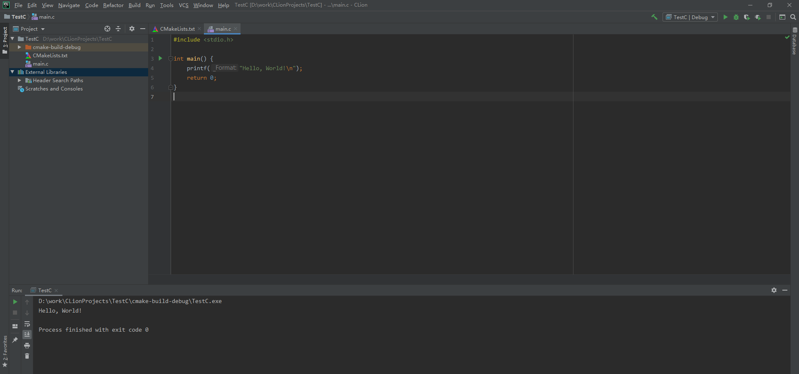
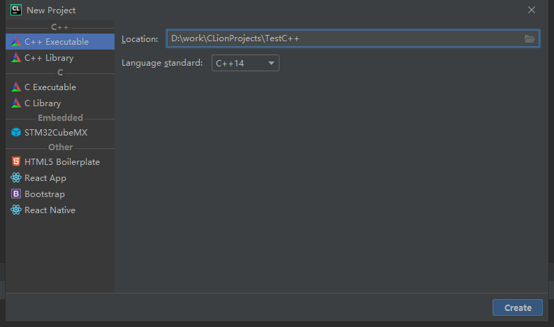
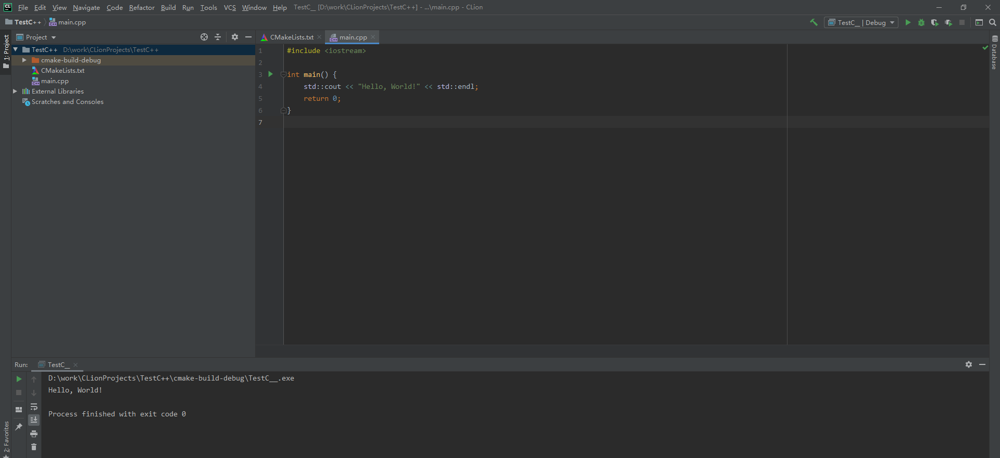

# C/C++ IDE CLion 配置使用教程

## 1. Clion下载

https://www.jetbrains.com/clion/download/

## 2. MinGw 下载

https://sourceforge.net/projects/mingw-w64/files/

选择mingw-w64，下载完成后解压到D盘根目录，形如：D:\mingw64

## 3. 配置CLion Toolchain环境

settings -> Build...>Toolchains -> 点加号 + （使用Mingw编译环境），相关环境参数如下图示：

D:\mingw64

D:\mingw64\bin\mingw32-make.exe

D:\mingw64\bin\gcc.exe

D:\mingw64\bin\g++.exe

D:\mingw64\bin\gdb.exe

## 4. 新建C工程

## 5. 新建C++工程

