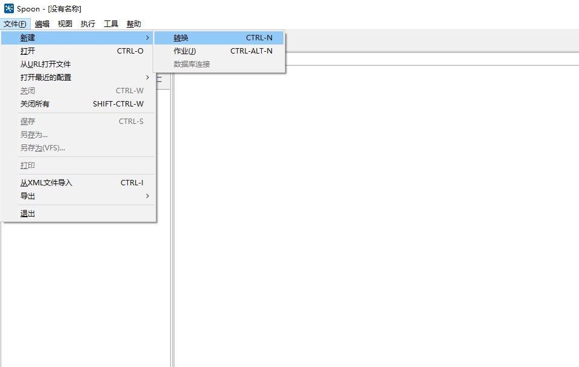
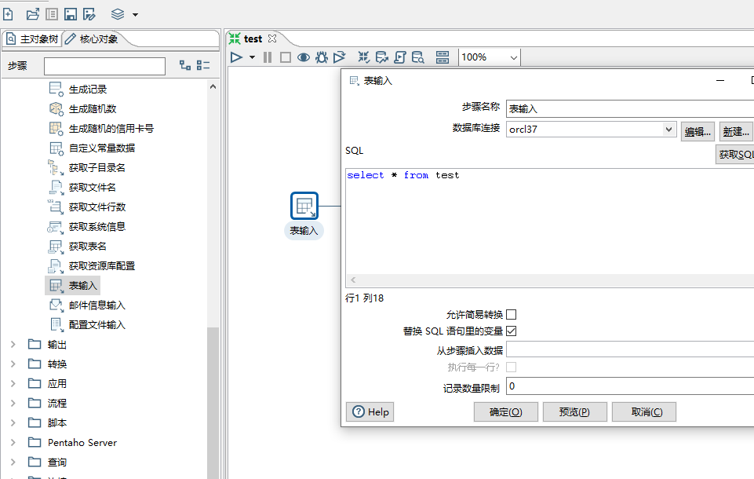
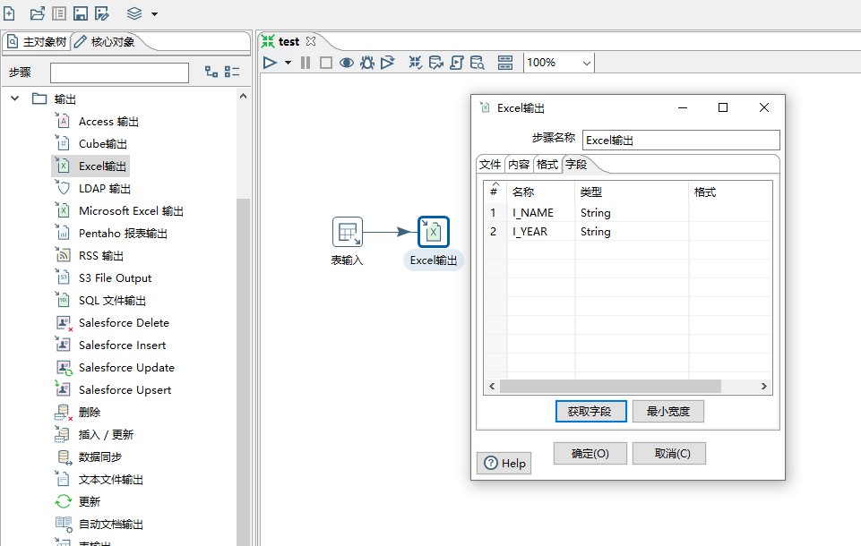
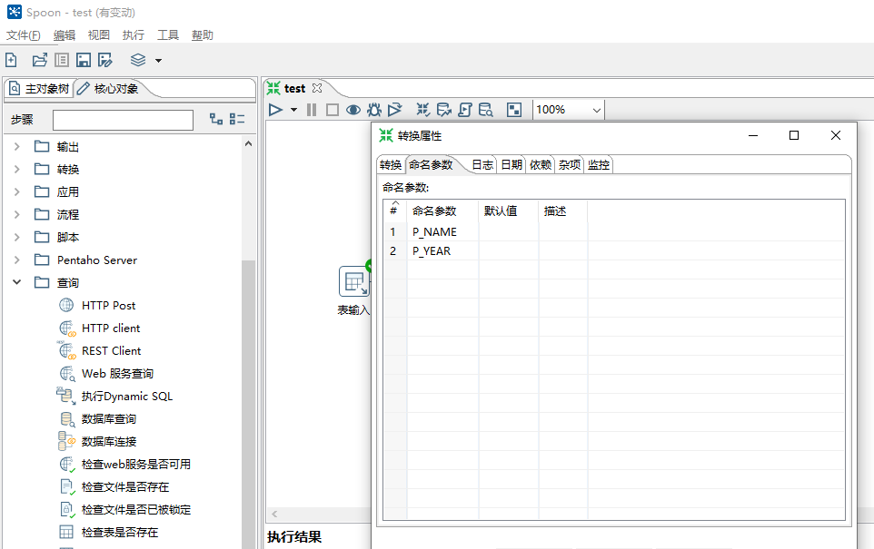
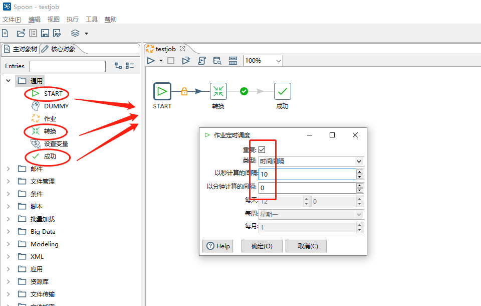
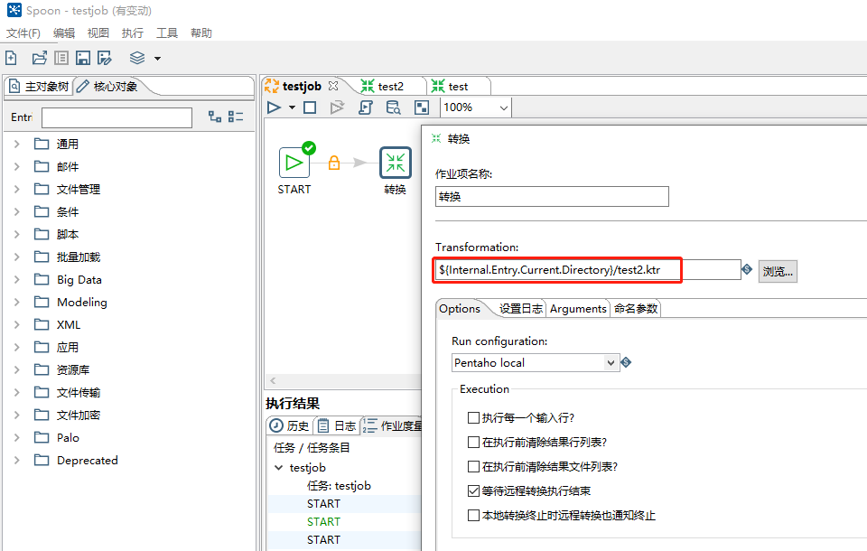
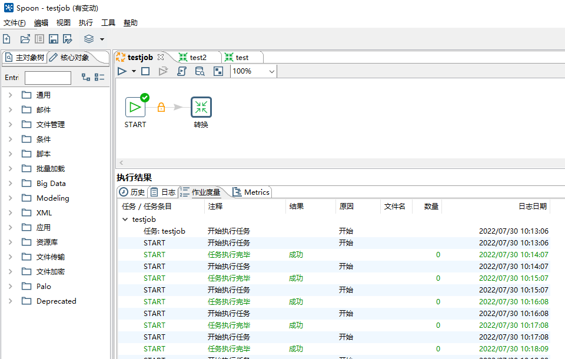

# pdi-ce-7.1.0.0-12

Kettle是一款开源的ETL工具，纯java编写，可以在Window、Linux、Unix上运行，绿色无需安装，数据抽取高效稳定
1. 勺子(Spoon.bat/spoon.sh) :是-个图形化的界面，可以让我们用图形化的方式开发转换和作业。windows选择.bat; Linux选择.sh。
2. 煎锅(Pan.bat/pan.sh) : 利用Pan可以用命令行的形式调用Trans。
3. 厨房(Kitchen batkitchen.sh) : 利用Kitchen可以使用命令行调用job
4. 菜单(Carte.bat/ Carte.sh): Carte是一 个轻量级的Web容器，用于建立专用、远程的ETL Server。

## 1. 下载

### 1.1 jdk1.8

https://www.oracle.com/java/technologies/downloads/

### 1.2 kettle

https://sourceforge.net/projects/pentaho/files/Data%20Integration/

### 1.3 驱动

https://dev.mysql.com/downloads/connector/j/

将mysql驱动和oracle驱动放在kettle包下面的lib包下面即可

## 2. 连接设置

下载完成解压到任意路径，打开文件夹，找到Spoon.bat，创建桌面快捷方式，打开


在文件->新建装换，新建转换后在左边的主对象树中建立DB连接用以连接数据库



连接oralce 


## 3. 应用

### 3.1 导出Excel

1. 表输入
   


2. Excel输出



设置保存位置和导出字段

3. 关联

按住【Shift】，鼠标左键点击【表输入】，向右拉到【Excel输出】上即可连接二者然后【Ctrl+S】保存转换

### 3.2 调用存储过程

1. sql

```sql
CREATE TABLE TEST(
  ID   VARCHAR2(100),
  NAME VARCHAR2(100),
  YEAR NUMBER
)

CREATE OR REPLACE PROCEDURE TEST_KATTLE(I_NAME VARCHAR2, I_YEAR NUMBER) AS
  P_ID VARCHAR2(100);
BEGIN
  SELECT SYS_GUID() INTO P_ID FROM DUAL;
  INSERT INTO TEST (ID, NAME, YEAR) VALUES (P_ID, I_NAME, I_YEAR);
END;
```

2. 添加

在右侧【核心对象】中搜索【表输入】，【调用DB存储过程】将其拖到新创建的转换中


```sql
SELECT '${P_NAME}' as I_NAME,'${P_YEAR}' as I_YEAR FROM DUAL
```


3. 设置转换

右键点击转换空白处，打开【转换设置】->【命名参数】， 配置调用存储过程要使用的输入参数（与【表输入】的SQL语句中的变量参数一致）




### 3.3 定时调度

#### 3.3.1 转换

文件 → 新建 → 作业(J)新建一个作业(job)，并保存点击面板左侧的核心对象 ，选择通用文件夹下的START和转换并把它拖到右侧的编辑区中，按住shift画线连接“START”和“转换”





#### 3.3.2 运行

