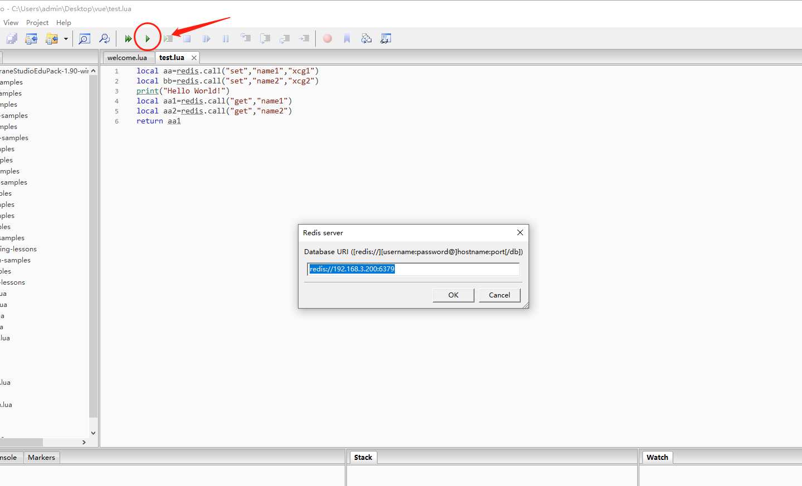

# ZeroBrane Studio

一个轻量级的Lua IDE，具有代码完成，语法高亮，实时编码，代码分析器以及Lua 5.1，Lua 5.2，Lua 5.3， LuaJIT和其他Lua引擎的调试支持

## 1. 下载

https://github.com/pkulchenko/ZeroBraneStudio/releases

## 2. 脚本

```lua
local aa=redis.call("set","name1","xcg1")
local bb=redis.call("set","name2","xcg2")
print("Hello World!")
local aa1=redis.call("get","name1")
local aa2=redis.call("get","name2")
return aa1
```

## 3. 运行

首次执行需要填写redis地址




## 4. 查看结果


## 5. 快捷键

- F10 下一行
- Shift+F10 跳过调试
- Ctrl +F10 跳过当前function
- Shift + F5 终止运行
- F6 运行
- F5 debug运行
